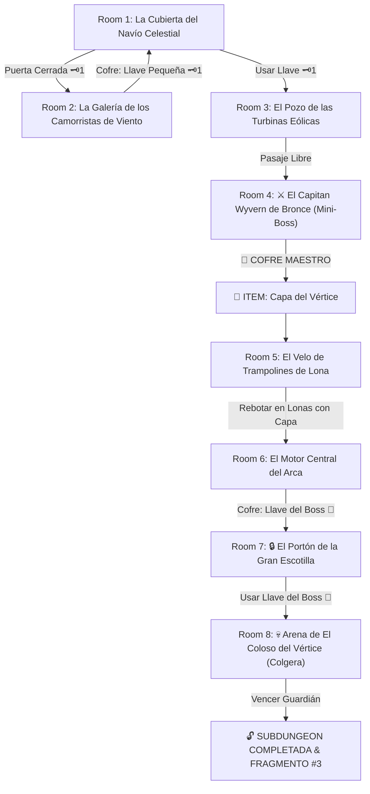

# 🌬️ Subdungeon 3: La Torre de los Vientos (Inspirada en el Arca de las Tormentas - TotK & Wind Waker)

> **Ubicación**: `7 - DM/OneShots/ARepeat/Subdungeons/03_Subdungeon_Aire_Torre.md`  
> **Inspiración Directa**: **Stormwind Ark / Wind Temple** (*Tears of the Kingdom*) + **Wind Temple** (*Wind Waker*)  
> **Estética**: **El Navío Celestíal en las Nubes**, **Trampolines de Lona Eólica** y **Motores de Turbinas**  
> **Dungeon Item**: *Capa del Vértice* (Planeo eólico & Ráfaga de aceleración de motor)  
> **Guardián de Área**: *El Coloso del Vértice* (Inspirado en *Colgera / Molgera*)  
> **Recompensa**: 🔓 Desbloqueo Permanente de la Torre + Fragmento de Tablilla #3

---

## 🗺️ Mapa de Flujo de la Mazmorra (Stormwind Ark Layout)

---

## 🏛️ Recorrido Verbatim Sala por Sala (Stormwind Ark Walkthrough)

### Room 1: La Cubierta del Navío Celestial (Entrada)
> *"Un colosal barco de madera mística y bronce flota suspendido en medio de una tormenta eterna de nubes. En la cubierta principal destaca la escotilla central sellada por un cerrojo rúnico 🗝️1. El paso hacia la proa del navío está abierto."*
* **Estética**: Viento aullante, mascarones de proa en forma de dragón, nubes eléctricas bajo el casco.
* **Puertas**: Popa (Entrada), Escotilla Central (Locked 🗝️1), Proa (Abierta).
* **Acción DM**: Dirigirse a la proa (Room 2) para recuperar la Llave Pequeña 🗝️1.

---

### Room 2: La Galería de los Camorristas de Viento (Llave Pequeña #1)
> *"La sección de mascarón de proa donde vientos laterales amenazan con arrastrar a los exploradores a las nubes. En el nicho del timón descansa un cofre eólico."*
* **Enemigos**: 3x Harpías de los Vientos (AC 13, 14 HP).
* **Resolución**: Mantener el equilibrio (*Acrobacias DC 12*) y derrotar a las harpías para reclamar la **Llave Pequeña 🗝️1**.

---

### Room 3: El Pozo de las Turbinas Eólicas
> *"Un pozo vertical interior cruzado por gigantescas aspas de madera que giran impulsando el aire hacia la cubierta. Al usar la Llave 🗝️1, la esclusa de engranajes abre paso a los camarotes del capitán."*
* **Puertas**: Cubierta (Locked 🗝️1 de vuelta), Norte (Camarotes del Mini-Boss).
* **Resolución**: Usar la Llave 🗝️1 y trabar la turbina secundaria (*Fuerza DC 12*) para cruzar entre las aspas.

---

### Room 4: ⚔️ El Capitán Wyvern de Bronce (Mini-Boss & Dungeon Item)
> *"Un autómata con forma de wyvern armado con abanicos mecánicos gigantescos que generan tornados defensivos."*
* **Mini-Boss**: **Capitán Wyvern** (AC 15, 48 HP).
* **🎁 COFRE MAESTRO**: Contiene la **Capa del Vértice** (Permite planeo en corrientes, saltos eólicos de 30 ft y activar ráfagas mecánicas contra turbinas).

---

### Room 5: El Velo de Trampolines de Lona (Navegación Aérea)
> *"Una sala abierta al cielo de 60 pies de altura donde velas de barcos montadas sobre muelles sirven como trampolines elásticos. En lo alto se avista la entrada al motor central."*
* **Puzle**: Saltar sobre los trampolines de lona y desplegar la recién obtenida *Capa del Vértice* en el punto culminante del rebote.
* **Resultado**: La combinación de lona elástica + corriente de la capa catapulta al grupo 60 pies arriba hasta la entrada de Room 6.

---

### Room 6: El Motor Central del Arca (Llave del Boss 👑)
> *"La sala de máquinas principal del barco donde cinco turbinas rúnicas alimentan el vuelo del navío. En una repisa central flota un cofre dorado."*
* **Puzle**: Usar la *Capa del Vértice* para proyectar ráfagas de aceleración en los cinco receptores de las turbinas.
* **Botín**: Abrir el cofre dorado de la repisa para tomar la **Llave del Boss 👑 (Llave de la Gran Escotilla)**.

---

### Room 7: 🔒 El Portón de la Gran Escotilla
> *"La entrada a las entrañas del navío: una escotilla de bronce masiva retrazada por dos grandes candados en forma de alas de barco."*
* **Resolución**: Insertar la **Llave del Boss 👑** para abrir las compuertas de babor y estribor.

---

### Room 8: 💀 Arena de El Coloso del Vértice (Colgera Boss)
> *"Un vacío colosal bajo la quilla del barco donde El Coloso del Vértice (un dragón ciempiés de hielo y viento) atraviesa las nubes rugiendo."*
* **Mecánica Colgera**: Ver ficha en [`04_Arena_del_Coloso_del_Vertice.md`](file:///Users/matiasbay/Documents/Obsidian/Shivath/7%20-%20DM/OneShots/ARepeat/Salas/07_Salas_Especiales/04_Arena_del_Coloso_del_Vertice.md). Usar la *Capa del Vértice* para picar en picado atravesando los escudos de hielo de la espalda del boss y aturdirlo 1 ronda.
* **Recompensa**: 🔓 Desbloqueo permanente de la Torre + **Fragmento de Tablilla #3**.
