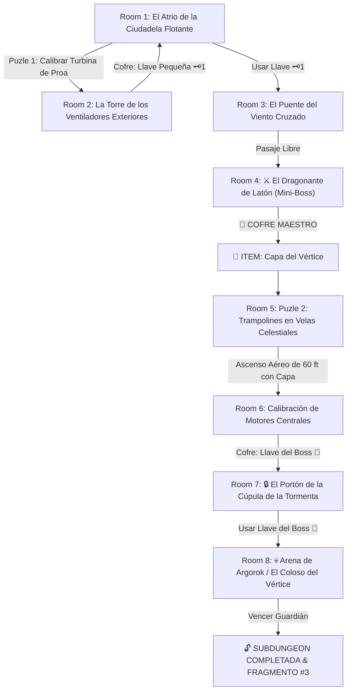

# 🌬️ Subdungeon 3: La Torre de los Vientos (Verbatim City in the Sky TP & Stormwind Ark TotK)

> **Ubicación**: `7 - DM/OneShots/ARepeat/Subdungeons/03_Subdungeon_Aire_Torre.md`  
> **Inspiración Verbatim**: **City in the Sky** (*Twilight Princess*) + **Stormwind Ark** (*Tears of the Kingdom*)  
> **Puzles Copiados Directos**: **La Calibración de los Cinco Motores de Turbina**, **El Salto de Trampolines en Velas Celestiales** y **El Enganche en Torres de Rayos contra Argorok**  
> **Dungeon Item**: *Capa del Vértice* (Planeo Eólico, Impulso de Ráfaga y Sustentación Aérea)  
> **Guardián de Área**: *El Coloso del Vértice* (Inspirado en *Argorok / Colgera*)  
> **Recompensa**: 🔓 Desbloqueo Permanente de la Torre + Fragmento de Tablilla #3

---

## 🗺️ Mapa de Flujo de la Mazmorra (City in the Sky Layout)

---

## 🏛️ Recorrido Verbatim Sala por Sala con Puzles Involucrados

### Room 1: El Atrio de la Ciudadela Flotante (Entrada)
> *"Un castillo celestial flotante suspendido sobre un mar de nubes impulsado por gigantescas hélices de bronce. En la proa se atisba el primer motor de turbina apagado. Al norte, la escotilla principal tiene un cerrojo rúnico 🗝️1."*
* **Puertas**: Popa (Entrada), Norte (Locked 🗝️1), Proa (Abierta).
* **Acción DM**: Dirigirse a la proa (Room 2) para activar la turbina y tomar la Llave Pequeña 🗝️1.

---

### Room 2: 🧩 Puzle 1 Verbatim: Calibración de la Turbina de Proa (TotK)
> *"Un motor eólico con aspas de bronce trabadas por cadenas de hielo eólico. Tres harpías custodian el nicho elevado."*
* **Puzle Involucrado**:
  1. **Derrotar a las Harpías Eólicas**: 3x Harpías (AC 13, 14 HP) que generan ráfagas de empuje (*Salvación de Fuerza DC 12* o ser arrojado 10 ft).
  2. **Girar el timón eólico**: Encajar una palanca en el eje de la turbina y realizar un giro coordinado (*Fuerza DC 13*).
* **Botín**: La turbina arranca expulsando una corriente ascendente que eleva el cofre con la **Llave Pequeña 🗝️1**.

---

### Room 3: El Puente del Viento Cruzado
> *"Una pasarela al vacío barrida por dos ventiladores laterales. Al usar la Llave 🗝️1, la escotilla norte se desengancha."*
* **Resolución**: Cruzar esquivando las ráfagas laterales (*Acrobacias DC 12*) e insertar la Llave 🗝️1.

---

### Room 4: ⚔️ Mini-Boss Verbatim: Dragonante de Latón (TP)
> *"Un autómata de latón armado con abanicos mecánicos gigantescos que proyecta tornados."*
* **Mini-Boss**: **Dragonante de Latón** (AC 15, 48 HP).
* **🎁 COFRE MAESTRO**: Al ser derrotado, entrega la **Capa del Vértice** (Permite planeo eólico, saltos de 30 ft y enganche a corrientes de hélices).

---

### Room 5: 🧩 Puzle 2 Verbatim: Trampolines en Velas Celestiales (Stormwind Ark TotK)
> *"Un pozo vertical abierto al cielo de 60 pies de altura donde tres velas de barcos celestiales están tensadas horizontalmente como trampolines sobre el vacío."*
* **Puzle Involucrado**:
  1. **Salto de Trampolín**: Correr y saltar sobre la primera vela elástica (*Acrobacias DC 12*). El rebote catapulta al jugador 30 pies hacia arriba.
  2. **Despliegue de la Capa en la Cumbre**: En el punto más alto del rebote, desplegar la *Capa del Vértice* para atrapar las corrientes de aire ascendentes de los aros rúnicos.
  3. **Cadena de Rebotes**: Encadenar 3 rebotes consecutivos en las velas hasta alcanzar el balcón superior de Room 6.

---

### Room 6: Calibración de Motores Centrales (Llave del Boss 👑)
> *"La sala de máquinas principal donde cuatro turbinas eólicas secundarias deben ser aceleradas mediante ráfagas."*
* **Puzle**: Usar la *Capa del Vértice* para proyectar ráfagas de aire directa a los 4 sensores de las turbinas.
* **Botín**: El cofre desenganchado entrega la **Llave del Boss 👑 (Llave de Argorok)**.

---

### Room 7: 🔒 El Portón de la Cúpula de la Tormenta
> *"Una escotilla abovedada de bronce barrida por la tormenta con un candado en forma de alas de dragón."*
* **Resolución**: Insertar la **Llave del Boss 👑** para abrir el acceso a la cima de la ciudadela.

---

### Room 8: 💀 Boss Final Verbatim: Argorok / El Coloso del Vértice (City in the Sky TP)
> *"La cima de la ciudadela voladora, rodeada por cuatro colosales pilares de iluminación con pararrayos en medio de una tempestad de relámpagos donde Argorok (un dragón acorazado de hierro) vuela escupiendo llamas."*
* **Mecánica Argorok Involucrada**:
  - **Fase 1 (Enganche a las Torres de Rayos)**: Los jugadores deben usar la *Capa del Vértice* para engancharse a las cuatro torres perimetrales (*Atletismo DC 13*) y trepar por encima de la altitud de vuelo de Argorok.
  - **Fase 2 (Caída en Picado sobre la Espalda)**: Esperar a que un relámpago ilumine el lomo del dragón, soltarse de la torre y ejecutar una caída en picado con la espada directamente sobre la gema de la espalda de Argorok (*Ataque Melé con Ventaja*).
  - **Fase 3 (Aturdimiento & Destrucción de Armadura)**: El dragón se desploma a la plataforma aturdido durante 1 ronda exponiendo su vientre.
* **Recompensa**: 🔓 Desbloqueo permanente de la Torre + **Fragmento de Tablilla #3**.
