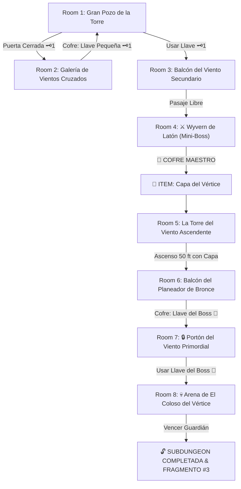

# 🌬️ Subdungeon 3: La Torre de los Vientos (Wind Temple Verbatim)

> **Ubicación**: `7 - DM/OneShots/ARepeat/Subdungeons/03_Subdungeon_Aire_Torre.md`  
> **Estilo**: Zelda Classic Dungeon Layout  
> **Dungeon Item**: *Capa del Vértice*  
> **Guardián de Área**: *El Coloso del Vértice*  
> **Recompensa**: 🔓 Desbloqueo Permanente de la Torre + Fragmento de Tablilla #3

---

## 🗺️ Mapa de Flujo de la Mazmorra (Zelda Diagram)

---

## 🏛️ Recorrido Verbatim Sala por Sala (DM Walkthrough)

### Room 1: Gran Pozo de la Torre (Entrada)
> *"Un pozo vertical colosal donde corrientes de aire frío resuenan como aullidos. En una plataforma a 20 pies de altura destaca un portón de piedra con un cerrojo rúnico 🗝️1. El paso del Este conduce a una pasarela volada."*
* **Puertas**: Abajo (Entrada), Norte Elevado (Locked 🗝️1), Este (Abierta).
* **Acción DM**: Tomar la pasarela Este (Room 2) para conseguir la Llave Pequeña 🗝️1.

---

### Room 2: Galería de los Vientos Cruzados (Llave Pequeña #1)
> *"Una estancia estrecha azotada por ráfagas laterales de viento que intentan empujar a los viajeros al abismo. Al fondo reposa un cofre de latón."*
* **Enemigos**: 3x Gárgolas eólicas (AC 13, 14 HP).
* **Puzle**: Cruzar la pasarela manteniendo el equilibrio (*Acrobacias DC 12*) y derrotar a las gárgolas para abrir el cofre con la **Llave Pequeña 🗝️1**.

---

### Room 3: Balcón del Viento Secundario
> *"Una repisa elevada con un molinillo de bronce que gira furiosamente. Al usar la Llave 🗝️1, el cerrojo libera la compuerta del norte."*
* **Puertas**: Sur (Locked 🗝️1 de vuelta), Norte (Puerta del Mini-Boss).
* **Resolución**: Abrir con la Llave 🗝️1 y avanzar hacia Room 4.

---

### Room 4: ⚔️ Guardia del Wyvern de Latón (Mini-Boss & Dungeon Item)
> *"Un draco mecánico de bronce de 15 pies de envergadura planea sobre un foso de aire caliente emitiendo ráfagas de choque."*
* **Mini-Boss**: **Wyvern de Latón** (AC 15, 48 HP; Ataque: Ráfaga Cortante +5, 2d6+3 Cortante).
* **Estrategia DM**: Vuela fuera del alcance melé en turnos alternos. Derrotarlo despeja el altar del templo.
* **🎁 COFRE MAESTRO**: Contiene la **Capa del Vértice** (Otorga saltos eólicos de 30 ft y planeo continuo en corrientes ascendentes).

---

### Room 5: La Torre del Viento Ascendente (Ascenso 50 ft)
> *"Un pozo vertical colosal de 50 pies. Una violenta corriente de aire ruge desde una gran reja en el suelo elevándose en vórtice hacia los balcones superiores."*
* **Puzle**: Saltar sobre la reja del suelo y desplegar la recién obtenida *Capa del Vértice*.
* **Resultado**: La corriente eleva automáticamente al grupo 50 pies hacia el balcón superior de Room 6.

---

### Room 6: El Balcón del Planeador de Bronce (Llave del Boss 👑)
> *"Un balcón sobre un abismo de 60 pies. En el aire giran cuatro aros de bronce rúnico iluminados que forman un circuito de sustentación hacia la repisa opuesta."*
* **Puzle**: Lanzarse planeando con la *Capa del Vértice* atravesando el centro de los 4 aros rúnicos para mantener velocidad y altura.
* **Botín**: Aterrizar en el balcón opuesto y abrir el cofre dorado con la **Llave del Boss 👑 (Llave de la Pluma)**.

---

### Room 7: 🔒 Portón del Viento Primordial
> *"Un gran portón de bronce con efigies de alas desplegadas y un candado rúnico en forma de pluma de viento."*
* **Resolución**: Insertar la **Llave del Boss 👑** para abrir el acceso a la arena del Boss.

---

### Room 8: 💀 Arena de El Coloso del Vértice (Guardián de Aire)
> *"Una plataforma circular suspendida en el vacío donde El Coloso del Vértice genera tornados violentos en el perímetro."*
* **Mecánica Boss**: Ver ficha en [`04_Arena_del_Coloso_del_Vertice.md`](file:///Users/matiasbay/Documents/Obsidian/Shivath/7%20-%20DM/OneShots/ARepeat/Salas/07_Salas_Especiales/04_Arena_del_Coloso_del_Vertice.md). Usar la *Capa del Vértice* para remontar el tornado y aterrizar sobre el núcleo débil del boss.
* **Recompensa**: 🔓 Desbloqueo permanente de la Torre + **Fragmento de Tablilla #3**.
