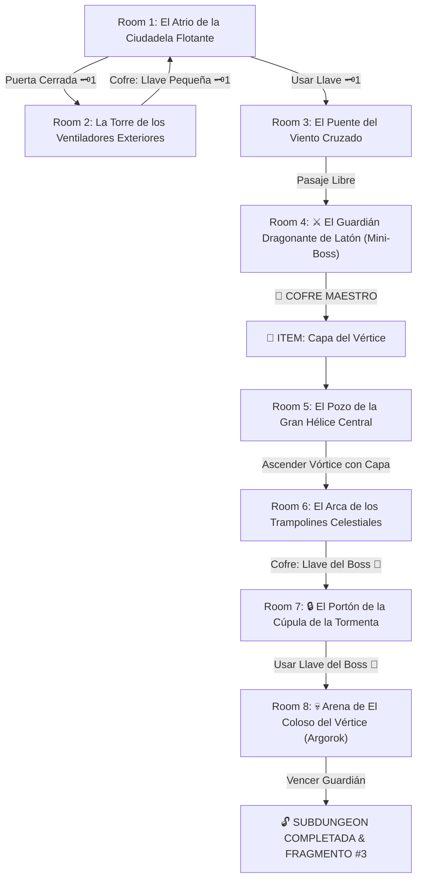

# 🌬️ Subdungeon 3: La Torre de los Vientos (Inspirada en City in the Sky - TP & Stormwind Ark - TotK)

> **Ubicación**: `7 - DM/OneShots/ARepeat/Subdungeons/03_Subdungeon_Aire_Torre.md`  
> **Inspiración Directa**: **City in the Sky** (*Twilight Princess*) + **Stormwind Ark** (*Tears of the Kingdom*)  
> **Estética**: **La Ciudadela de las Nubes**, **Grandes Ventiladores de Hélice**, **Mecanismos Eólicos** y **Puentes de Tormenta**  
> **Dungeon Item**: *Capa del Vértice* (Planeo eólico, impulso de corriente y enganche eólico)  
> **Guardián de Área**: *El Coloso del Vértice* (Inspirado en *Argorok / Colgera*)  
> **Recompensa**: 🔓 Desbloqueo Permanente de la Torre + Fragmento de Tablilla #3

---

## 🗺️ Mapa de Flujo de la Mazmorra (City in the Sky / Stormwind Ark Layout)

---

## 🏛️ Recorrido Verbatim Sala por Sala (City in the Sky Walkthrough)

### Room 1: El Atrio de la Ciudadela Flotante (Entrada)
> *"Una gigantesca plaza de piedra eólica blanca flanqueada por torres de vigilancia que flotan sobre una tormenta infinita de nubes. Grandes hélices de bronce giran impulsadas por las corrientes del abismo. Al norte, la escotilla principal de la ciudadela está bloqueada por un candado rúnico 🗝️1."*
* **Estética (City in the Sky)**: Pilares flotantes, arquitectura eólica arcaica, ráfagas continuas de viento y vista sobre el abismo de nubes.
* **Puertas**: Sur (Entrada), Norte (Locked 🗝️1), Este (Abierta).
* **Acción DM**: Cruzar el pasillo Este (Room 2) para recuperar la Llave Pequeña 🗝️1.

---

### Room 2: La Torre de los Ventiladores Exteriores (Llave Pequeña #1)
> *"Una torre exterior rodeada por ventiladores mecánicos giratorios que expulsan ráfagas rítmicas. En la cima de un pilar flotante descansa un cofre eólico."*
* **Enemigos**: 3x Harpías Eólicas / Oocca de Bronce (AC 13, 14 HP).
* **Resolución**: Cruzar esquivando las ráfagas (*Acrobacias DC 12*) y derrotar a los enemigos para reclamar la **Llave Pequeña 🗝️1**.

---

### Room 3: El Puente del Viento Cruzado
> *"Una pasarela colgada sobre el vacío donde dos colosales hélices laterales generan un túnel de viento cruzado. Al usar la Llave 🗝️1, la esclusa del norte se abre hacia el pabellón de combate."*
* **Puertas**: Sur (Locked 🗝️1 de vuelta), Norte (Puerta del Mini-Boss).
* **Resolución**: Insertar la Llave 🗝️1 y alterar la velocidad de los ventiladores (*Fuerza DC 12*) para estabilizar la pasarela.

---

### Room 4: ⚔️ El Guardián Dragonante de Latón (Mini-Boss & Dungeon Item)
> *"Un autómata con aspecto de wyvern de bronce armado con escudos eólicos pivotantes que generan tornados defensivos."*
* **Mini-Boss**: **Dragonante de Latón** (AC 15, 48 HP).
* **🎁 COFRE MAESTRO**: Contiene la **Capa del Vértice** (Permite planeo eólico, saltos de sustentación de 30 ft y enganche en corrientes de hélices).

---

### Room 5: El Pozo de la Gran Hélice Central (Ascenso Vertical)
> *"Un pozo vertical colosal de 50 pies atravesado por una gigantesca hélice en el suelo que expulsa un vórtice continuo hacia la cúpula."*
* **Puzle**: Saltar sobre el centro de la hélice y desplegar la recién obtenida *Capa del Vértice*.
* **Resultado**: La potencia del vórtice eleva al grupo 50 pies arriba hacia la entrada de Room 6.

---

### Room 6: El Arca de los Trampolines Celestiales (Llave del Boss 👑)
> *"Una cubierta de navío celestial abierta al cielo donde lonas de vela elásticas sirven como trampolines entre plataformas flotantes. En una repisa aislada flota un cofre dorado."*
* **Puzle**: Rebotar en los trampolines de lona y usar la *Capa del Vértice* para mantener sustentación hacia las corrientes de los aros.
* **Botín**: Reclamar del cofre dorado la **Llave del Boss 👑 (Llave de Argorok)**.

---

### Room 7: 🔒 El Portón de la Cúpula de la Tormenta
> *"Una cúpula abovedada azotada por la tormenta con un gran portón eólico con la forma de alas de dragón extendidas."*
* **Resolución**: Insertar la **Llave del Boss 👑** para desenganchar los motores eólicos y abrir la arena del Boss.

---

### Room 8: 💀 Arena de El Coloso del Vértice (Argorok Boss)
> *"La cúspide de la ciudadela voladora, rodeada por cuatro pilares eólicos en medio de una tormenta de rayos donde El Coloso del Vértice (un dragón coraza de hierro y viento) vuela enfurecido."*
* **Mecánica Argorok**: Ver ficha en [`04_Arena_del_Coloso_del_Vertice.md`](file:///Users/matiasbay/Documents/Obsidian/Shivath/7%20-%20DM/OneShots/ARepeat/Salas/07_Salas_Especiales/04_Arena_del_Coloso_del_Vertice.md). Usar la *Capa del Vértice* para engancharse a los pilares eólicos, remontar la tormenta y caer sobre la gema de la espalda del dragón aturdiéndolo 1 ronda.
* **Recompensa**: 🔓 Desbloqueo permanente de la Torre + **Fragmento de Tablilla #3**.
