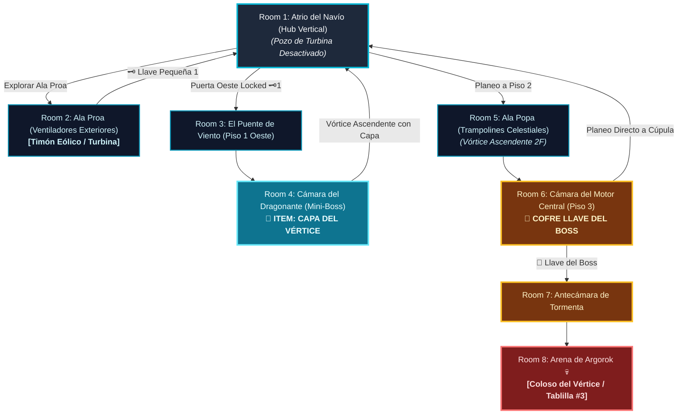

# 🌬️ Subdungeon 3: La Torre de los Vientos (Layout Complejo y No-Lineal estilo City in the Sky)

> **Ubicación**: `7 - DM/OneShots/ARepeat/Subdungeons/03_Subdungeon_Aire_Torre.md`  
> **Inspiración Verbatim**: **City in the Sky** (*Twilight Princess*) + **Stormwind Ark** (*Tears of the Kingdom*)  
> **Regla de Diseño DM**: **CERO BLOQUEOS POR TIRADA OBLIGATORIA (No Skill-Check Gates)**. La progresión es 100% interactiva, mecánica y espacial. Las tiradas de dados son opcionales (evitar daño, ir más rápido o hallar secretos), pero el avance obligatorio NUNCA requiere fallar/pasar un dado.  
> **Estructura de Layout**: **Núcleo de la Ciudadela Flotante (Hub Vertical)** + **Ala Proa (Turbinas Exteriores)** + **Ala Popa (Trampolines Celestes)** + **Activación de Vórtices Eólicos**  
> **Dungeon Item**: *Capa del Vértice* (Planeo Eólico, Impulso de Ráfaga y Sustentación Aérea)  
> **Guardián de Área**: *El Coloso del Vértice* (Inspirado en *Argorok / Colgera*)  
> **Recompensa**: 🔓 Desbloqueo Permanente de la Torre + Fragmento de Tablilla #3

---

## 🗺️ Mapa de Flujo No-Lineal de la Mazmorra (City in the Sky Non-Linear Layout)

---

### 📊 Tabla Resumen de Progreso (Paso a Paso)

| Paso | Ubicación | Tipo | Objetivo y Acción Clave | Resultado |
| :---: | :--- | :---: | :--- | :--- |
| **1** | **Room 2 (Ala Proa)** | 🟢 Exploración | Girar timón eólico y encajar palanca | Obtenida **Llave Pequeña 🗝️1** |
| **2** | **Room 3 & 4 (Ala Oeste)** | ⚔️ Mini-Boss | Cruzar puente de viento y vencer al *Dragonante* | 🎁 Obtención de la **Capa del Vértice** |
| **3** | **Room 5 (Ala Popa 2F)** | 🧩 Puzle | Desplegar la capa sobre el pozo y rebotar en velas | Ascenso a Piso 3 |
| **4** | **Room 6 (Motor 3F)** | 👑 Clave & Atajo | Acelerar las 4 turbinas secundarias con la capa | 👑 Obtenida **Llave del Boss** |
| **5** | **Room 8 (Arena Final)** | 💀 Boss | Planear al Hub e ingresar a Cúpula Norte | 🔓 Subdungeon 3 + Fragmento #3 |

---

## 🏛️ Recorrido Verbatim Sala por Sala (DM Walkthrough & Vertical Navigation)

### Room 1: Atrio del Navío Celestial (Hub Vertical)
> *"Una plaza colosal de piedra eólica blanca que flota sobre un abismo de nubes. En el centro, un gran pozo de turbina desactivado se halla apagado. Tres accesos destacan: la Proa (Este), la Escotilla del Puente (Oeste - Locked 🗝️1) y la Popa elevada en el Piso 2. Al norte, en la cima, la Cúpula de la Tormenta 🔒."*

---

### Room 2: 🧩 Ala Proa: Torre de Ventiladores Exteriores (TotK)
> *"Un pasaje al aire libre donde hélices de bronce giran impulsadas por corrientes heladas."*
* **Puzle Mecánico Sin Gating**: Derrotar a 3x Harpías Eólicas y girar el timón eólico encajando una palanca. *(Tirada opcional de Fuerza DC 13 permite girarlo solo en vez de en equipo, pero el timón 100% arranca la turbina)*.
* **Botín**: La turbina expulsa una corriente que eleva el cofre con la **Llave Pequeña 🗝️1**.
* **🔄 BACKTRACKING**: Regresar al **Hub (Room 1)** e insertar la Llave 🗝️1 en la Escotilla Oeste.

---

### Room 3: Ala Oeste: El Puente del Viento Cruzado
> *"Una pasarela al vacío barrida por dos ventiladores laterales."*
* **Mecánica Sin Gating**: Cruzar observando las ráfagas laterales. *(Tirada opcional de Acrobacias DC 12 evita caer de rodillas, pero el cruce es 100% seguro)*.

---

### Room 4: ⚔️ Cámara del Mini-Boss: Dragonante de Latón (TP)
> *"Un autómata de latón que proyecta tornados."*
* **🎁 COFRE MAESTRO**: Otorga la **Capa del Vértice** (Permite planeo eólico y atrapar corrientes de aire).
* **🔄 BACKTRACKING & VÓRTICE RECTIFICADO**: Con la *Capa del Vértice*, el grupo regresa al **Hub (Room 1)**. Al desplegar la capa sobre el pozo central, el vórtice ascendente catapulta al grupo al Piso 2 (Ala Popa - Room 5).

---

### Room 5: 🧩 Ala Popa: Trampolines en Velas Celestiales (TotK)
> *"Un pozo vertical de 60 pies con tres velas elásticas horizontalmente."*
* **Puzle Mecánico Sin Gating**: Rebotar en las 3 velas y desplegar la *Capa del Vértice* en el punto cumbre de cada salto para ascender al Piso 3 (Room 6). *(Tirada opcional de Acrobacias DC 12 otorga 10 ft extra de altura, pero el ascenso es 100% garantizado)*.

---

### Room 6: Piso 3: Cámara del Motor Central (Llave del Boss 👑)
> *"La sala de máquinas principal donde cuatro turbinas eólicas secundarias deben ser aceleradas mediante ráfagas."*
* **Puzle**: Proyectar ráfagas de aire con la capa en las cuatro turbinas.
* **Botín**: Reclamar la **Llave del Boss 👑 (Llave de Argorok)**.
* **🔄 BACKTRACKING**: Planear desde la balconada del Piso 3 directamente a la Cúpula Norte del Hub (Room 1).

---

### Room 7: 🔒 Antecámara de la Tormenta
> *"Insertar la Llave del Boss 👑 para abrir las alas de bronce de la cúpula."*

---

### Room 8: 💀 Boss Final: Argorok / El Coloso del Vértice (TP)
> *"Cúspide de la ciudadela entre tormentas de rayos con 4 torres de pararrayos."*
* **Mecánica Boss**: Engancharse a las torres con la capa, ascender sobre Argorok y picar en caída libre sobre la gema de su espalda.
* **Recompensa**: 🔓 Desbloqueo permanente de la Torre + **Fragmento de Tablilla #3**.
