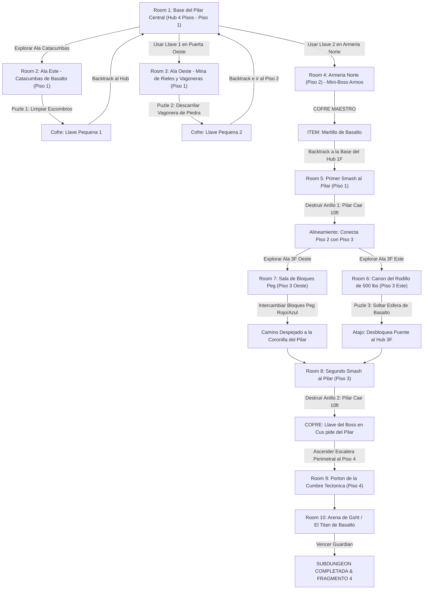

# 🪨 Subdungeon 4: El Dominio Telúrico (Layout Complejo Complejo estilo Snowhead Temple)

> **Ubicación**: `7 - DM/OneShots/ARepeat/Subdungeons/04_Subdungeon_Tierra_Dominio.md`  
> **Inspiración Verbatim**: **Snowhead Temple** (*Majora's Mask* - Edición Basalto 100% Roca)  
> **Estructura de Layout**: **Hub Central Cilíndrico de 4 Pisos** + **2 Llaves Pequeñas** + **3 Alas Interconectadas** + **2 Colapsos Verticales del Pilar Central**  
> **Dungeon Item**: *Martillo de Basalto* (Gran Megaton Hammer Telúrico)  
> **Guardián de Área**: *El Titán de Basalto* (Inspirado en *Goht / Scaldera*)  
> **Recompensa**: 🔓 Desbloqueo Permanente del Dominio Telúrico + Fragmento de Tablilla #4

---

## 🗺️ Mapa de Flujo No-Lineal de la Mazmorra (Snowhead Complex Multi-Floor Layout)

---

## 🏛️ Recorrido Verbatim Sala por Sala con Puzles e Interconexiones

### Room 1: Base del Pilar Central (Hub Central - 4 Pisos - Piso 1)
> *"Una catedral cilíndrica de cuatro pisos en cuyo eje se alza un Pilar Central de Basalto de 40 pies. Pasarelas de piedra giran alrededor del pilar en cada piso, pero las de los pisos 3 y 4 están desalineadas e inaccesibles. En el Piso 1 destacan: Catacumbas (Este), Mina de Vagoneras (Oeste - Locked 🗝️1), Armería (Piso 2 Norte - Locked 🗝️2) y la Cumbre (Piso 4 - Locked 🔒)."*
* **Mecánica Central**: El Pilar Central bloquea los balcones altos hasta que sus anillos sean destruidos con el *Martillo de Basalto*.

---

### Room 2: 🧩 Ala Este (Piso 1): Catacumbas de Basalto (OoT / MM)
> *"Un pasadizo donde temblores desprenden rocas sobre tumbas antiguas. Tras un derrumbe descansa un cofre."*
* **Puzle Involucrado**: Mover las rocas de falla (*Fuerza DC 11*) y derrotar a 3x Escarabajos Telúricos.
* **Botín**: Abrir el cofre para reclamar la **Llave Pequeña 🗝️1**.
* **🔄 BACKTRACKING**: Regresar al **Hub (Room 1)** e insertar la Llave 🗝️1 en la Mina de Vagoneras Oeste.

---

### Room 3: 🧩 Ala Oeste (Piso 1): Mina de Rieles y Vagoneras (TP / MM)
> *"Un complejo de rieles de minería donde una vagonera de granito está trabada por un pasador de piedra azuledada."*
* **Puzle Involucrado**:
  1. **Alinear los Rieles**: Girar la aguja del cambio de vía (*Fuerza DC 12*).
  2. **Empujar la Vagonera**: Desbloquear el freno para que la vagonera se estrelle contra el muro de la cornisa elevada.
* **Botín**: Al colapsar la cornisa, cae el cofre con la **Llave Pequeña 🗝️2**.
* **🔄 BACKTRACKING**: Regresar al **Hub (Room 1)**, subir la escalera al Piso 2 e insertar la Llave 🗝️2 en la Armería Norte.

---

### Room 4: ⚔️ Mini-Boss (Piso 2): Armería Norte (Armos de la Cumbre MM)
> *"Una sala abovedada en el Piso 2 donde un autómata de granito despierta al pisar el altar."*
* **Combate**: Armos de la Cumbre (AC 16, 52 HP).
* **🎁 COFRE MAESTRO**: Otorga el **Martillo de Basalto** (Gran Megaton Hammer capaz de pulverizar anillos del Pilar Central y bloques Peg).
* **🔄 BACKTRACKING & PRIMER IMPACTO**: El grupo desciende a la base del **Hub (Room 1)** para asestar el primer golpe al pilar.

---

### Room 5: 🧩 Base del Hub (Piso 1): Primer Smash al Pilar Central (Snowhead MM)
> *"Pararse ante el primer anillo frágil de basalto azulado en la base del Pilar Central."*
* **Puzle Involucrado**: Asestar un golpe de masa completa con el *Martillo de Basalto* (*Fuerza DC 13*).
* **Resultado**: ¡El primer anillo de 10 pies del pilar se pulveriza en escombros y todo el Pilar Central desciende 10 pies hacia el subsuelo! Esto conecta por primera vez el Piso 2 con las pasarelas del Piso 3 (Room 6 y Room 7).

---

### Room 6: 🧩 Piso 3 Este: Cañón del Rodillo de 500 lbs (Scaldera SS / MM)
> *"Un pasillo inclinado donde una esfera de basalto de 500 lbs descansa sobre un trinquete."*
* **Puzle Involucrado**: Golpear el trinquete con el *Martillo de Basalto*. La esfera rueda destruyendo la mampostería del fondo y desbloqueando un puente atajo directo al Hub en Piso 3.

---

### Room 7: 🧩 Piso 3 Oeste: Sala de Bloques Peg (Snowhead MM)
> *"Una sala con dos bloques Peg (rojo elevado y azul hundido) que cortan el paso."*
* **Puzle Involucrado**: Golpear el bloque Peg rojo con el martillo para hundirlo, elevando el bloque Peg azul y creando una pasarela continua.

---

### Room 8: 🧩 Piso 3 Hub: Segundo Smash & Llave del Boss (Snowhead MM)
> *"De regreso a la pasarela del Piso 3, el grupo se halla frente al segundo anillo frágil del pilar."*
* **Puzle Involucrado**:
  1. Asestar un segundo golpe con el *Martillo de Basalto* sobre el pilar (desciende otros 10 ft).
  2. La corona del pilar se nivela exactamente con la pasarela del Piso 3.
* **Botín**: Caminar por encima de la cima del pilar desprendido para abrir el cofre dorado con la **Llave del Boss 👑 (Llave de Goht)**.

---

### Room 9: 🔒 Portón de la Cumbre Tectónica (Piso 4)
> *"Ascender por la escalera perimetral al Piso 4 e insertar la Llave del Boss 👑."*

---

### Room 10: 💀 Boss Final: Goht / El Titán de Basalto (Snowhead MM)
> *"Pista circular de basalto donde Goht rueda a gran velocidad."*
* **Mecánica Boss**: Golpe de martillo en sus patas durante la embestida (*DC 13*) para hacerlo tropezar y golpear su vientre expuesto.
* **Recompensa**: 🔓 Desbloqueo permanente del Dominio Telúrico + **Fragmento de Tablilla #4**.
