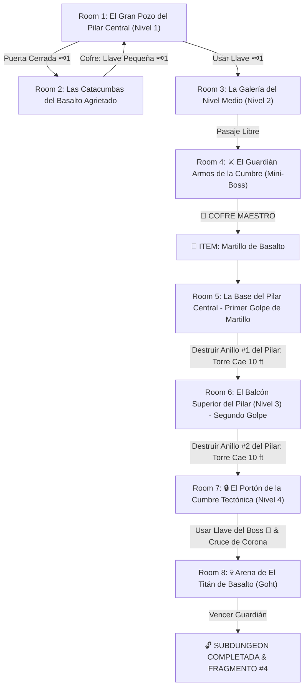

# 🪨 Subdungeon 4: El Dominio Telúrico (Inspirada en Snowhead Temple - Majora's Mask Edición Basalto)

> **Ubicación**: `7 - DM/OneShots/ARepeat/Subdungeons/04_Subdungeon_Tierra_Dominio.md`  
> **Inspiración Directa**: **Snowhead Temple / Torre de la Cumbre** (*The Legend of Zelda: Majora's Mask*)  
> **Gimmick Mecánico Central**: **El Gran Pilar Central de Basalto (Destrucción por Pisos)**  
> **Regla de Mazmorra**: Golpear las secciones del Pilar Central con el *Martillo de Basalto* destruye anillos de piedra de 10 pies, haciendo colapsar verticalmente la torre piso por piso para alinear pasarelas y desbloquear los pisos 1 a 4.  
> **Dungeon Item**: *Martillo de Basalto* (Gran Megaton Hammer Telúrico)  
> **Guardián de Área**: *El Titán de Basalto* (Inspirado en *Goht / Scaldera*)  
> **Recompensa**: 🔓 Desbloqueo Permanente del Dominio Telúrico + Fragmento de Tablilla #4

---

## 🗺️ Mapa de Flujo de la Mazmorra (Snowhead Central Pillar Layout)

---

## 🏛️ Recorrido Verbatim Sala por Sala (Snowhead Basalt Walkthrough)

### Room 1: El Gran Pozo del Pilar Central (Entrada - Nivel 1)
> *"Una monumental torre cilíndrica de cuatro pisos de altura en cuyo centro se alza un gigantesco Pilar Central de Basalto que recorre la mazmorra de abajo arriba. Pasarelas de piedra giran alrededor del pilar a distintas alturas, pero el paso a los pisos superiores está cortado por la elevación del pilar. En el muro norte del piso inferior hay un portón con un candado de hierro 🗝️1."*
* **Mecánica Central (Snowhead Temple MM)**: El Pilar Central de Basalto recorre los pisos 1 a 4. Mientras esté intacto, las pasarelas de los pisos 3 y 4 están desalineadas.
* **Puertas**: Sur (Entrada), Norte (Locked 🗝️1), Este (Abierta).
* **Acción DM**: Avanzar hacia las catacumbas del Este (Room 2) para hallar la Llave Pequeña 🗝️1.

---

### Room 2: Las Catacumbas del Basalto Agrietado (Llave Pequeña #1)
> *"Un pasadizo donde temblores continuos desprenden escombros de basalto. En el fondo de la estancia, bloqueado por una losa frágil, descansa un cofre de hierro."*
* **Enemigos**: 3x Escarabajos Telúricos de Basalto (AC 14, 16 HP).
* **Resolución**: Mover las rocas (*Fuerza DC 11*) y derrotar a los escarabajos para tomar la **Llave Pequeña 🗝️1**.

---

### Room 3: La Galería del Nivel Medio (Nivel 2)
> *"Una pasarela circular alrededor del Pilar Central en el piso 2. Al usar la Llave 🗝️1, la esclusa de piedra se abre hacia la cámara del Mini-Boss."*
* **Puertas**: Piso 1 (Locked 🗝️1 de vuelta), Norte (Puerta del Mini-Boss).
* **Resolución**: Insertar la Llave 🗝️1 para acceder al pabellón del Mini-Boss.

---

### Room 4: ⚔️ El Guardián Armos de la Cumbre (Mini-Boss & Dungeon Item)
> *"Un colosal autómata de granito armado con un mazo masivo que custodia el pedestal del templo."*
* **Mini-Boss**: **Armos de la Cumbre** (AC 16, 52 HP).
* **🎁 COFRE MAESTRO**: Contiene el **Martillo de Basalto** (Gran Megaton Hammer telúrico capaz de destruir secciones cuadradas del Pilar Central, demoler muros agrietados y aplastar corazas minerales).

---

### Room 5: La Base del Pilar Central - Primer Golpe de Martillo (Nivel 1)
> *"De regreso a la base del Pilar Central en el Piso 1. En la parte inferior del pilar destacan dos anillos de basalto azulado marcados por grietas de falla sísmica."*
* **Puzle**: Asestar un golpe de impacto con el recién obtenido *Martillo de Basalto* sobre la grieta del primer anillo del pilar.
* **Resultado**: ¡El anillo de piedra se pulveriza en pedazos y todo el Pilar Central de 40 pies desciende estruendosamente 10 pies hacia el subsuelo! Esto alinea por primera vez la pasarela del Piso 2 con el balcón del Piso 3 (Room 6).

---

### Room 6: El Balcón Superior del Pilar - Segundo Golpe (Nivel 3 - Llave del Boss 👑)
> *"Al ascender al Piso 3 por las pasarelas recién alineadas, el grupo alcanza el segundo anillo frágil del Pilar Central. Al otro lado de la sala, sobre la corona del pilar, se atisba un cofre dorado."*
* **Puzle**: Asestar un segundo golpe con el *Martillo de Basalto* sobre el segundo anillo del pilar. El pilar desciende otros 10 pies.
* **Resultado**: La cúspide del Pilar Central queda a la misma altura que la pasarela del Piso 3, permitiendo caminar por encima de la cabeza del pilar para alcanzar el cofre dorado con la **Llave del Boss 👑 (Llave del Carnero de Piedra)**.

---

### Room 7: 🔒 El Portón de la Cumbre Tectónica (Nivel 4)
> *"La cima de la torre en el Piso 4. Un portón monumental de basalto con la efigie de un carnero de piedra y un candado masivo."*
* **Resolución**: Insertar la **Llave del Boss 👑** para que los pasadores de piedra retraigan la puerta de la arena.

---

### Room 8: 💀 Arena de El Titán de Basalto (Goht Boss)
> *"Una vasta pista circular de basalto donde El Titán de Basalto (un coloso embestidor con coraza de piedra) rueda a gran velocidad alrededor del eje central."*
* **Mecánica Goht**: Ver ficha en [`05_Arena_del_Titan_de_Basalto.md`](file:///Users/matiasbay/Documents/Obsidian/Shivath/7%20-%20DM/OneShots/ARepeat/Salas/07_Salas_Especiales/05_Arena_del_Titan_de_Basalto.md). Impactar con el *Martillo de Basalto* en sus patas o coraza al rodar lo desequilibra, agrieta su coraza y lo aturde 1 ronda.
* **Recompensa**: 🔓 Desbloqueo permanente del Dominio Telúrico + **Fragmento de Tablilla #4**.
