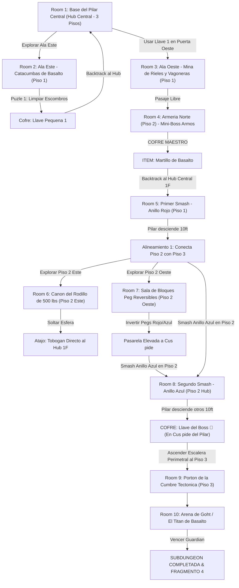

# 🪨 Subdungeon 4: El Dominio Telúrico (Layout No-Lineal estilo Snowhead Temple)

> **Ubicación**: `7 - DM/OneShots/ARepeat/Subdungeons/04_Subdungeon_Tierra_Dominio.md`  
> **Inspiración Verbatim**: **Snowhead Temple** (*Majora's Mask* - Edición Basalto)  
> **Regla de Diseño DM**: **CERO BLOQUEOS POR TIRADA OBLIGATORIA (No Skill-Check Gates)**. La progresión es 100% interactiva, mecánica y espacial. Las tiradas de dados son opcionales (evitar daño, ir más rápido o hallar secretos), pero el avance obligatorio NUNCA requiere fallar/pasar un dado.  
> **Estructura de Layout**: **Hub Central de 3 Pisos** + **Ala Este (Catacumbas)** + **Ala Oeste (Mina de Vagoneras)** + **Alineación Mecánica del Pilar Central** + **Backtracking con Dungeon Item**  
> **Dungeon Item**: *Martillo de Basalto* (Gran Megaton Hammer Telúrico)  
> **Guardián de Área**: *El Titán de Basalto* (Inspirado en *Goht / Scaldera*)  
> **Recompensa**: 🔓 Desbloqueo Permanente del Dominio Telúrico + Fragmento de Tablilla #4

---

## 🗺️ Mapa de Flujo No-Lineal de la Mazmorra (Snowhead Balanced Zelda Layout)

---

## 🏛️ Recorrido Verbatim Sala por Sala (DM Walkthrough & Backtracking)

### Room 1: Base del Pilar Central (Hub Central - 3 Pisos)
> *"Un gran atrio cilíndrico de tres pisos tallado en piedra volcánica. En su eje se alza un Pilar Central de Basalto de 30 pies formado por dos gigantescos Anillos Rúnicos (Anillo Rojo en 1F y Anillo Azul en 2F). Tres accesos destacan: al Este las Catacumbas, al Oeste un pasaje con cerrojo de latón 🗝️1, y al Norte, en el Piso 3, se yergue el Portón de la Cumbre 🔒."*
* **Mecánica Central**: El Pilar Central bloquea los balcones altos del Piso 3 hasta que sus anillos sean pulverizados con el *Martillo de Basalto*.

---

### Room 2: 🧩 Ala Este (Piso 1): Catacumbas de Basalto (OoT / MM)
> *"Una galería subterránea barrida por temblores donde losas de granito han colapsado sobre tumbas antiguas."*
* **Puzle Mecánico Sin Gating**:
  1. Desplazar la losa de falla de 300 lbs (*Fuerza DC 11 opcional para hacerlo de un solo empuje, o 1 minuto de palanca manual*) para liberar el paso.
  2. Derrotar a 3x Escarabajos Telúricos.
* **Botín**: Cofre con la **Llave Pequeña 🗝️1**.
* **🔄 BACKTRACKING**: Regresar al **Hub (Room 1)** e insertar la Llave 🗝️1 en la Puerta Oeste.

---

### Room 3: 🧩 Ala Oeste (Piso 1): Mina de Rieles y Vagoneras (TP / MM)
> *"Un complejo de rieles de minería donde una vagonera de granito está trabada en la aguja de cambio de vía."*
* **Puzle Mecánico Sin Gating**:
  1. Girar la aguja de la vía manualmente.
  2. Soltar el trinquete para que la vagonera ruede y colapse la pared de la cornisa elevada, abriendo el paso al Piso 2 Norte.

---

### Room 4: ⚔️ Mini-Boss (Piso 2 Norte): Armería Norte (Armos de la Cumbre MM)
> *"Una sala abovedada en el Piso 2 donde un autómata gigante de granito despierta al pisar el altar tectónico."*
* **Combate**: Armos de la Cumbre (AC 16, 52 HP). Golpear la gema rúnica de su espalda cuando gira.
* **🎁 COFRE MAESTRO**: Otorga el **Martillo de Basalto** (Gran Megaton Hammer capaz de pulverizar anillos de basalto, remaches tectónicos y bloques Peg).
* **🔄 BACKTRACKING & PRIMER IMPACTO**: Regresar a la base del **Hub (Room 1)** para asestar el primer golpe al pilar.

---

### Room 5: 🧩 Hub (Piso 1): Primer Smash al Pilar Central - Anillo Rojo (Snowhead MM)
> *"Pararse ante el Anillo de Basalto Rojo en la base del Pilar Central."*
* **Puzle Mecánico Sin Gating**: Asestar un golpe de carga completa con el *Martillo de Basalto* sobre el remache del Anillo Rojo.
* **Resultado**: ¡El Anillo Rojo de 10 pies sale despedido por los aires y se pulveriza! El Pilar Central desciende 10 pies. Esto alinea la pasarela del Piso 2 directamente con las entradas de Room 6 (Este) y Room 7 (Oeste).

---

### Room 6: 🧩 Piso 2 Este: Cañón del Rodillo de 500 lbs (Scaldera SS / MM)
> *"Un pasillo inclinado donde una esfera de basalto de 500 lbs descansa atrapada en un trinquete."*
* **Puzle Mecánico Sin Gating**: Golpear el trinquete con el *Martillo de Basalto*. La esfera rueda destruyendo el muro inferior y creando un **Tobogán Atajo Permanente** directo al Piso 1 del Hub.

---

### Room 7: 🧩 Piso 2 Oeste: Sala de Bloques Peg Reversibles (Snowhead MM)
> *"Una estancia con dos bloques Peg intercambiables (Rojo elevado / Azul hundido)."*
* **Puzle Mecánico Sin Gating**: Golpear el bloque Peg rojo con el *Martillo de Basalto* para hundirlo. Esto eleva el bloque Peg azul, formando una pasarela continua hacia la cima del pilar.

---

### Room 8: 🧩 Hub (Piso 2): Segundo Smash & Llave del Boss 👑 (Snowhead MM)
> *"De regreso a la pasarela del Piso 2, el grupo se posiciona ante el Anillo de Basalto Azul del pilar."*
* **Puzle Mecánico**:
  1. Asestar un segundo golpe con el *Martillo de Basalto* en el Anillo Azul.
  2. El pilar desciende otros 10 ft. La **cúspide plana del pilar** se nivela exactamente con la pasarela del Piso 2.
* **Botín**: Caminar por encima de la cima del pilar desprendido para abrir el cofre dorado con la **Llave del Boss 👑 (Llave de Goht)**.

---

### Room 9: 🔒 Portón de la Cumbre Tectónica (Piso 3)
> *"Ascender por la escalera perimetral (o cruzando la pasarela Peg de Room 7) al Piso 3 e insertar la Llave del Boss 👑."*

---

### Room 10: 💀 Boss Final: Goht / El Titán de Basalto (Snowhead MM)
> *"Una monumental pista circular de basalto donde Goht embiste a gran velocidad envuelto en chispas y rocas."*
* **Mecánica Boss**: Asestar martillazos mecánicos en las articulaciones de sus patas durante sus embestidas para hacerlo tropezar y rematar su vientre.
* **Recompensa**: 🔓 Desbloqueo permanente del Dominio Telúrico + **Fragmento de Tablilla #4**.

