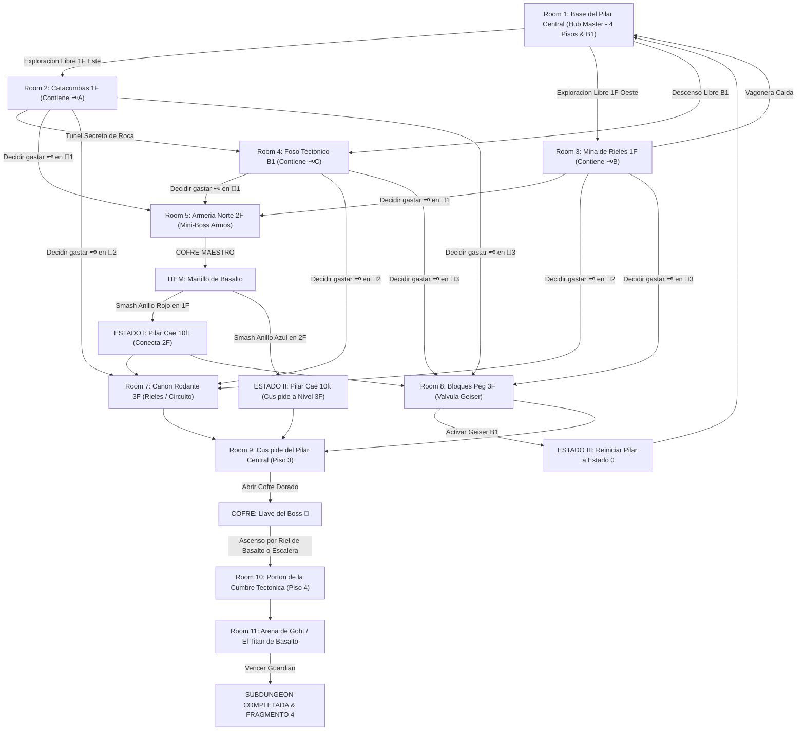

# 🪨 Subdungeon 4: El Dominio Telúrico (Zelda Macro-Dungeon: Snowhead / Stone Tower Style)

> **Ubicación**: `7 - DM/OneShots/ARepeat/Subdungeons/04_Subdungeon_Tierra_Dominio.md`  
> **Inspiración Verbatim**: **Snowhead Temple** (*Majora's Mask*) + **Stone Tower Temple** (*Majora's Mask*)  
> **Regla de Diseño DM**: **CERO BLOQUEOS POR TIRADA OBLIGATORIA (No Skill-Check Gates)**. La progresión es 100% interactiva, mecánica y espacial. Las tiradas de dados son opcionales (evitar daño, ir más rápido o hallar secretos), pero el avance obligatorio NUNCA requiere fallar/pasar un dado.  
> **Estructura de Layout**: **Hub Central de 4 Pisos + Foso B1** + **Macro-Gimmick: Alineación del Eje Rúnico (4 Estados Globales de Mazmorra)** + **Matriz No-Lineal de 3 Llaves Pequeñas e Intercambiables** + **Circuito de Vagoneras y Toboganes Verticales**  
> **Dungeon Item**: *Martillo de Basalto* (Gran Megaton Hammer Telúrico)  
> **Guardián de Área**: *El Titán de Basalto* (Inspirado en *Goht / Scaldera*)  
> **Recompensa**: 🔓 Desbloqueo Permanente del Dominio Telúrico + Fragmento de Tablilla #4

---

## ⚙️ El Macro-Gimmick Global: Alineación del Eje Rúnico (4 Estados del Pilar Central)

El corazón de la mazmorra es un Pilar Central de Basalto de 40 pies en un cilíndrico Hub Master (4 Pisos). El pilar está dividido en 4 anillos rúnicos (Rojo en 1F, Azul en 2F, Verde en 3F, Dorado en 4F). Asestar impactos con el *Martillo de Basalto* en los anillos los pulveriza, alterando mecánicamente la altura del pilar y las pasarelas que conecta en toda la mazmorra:

* **ESTADO 0 (Eje Elevado - Inicio)**: Conecta 1F Hub $\leftrightarrow$ 1F Este (Catacumbas) y 1F Oeste (Mina). Pisos 2 y 3 inaccesibles.
* **ESTADO I (Anillo Rojo Destruido)**: El pilar desciende 10 ft. Conecta 1F Hub $\leftrightarrow$ 2F Norte (Armería) y 2F Este (Cripta).
* **ESTADO II (Anillo Azul Destruido)**: El pilar desciende otros 10 ft. Conecta 2F West $\leftrightarrow$ 3F East (Cañón Rodante) y 3F West (Pegs). Cúspide al alcance de 3F.
* **ESTADO III (Geiser Neumático B1 Activado)**: Presionar la válvula neumática en el Foso B1 eleva una columna de vapor magmático que reinstala los anillos de basalto, **reiniciando la altura del pilar al Estado 0** a voluntad del grupo para resolver salas opcionales o rehacer recorridos.

---

## 🔑 Matriz No-Lineal de Llaves Pequeñas y Candados Intercambiables

El grupo puede encontrar hasta **3 Llaves Pequeñas (🗝️A, 🗝️B, 🗝️C)** en cualquier orden y decidir en qué **Puerta Candado (🚪1, 🚪2, 🚪3)** gastarlas primero, alterando el orden de resolución:

| Llave Pequeña | Ubicación Inicial | Acceso |
| :--- | :--- | :--- |
| **🗝️ Llave A** | Cofre sumergido en escombros (Room 2: Catacumbas 1F) | Libre desde 1F Este |
| **🗝️ Llave B** | Cofre en cornisa tras colapso de vagonera (Room 3: Mina 1F) | Requiere empujar vagonera (Libre 1F Oeste) |
| **🗝️ Llave C** | Cofre en cavidad rúnica (Room 4: Foso B1) | Requiere bajar por la grieta del Hub (Libre B1) |

| Puerta Candado | Destino | Ventaja de Abrir Primero |
| :--- | :--- | :--- |
| **🚪 Puerta 1** | Room 5: Armería Norte (Piso 2) | Acceso temprano al **Martillo de Basalto** (Dungeon Item). |
| **🚪 Puerta 2** | Room 7: Cañón Rodante (Piso 3 Este) | Desbloquea la red de rieles y el circuito de vagoneras directa a 1F. |
| **🚪 Puerta 3** | Room 8: Sala de Bloques Peg (Piso 3 Oeste) | Acceso directo a la válvula del Geiser Neumático para ciclar el Pilar. |

---

## 🗺️ Mapa de Flujo No-Lineal de la Mazmorra (Zelda Matrix Flowchart)

---

## 🏛️ Recorrido Verbatim Sala por Sala (Mecánicas Zelda & Conexiones 3D)

### Room 1: Base del Pilar Central (Hub Master - 4 Pisos & B1 Foso)
> *"Un monumental cilindro tectónico de cuatro niveles cruzado por pasarelas concéntricas de granito. En el eje vertical se alza un Pilar Central de 40 pies compuesto por 4 gigantescos Anillos Rúnicos (Rojo, Azul, Verde, Dorado). Al inicio, las pasarelas de los pisos 2, 3 y 4 no coinciden con las puertas de los pisos superiores. Desde el suelo del Piso 1 se observan tres accesos: Catacumbas (Este), Mina de Rieles (Oeste) y el abismo del Foso Tectónico (Grieta B1)."*
* **Mecánica Central**: Progresión totalmente interconectada. Ningún paso bloqueado por dados.

---

### Room 2: 🧩 Ala Este (Piso 1): Catacumbas de Basalto
> *"Criptas subterráneas barridas por derrumbes constantes donde sarcófagos de granito descansan bajo losas quebradas."*
* **Puzle Mecánico Sin Gating**:
  1. Desplazar la piedra de falla de 300 lbs (*Fuerza DC 11 opcional para hacerlo de un solo empuje, o 1 minuto de palanca manual*) para despejar el pasaje.
  2. Derrotar a 3x Escarabajos Telúricos.
* **Botín**: Cofre con la **Llave Pequeña 🗝️A**.
* **🔄 CONEXIONES NO-LINEALES**:
  - Regresar al Hub (Room 1).
  - Volar la pared de mampostería agrietada (o romperla con vagonera) para caer al **Foso Tectónico (Room 4)**.

---

### Room 3: 🧩 Ala Oeste (Piso 1): Mina de Rieles y Vagoneras
> *"Un complejo minero con rieles suspendidos sobre el vacío. Una vagonera de granito está encallada en el trinquete principal."*
* **Puzle Mecánico Sin Gating**:
  1. Accionar la aguja del cambio de vía manualmente.
  2. Soltar el pasador de freno de la vagonera. La vagonera ruede por la vía en pendiente y descarrila contra el muro inferior, derrumbando una cornisa.
* **Botín**: El derrumbe hace caer el cofre con la **Llave Pequeña 🗝️B**.
* **🔄 CONEXIONES NO-LINEALES**:
  - La vía vacía despeja un túnel de retorno directo a la pasarela del **Hub 1F**.

---

### Room 4: 🧩 Foso Tectónico Subterráneo (Piso B1): La Geoda Neumática
> *"Una caverna abisal bajo el templo alimentada por un geiser magmático encajonado en pistones de bronce."*
* **Puzle Mecánico Sin Gating**: Girar la llave de paso de vapor permite accionar una plataforma elevadora de presión para subir a cualquier piso.
* **Botín**: Cofre en nicho rúnico con la **Llave Pequeña 🗝️C**.
* **Mecánica Reset (Estado III)**: Una vez obtenido el *Martillo de Basalto*, golpear el pistón principal del geiser dispara una columna de vapor que eleva el pilar central y restaura sus anillos desprendidos, reiniciando la mazmorra al **Estado 0** en cualquier momento.

---

### Room 5: ⚔️ Armería Norte (Piso 2): Mini-Boss Armos (Requiere 1x Llave Pequeña en 🚪1)
> *"Una estancia abovedada en el Piso 2 donde un autómata gigante de granito de 12 pies permanece petrificado sobre un altar tectónico."*
* **Combate**: Armos de la Cumbre (AC 16, 52 HP). Golpear la gema rúnica de su espalda cuando gira.
* **🎁 COFRE MAESTRO**: Otorga el **Martillo de Basalto** (Gran Megaton Hammer capaz de pulverizar anillos de basalto, remaches tectónicos y bloques Peg).

---

### Room 6: 🧩 Hub Central: Mecanismo del Eje (Impactos de Martillo & Cambio de Estados)
> *"Posicionarse ante los anillos del Pilar Central con el Martillo de Basalto."*
* **Puzle de Estado I (Smash Anillo Rojo en 1F)**: Impactar el remache rojo pulveriza el Anillo Rojo. El pilar desciende 10 ft. **Las pasarelas de Piso 2 se alinean con las salas de Piso 3 (Room 7 y Room 8)**.
* **Puzle de Estado II (Smash Anillo Azul en 2F)**: Impactar el remache azul pulveriza el Anillo Azul. El pilar desciende otros 10 ft. **La cúspide plana del pilar queda a nivel del Piso 3**, permitiendo caminar por encima de su corona.

---

### Room 7: 🧩 Piso 3 Este: Cañón Rodante & Circuito de Vagoneras (🚪2)
> *"Un canal inclinado por donde ruedan esferas de basalto de 500 lbs impulsadas por bielas mecánicas."*
* **Puzle Mecánico Sin Gating**: Golpear la biela con el *Martillo de Basalto* frena el flujo de esferas y desvía la vía minera.
* **Circuito de Vagonera**: Montar en la vagonera superior transporta a los jugadores en un vertiginoso viaje por el exterior del templo, aterrizando en la cornisa superior del Hub (Piso 3).

---

### Room 8: 🧩 Piso 3 Oeste: Sala de Bloques Peg Reversibles (🚪3)
> *"Una estancia con una matriz de bloques Peg intercambiables (Rojos elevados / Azules hundidos)."*
* **Puzle Mecánico Sin Gating**: Usar el *Martillo de Basalto* para rematar los bloques Peg rojos. Esto eleva los bloques Peg azules, formando una pasarela continua hacia la cúspide del pilar.
* **Válvula del Geiser**: Contiene una palanca neumática secundaria que se conecta con el Foso B1 (Room 4).

---

### Room 9: 🧩 Cúspide del Pilar Central (Piso 3): La Llave del Boss 👑
> *"Caminar por la corona de basalto del pilar central una vez alineado en Estado II o cruzar por la pasarela de Bloques Peg (Room 8)."*
* **Botín**: Abrir el cofre dorado monumental para reclamar la **Llave del Boss 👑 (Llave de Goht)**.

---

### Room 10: 🔒 Portón de la Cumbre Tectónica (Piso 4)
> *"Ascender por la escalera perimetral del Hub (o impulsarse en un bloque Peg invertido) al Piso 4 e insertar la Llave del Boss 👑."*

---

### Room 11: 💀 Boss Final: Goht / El Titán de Basalto (Snowhead MM)
> *"Una monumental pista circular de basalto donde Goht embiste a gran velocidad envuelto en chispas y rocas."*
* **Mecánica Boss**: Asestar martillazos mecánicos en las articulaciones de sus patas durante sus embestidas para hacerlo tropezar y rematar su vientre.
* **Recompensa**: 🔓 Desbloqueo permanente del Dominio Telúrico + **Fragmento de Tablilla #4**.
