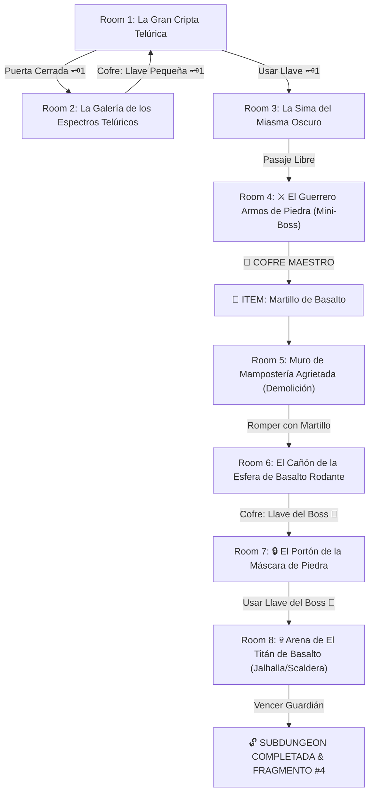

# 🪨 Subdungeon 4: El Dominio Telúrico (Inspirada en Earth Temple - Wind Waker & Skyward Sword)

> **Ubicación**: `7 - DM/OneShots/ARepeat/Subdungeons/04_Subdungeon_Tierra_Dominio.md`  
> **Inspiración Directa**: **Earth Temple** (*The Legend of Zelda: The Wind Waker*) + **Earth Temple** (*Skyward Sword*)  
> **Mecánicas Clave**: **Reflexión de Luz Telúrica**, **Demolición con Gran Martillo** y **Esferas Rodantes de Basalto**  
> **Dungeon Item**: *Martillo de Basalto* (Gran Megatonal Hammer)  
> **Guardián de Área**: *El Titán de Basalto* (Inspirado en *Jalhalla / Scaldera*)  
> **Recompensa**: 🔓 Desbloqueo Permanente del Dominio Telúrico + Fragmento de Tablilla #4

---

## 🗺️ Mapa de Flujo de la Mazmorra (Earth Temple Layout)

---

## 🏛️ Recorrido Verbatim Sala por Sala (Earth Temple Walkthrough)

### Room 1: La Gran Cripta Telúrica (Entrada)
> *"Una gruta ancestral tallada en piedra con estatuas de jueces telúricos cubiertas por niebla purpúrea. En el centro, un haz solar débil incide sobre un espejo rúnico. Al norte, un portón de granito con un ojo de cerradura de piedra 🗝️1 bloquea el camino."*
* **Estética**: Tumbas antiguas, estalactitas, espejos reflectantes de bronce, miasma terrenal.
* **Puertas**: Sur (Entrada), Norte (Locked 🗝️1), Este (Abierta).
* **Acción DM**: Explorar las catacumbas del Este (Room 2) para recuperar la Llave Pequeña 🗝️1.

---

### Room 2: La Galería de los Espectros Telúricos (Llave Pequeña #1)
> *"Un pasillo flanqueado por sarcófagos de basalto de los que emana una niebla fría. En el fondo, tras un espejo de piedra oscurecido, descansa un cofre de granito."*
* **Enemigos**: 3x Estatuas Floormaster / Poe Telúricos (AC 13, 15 HP).
* **Resolución**: Girar el espejo de la entrada para reflejar la luz sobre los enemigos (los petrifica 1 ronda) y tomar la **Llave Pequeña 🗝️1** del cofre.

---

### Room 3: La Sima del Miasma Oscuro
> *"Una sima profunda inundada de miasma telúrico venenoso. Losas de piedra tambaleantes giran sobre pivotes centrados."*
* **Puertas**: Sur (Locked 🗝️1 de vuelta), Norte (Puerta del Mini-Boss).
* **Resolución**: Usar la Llave 🗝️1 y colocar cuñas de piedra en los pivotes (*Fuerza DC 12*) para estabilizar las losas sobre la sima.

---

### Room 4: ⚔️ El Guerrero Armos de Piedra (Mini-Boss & Dungeon Item)
> *"Un autómata de granito de 14 pies de altura provisto de un gran mazo de basalto y un broquel impenetrable."*
* **Mini-Boss**: **Armos Telúrico** (AC 16, 52 HP).
* **🎁 COFRE MAESTRO**: Contiene el **Martillo de Basalto** (Gran Megatonal Hammer que pulveriza muros agrietados, hunde estacas de ancla y destruye armaduras de piedra).

---

### Room 5: Muro de Mampostería Agrietada (Demolición)
> *"Una gruesa pared de roca con profundas grietas estructurales bloquea el paso hacia las galerías inferiores."*
* **Puzle**: Asestar un golpe de impacto con el recién obtenido *Martillo de Basalto*.
* **Resultado**: El muro colapsa en escombros (Isaac Shatter), liberando el pasadizo hacia Room 6.

---

### Room 6: El Cañón de la Esfera de Basalto Rodante (Llave del Boss 👑)
> *"Un pasillo inclinado donde una esfera masiva de basalto de 500 lbs descansa sobre un trinquete. Al final del cañón hay una barrera de estelas que bloquea un cofre dorado."*
* **Puzle**: Asestar un golpe de martillo al trinquete de hierro. La esfera desciende rodando por el canal y pulveriza la barrera de estelas del fondo (estilo Scaldera).
* **Botín**: Rescatar del nicho destruido la **Llave del Boss 👑 (Llave de la Máscara de Piedra)**.

---

### Room 7: 🔒 El Portón de la Máscara de Piedra
> *"Un portón masivo grabado con el rostro de un rey telúrico cuyos ojos de piedra se abren únicamente al recibir la llave sagrada."*
* **Resolución**: Insertar la **Llave del Boss 👑** para que la losa del portón se eleve hacia el techo.

---

### Room 8: 💀 Arena de El Titán de Basalto (Jalhalla / Scaldera Boss)
> *"Una gran gruta de techos bajos donde El Titán de Basalto (un coloso de magma y coraza rocosa de 15 pies) hace retumbar la cueva."*
* **Mecánica Boss**: Ver ficha en [`05_Arena_del_Titan_de_Basalto.md`](file:///Users/matiasbay/Documents/Obsidian/Shivath/7%20-%20DM/OneShots/ARepeat/Salas/07_Salas_Especiales/05_Arena_del_Titan_de_Basalto.md). Impactar con el *Martillo de Basalto* agrieta su coraza y expone su núcleo interior durante 1 ronda.
* **Recompensa**: 🔓 Desbloqueo permanente del Dominio Telúrico + **Fragmento de Tablilla #4**.
