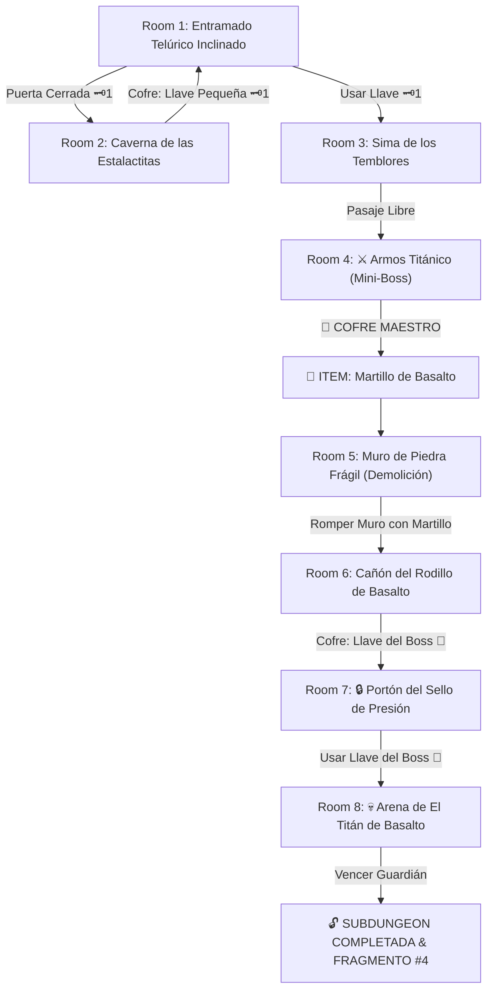

# 🪨 Subdungeon 4: El Dominio Telúrico (Earth Temple Verbatim)

> **Ubicación**: `7 - DM/OneShots/ARepeat/Subdungeons/04_Subdungeon_Tierra_Dominio.md`  
> **Estilo**: Zelda Classic Dungeon Layout  
> **Dungeon Item**: *Martillo de Basalto*  
> **Guardián de Área**: *El Titán de Basalto*  
> **Recompensa**: 🔓 Desbloqueo Permanente del Dominio Telúrico + Fragmento de Tablilla #4

---

## 🗺️ Mapa de Flujo de la Mazmorra (Zelda Diagram)

---

## 🏛️ Recorrido Verbatim Sala por Sala (DM Walkthrough)

### Room 1: Entramado Telúrico Inclinado (Entrada)
> *"La estancia se encuentra desequilibrada, inclinada 20 grados sobre un pivote sísmico. El muro norte exhibe un portón de piedra masiva con un cerrojo de hierro 🗝️1. El paso del Este conduce a una mina baja."*
* **Puertas**: Sur (Entrada), Norte (Locked 🗝️1), Este (Abierta).
* **Acción DM**: Los exploradores deben resbalar hacia la derecha (Room 2) para hallar la Llave Pequeña 🗝️1.

---

### Room 2: Caverna de las Estalactitas (Llave Pequeña #1)
> *"Una gruta minera donde vibraciones continuas hacen desprender escombros del techo. En una repisa tras un muro de roca descansa un cofre de basalto."*
* **Enemigos**: 3x Escarabajos Telúricos (AC 14, 16 HP).
* **Resolución**: Vencer a los escarabajos y esquivar las estalactitas (*Reflejos DC 12*) para tomar la **Llave Pequeña 🗝️1**.

---

### Room 3: Sima de los Temblores Telúricos
> *"Grandes losas de suelo de piedra vibran sobre un foso lleno de estalagmitas. Al usar la Llave 🗝️1, la compuerta se abre hacia la cámara del Mini-Boss."*
* **Puertas**: Sur (Locked 🗝️1 de vuelta), Norte (Puerta del Mini-Boss).
* **Resolución**: Insertar la Llave 🗝️1 y colocar cuñas de piedra (*Fuerza DC 12*) para trabar las losas y cruzar.

---

### Room 4: ⚔️ Guardia del Armos Titánico (Mini-Boss & Dungeon Item)
> *"Una colosal estatua de piedra de 12 pies de altura con un escudo de granito cobra vida con un estruendo ensordecedor."*
* **Mini-Boss**: **Armos Titánico** (AC 16, 52 HP; Inmune a cortes/flechas; Vulnerable a golpes de maza).
* **Estrategia DM**: Salta creando ondas de choque. Derrotarlo permite abrir el cofre del templo.
* **🎁 COFRE MAESTRO**: Contiene el **Martillo de Basalto** (Permite pulverizar muros agrietados, golpear estacas de ancla y romper armaduras de piedra).

---

### Room 5: Muro de Piedra Frágil (Demolición Isaac)
> *"Un grueso muro de mampostería antigua bloquea el pasillo por completo, exhibiendo profundas grietas estructurales por las que cae polvo constante."*
* **Puzle**: Asestar un golpe de impacto directo con el recién obtenido *Martillo de Basalto*.
* **Resultado**: El muro se desploma en escombros (Isaac Shatter), abriendo paso a Room 6.

---

### Room 6: El Cañón del Rodillo de Basalto (Llave del Boss 👑)
> *"Un pasillo inclinado donde descansa una esfera masiva de basalto de 500 lbs retenida por un trinquete. Al final del pasillo hay una barricada que custodia un cofre dorado."*
* **Puzle**: Golpear el trinquete con el *Martillo de Basalto*. La esfera rueda por el canal y destruye la barricada del fondo.
* **Botín**: Abrir el cofre detrás de los escombros para reclamar la **Llave del Boss 👑 (Llave del Yunque)**.

---

### Room 7: 🔒 Portón del Sello de Presión
> *"Una losa masiva en el suelo conectada a pesados pasadores de hierro en el portón final. Requiere la Llave del Yunque para liberar la traba."*
* **Resolución**: Insertar la **Llave del Boss 👑** para desenganchar los pasadores de piedra.

---

### Room 8: 💀 Arena de El Titán de Basalto (Guardián de Tierra)
> *"Una gruta de techos bajos donde El Titán de Basalto se yergue con una coraza de piedra impenetrable."*
* **Mecánica Boss**: Ver ficha en [`05_Arena_del_Titan_de_Basalto.md`](file:///Users/matiasbay/Documents/Obsidian/Shivath/7%20-%20DM/OneShots/ARepeat/Salas/07_Salas_Especiales/05_Arena_del_Titan_de_Basalto.md). Golpear con el *Martillo de Basalto* agrieta su coraza y remueve su inmunidad 1 ronda.
* **Recompensa**: 🔓 Desbloqueo permanente del Dominio Telúrico + **Fragmento de Tablilla #4**.
