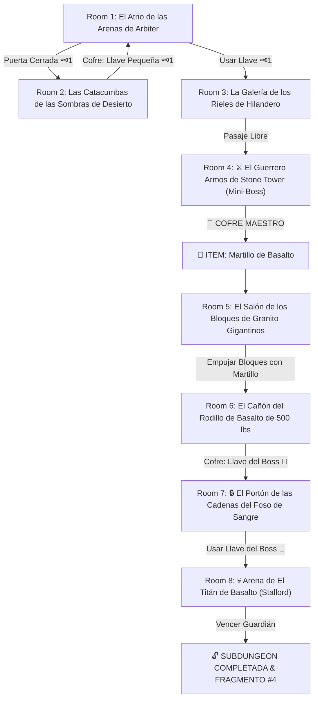

# 🪨 Subdungeon 4: El Dominio Telúrico (Inspirada en Arbiter's Grounds - TP & Stone Tower - MM sin gravedad)

> **Ubicación**: `7 - DM/OneShots/ARepeat/Subdungeons/04_Subdungeon_Tierra_Dominio.md`  
> **Inspiración Directa**: **Arbiter's Grounds** (*Twilight Princess*) + **Stone Tower Temple** (*Majora's Mask* - Sin Inversión de Gravedad)  
> **Mecánicas Clave**: **Rieles de Hilandero en la Arena**, **Bloques de Granito Gigantinos de Stone Tower**, **Arenas Movedizas** y **Gran Martillo de Basalto**  
> **Dungeon Item**: *Martillo de Basalto* (Gran Megaton Hammer Telúrico)  
> **Guardián de Área**: *El Titán de Basalto* (Inspirado en *Stallord / Armos Coloso*)  
> **Recompensa**: 🔓 Desbloqueo Permanente del Dominio Telúrico + Fragmento de Tablilla #4

---

## 🗺️ Mapa de Flujo de la Mazmorra (Arbiter's Grounds / Stone Tower Layout)

---

## 🏛️ Recorrido Verbatim Sala por Sala (Arbiter's Grounds / Stone Tower Walkthrough)

### Room 1: El Atrio de las Arenas de Arbiter (Entrada)
> *"Una monumental prisión del desierto excavada en la piedra rojiza. El suelo está cubierto por ríos de arena movediza que fluyen lentamente. A los lados se erigen colosales estatuas de piedra al estilo de Stone Tower. Al norte, un espeso portón de hierro con un ojo de cerradura de latón 🗝️1 bloquea el avance."*
* **Estética**: Jeroglíficos del desierto, cadenas colgantes, rieles esculpidos en los muros de piedra, estatuas gigantinas de Stone Tower.
* **Puertas**: Sur (Entrada), Norte (Locked 🗝️1), Este (Abierta).
* **Acción DM**: Descender a las catacumbas del Este (Room 2) para hallar la Llave Pequeña 🗝️1.

---

### Room 2: Las Catacumbas de las Sombras de Desierto (Llave Pequeña #1)
> *"Un corredor de sarcófagos de granito donde la arena se filtra por las grietas del techo. En una repisa tras un foso de arena movediza descansa un cofre."*
* **Enemigos**: 3x Espectros Poe del Desierto / Moldorm de Arena (AC 13, 15 HP).
* **Resolución**: Cruzar esquivando la succión de la arena (*Atletismo DC 11*) y derrotar a los enemigos para tomar la **Llave Pequeña 🗝️1**.

---

### Room 3: La Galería de los Rieles de Hilandero (Arbiter's Grounds)
> *"Un pasadizo donde rieles de piedra esculpidos recorren las paredes sobre un abismo de arena. Al usar la Llave 🗝️1, la compuerta se eleva hacia la cámara del Mini-Boss."*
* **Puertas**: Sur (Locked 🗝️1 de vuelta), Norte (Puerta del Mini-Boss).
* **Resolución**: Insertar la Llave 🗝️1 y colocar cuñas de basalto (*Fuerza DC 12*) para fijar la pasarela del riel.

---

### Room 4: ⚔️ El Guerrero Armos de Stone Tower (Mini-Boss & Dungeon Item)
> *"Un colosal autómata de granito de 14 pies de altura inspirado en los guardianes de Stone Tower que despierta con un golpe de mazo."*
* **Mini-Boss**: **Armos de Stone Tower** (AC 16, 52 HP; inmune a cortes/flechas).
* **🎁 COFRE MAESTRO**: Contiene el **Martillo de Basalto** (Gran Megaton Hammer telúrico que pulveriza bloques de piedra, desengancha cadenas de traba y destruye armaduras minerales).

---

### Room 5: El Salón de los Bloques de Granito Gigantinos (Stone Tower Blocks)
> *"Una inmensa cámara con bloques de granito cuadrados de 10 pies de lado que bloquean el paso. En los bloques destacan hendiduras para recibir impactos de gran masa."*
* **Puzle**: Asestar impactos directos con el recién obtenido *Martillo de Basalto* en la base de los bloques de granito.
* **Resultado**: El martillo desplaza los bloques gigantinos por los rieles del suelo (estilo puzles de bloques de Stone Tower MM) abriendo paso a Room 6.

---

### Room 6: El Cañón del Rodillo de Basalto de 500 lbs (Llave del Boss 👑)
> *"Un pasillo inclinado donde una esfera masiva de basalto de 500 lbs descansa sobre un trinquete de hierro. Al final del cañón hay una barricada de estelas que custodia un cofre dorado."*
* **Puzle**: Golpear el trinquete con el *Martillo de Basalto*. La esfera rueda estruendosamente por el canal pulverizando la barricada del fondo.
* **Botín**: Abrir el cofre detrás de los escombros para reclamar la **Llave del Boss 👑 (Llave de Stallord)**.

---

### Room 7: 🔒 El Portón de las Cadenas del Foso de Sangre
> *"Un portón masivo de granito custodiado por cadenas de traba tectónica conectadas a la arena del boss."*
* **Resolución**: Insertar la **Llave del Boss 👑** y golpear la losa de ancla con el *Martillo de Basalto* para retraer las cadenas.

---

### Room 8: 💀 Arena de El Titán de Basalto (Stallord Boss)
> *"Un foso circular de arena movediza dominado por una columna central de espinas donde Stallord (un colosal dragón esquelético fosilizado en la roca) emerge rugiendo."*
* **Mecánica Stallord**: Ver ficha en [`05_Arena_del_Titan_de_Basalto.md`](file:///Users/matiasbay/Documents/Obsidian/Shivath/7%20-%20DM/OneShots/ARepeat/Salas/07_Salas_Especiales/05_Arena_del_Titan_de_Basalto.md). Usar el *Martillo de Basalto* para golpear la columna central y la columna vertebral del boss aturdiéndolo 1 ronda.
* **Recompensa**: 🔓 Desbloqueo permanente del Dominio Telúrico + **Fragmento de Tablilla #4**.
