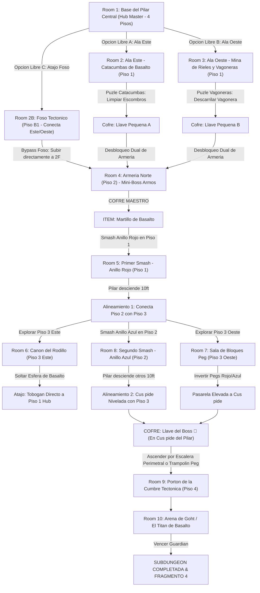

# 🪨 Subdungeon 4: El Dominio Telúrico (Layout No-Lineal & Dinámico estilo Snowhead Temple)

> **Ubicación**: `7 - DM/OneShots/ARepeat/Subdungeons/04_Subdungeon_Tierra_Dominio.md`  
> **Inspiración Verbatim**: **Snowhead Temple** (*Majora's Mask* - Edición Basalto 100% Roca)  
> **Regla de Diseño DM**: **CERO BLOQUEOS POR TIRADA OBLIGATORIA (No Skill-Check Gates)**. La progresión es 100% interactiva, mecánica y espacial. Las tiradas de dados son opcionales (evitar daño, ir más rápido o hallar secretos), pero el avance obligatorio NUNCA requiere fallar/pasar un dado.  
> **Estructura de Layout**: **Hub Central Cilíndrico (4 Pisos)** + **Exploración Paralela Libre (Ala Este / Ala Oeste / Foso Subterráneo B1)** + **Mecánica Dinámica de Anillos del Pilar Central** + **2 Caminos Independientes a la Llave del Boss**  
> **Dungeon Item**: *Martillo de Basalto* (Gran Megaton Hammer Telúrico)  
> **Guardián de Área**: *El Titán de Basalto* (Inspirado en *Goht / Scaldera*)  
> **Recompensa**: 🔓 Desbloqueo Permanente del Dominio Telúrico + Fragmento de Tablilla #4

---

## 🗺️ Mapa de Flujo No-Lineal de la Mazmorra (Snowhead Complex Dynamic Multi-Floor Layout)

---

## 🏛️ Recorrido Verbatim Sala por Sala con Puzles e Interconexiones

### Room 1: Base del Pilar Central (Hub Master - 4 Pisos)
> *"Una majestuosa catedral cilíndrica de cuatro pisos. En su eje central se alza un monumental Pilar Central de Basalto de 40 pies formado por tres gigantescos Anillos Rúnicos desmontables (Rojo en 1F, Azul en 2F, Verde en 3F). En el Piso 1 existen tres accesos inmediatos: el Ala Este (Catacumbas), el Ala Oeste (Mina) y una grieta descendente al Foso Tectónico (Piso B1). En el Piso 2 se encuentra la Armería Norte (Locked 🔒 Puerta de Cerrojo Dual). En el Piso 4 domina el Portón de la Cumbre 🔒."*
* **Mecánica No-Lineal**: El grupo tiene libertad total de explorar Ala Este, Ala Oeste o descender al Foso B1 desde el primer segundo. No hay orden impuesto.

### Room 2: 🧩 Ala Este (Piso 1): Catacumbas de Basalto (OoT / MM)
> *"Un complejo de criptas donde temblores desprenden losas sobre sarcófagos antiguos."*
* **Puzle Mecánico Sin Gating**:
  1. Mover la piedra de falla (*Fuerza DC 11 opcional para despejar de un solo empuje, o 1 minuto de trabajo en equipo*) para liberar el acceso.
  2. Derrotar 3x Escarabajos Telúricos.
* **Botín**: Cofre con la **Llave Pequeña A 🗝️**.
* **🔄 OPCIONES DE CONEXIÓN**:
  - Volver al Hub (Room 1).
  - Descender por la rampa trasera hacia el **Foso Tectónico (Room 2B)** para cruzar directamente al Ala Oeste sin pasar por el Hub.

### Room 2B: 🧩 Foso Tectónico Subterráneo (Piso B1 - Atajo Inter-Alas)
> *"Una caverna sin clavar por debajo del pilar central donde gruesas raíces tectónicas cruzan el abismo."*
* **Mecánica Sin Gating**: Trepar por las raíces o accionar la palanca hidráulica permite moverse fluidamente entre Ala Este (Room 2) y Ala Oeste (Room 3), o subir mediante una escalera de contrapeso directamente al Piso 2 del Hub.

### Room 3: 🧩 Ala Oeste (Piso 1): Mina de Rieles y Vagoneras (TP / MM)
> *"Un sistema de minería donde una vagonera de granito está trabada en la aguja de cambio de vía."*
* **Puzle Mecánico Sin Gating**:
  1. Girar el interruptor de la vía manualmente.
  2. Soltar el trinquete de la vagonera para que ruede y colapse el muro de basalto débil.
* **Botín**: Al caer el muro, se revela el cofre con la **Llave Pequeña B 🗝️**.
* **🔄 RESOLUCIÓN PRE-ITEM**: Con la **Llave A** y la **Llave B** (o usando el elevador del Foso B1), el grupo asciende al Piso 2 del Hub y abre el cerrojo dual de la Armería Norte (Room 4).

### Room 4: ⚔️ Mini-Boss (Piso 2 Norte): Armería Norte (Armos de la Cumbre MM)
> *"Una armería abovedada donde un coloso autómata de granito despierta al pisar el altar tectónico."*
* **Combate**: Armos de la Cumbre (AC 16, 52 HP). Golpear la gema de su espalda cuando gira.
* **🎁 COFRE MAESTRO**: Otorga el **Martillo de Basalto** (Gran Megaton Hammer capaz de pulverizar anillos de basalto, remaches tectónicos y bloques Peg).

### Room 5: 🧩 Hub (Piso 1): Primer Smash al Pilar Central - Anillo Rojo (Snowhead MM)
> *"Ante el Anillo de Basalto Rojo en la base del Pilar Central."*
* **Puzle Mecánico Sin Gating**: Asestar un golpe de carga completa con el *Martillo de Basalto* sobre el remache del Anillo Rojo.
* **Resultado**: ¡El Anillo Rojo de 10 pies sale despedido por los aires y se pulveriza! El Pilar Central desciende 10 pies hacia el suelo. Esto alinea la pasarela del Piso 2 directamente con las entradas del **Piso 3 Este (Room 6)** y **Piso 3 Oeste (Room 7)**.

### Room 6: 🧩 Piso 3 Este: Cañón del Rodillo de 500 lbs (Scaldera SS / MM)
> *"Un corredor inclinado donde una esfera de basalto de 500 lbs descansa atrapada en una biela tectónica."*
* **Puzle Mecánico Sin Gating**: Golpear la biela con el *Martillo de Basalto*. La esfera rueda destruyendo el muro inferior y creando un **Tobogán Atajo Permanente** directo al Piso 1 del Hub.

### Room 7: 🧩 Piso 3 Oeste: Sala de Bloques Peg Reversibles (Snowhead MM)
> *"Una estancia con una matriz de bloques Peg intercambiables (Rojo elevado / Azul hundido)."*
* **Puzle Mecánico Sin Gating**: Usar el *Martillo de Basalto* para rematar los bloques Peg rojos. Esto eleva los bloques Peg azules, formando una pasarela elevada hacia el eje del Pilar Central.

### Room 8: 🧩 Hub (Piso 2/3): Segundo Smash al Pilar - Anillo Azul & Llave del Boss (Snowhead MM)
> *"Con las pasarelas del Piso 3 despejadas, el grupo se posiciona ante el Anillo de Basalto Azul del pilar."*
* **Mecánica No-Lineal**:
  1. Asestar un segundo golpe con el *Martillo de Basalto* en el Anillo Azul.
  2. El pilar desciende otros 10 ft, dejando su **Cúspide plana** perfectamente nivelada con las pasarelas del Piso 3.
* **Botín (Llave del Boss 👑)**:
  - *Opción A*: Caminar libremente por encima de la cima del pilar desprendido.
  - *Opción B*: Cruzar por la pasarela de Bloques Peg (Room 7) si se resolvió previamente.
  - Cofre dorado con la **Llave del Boss 👑 (Llave de Goht)**.

### Room 9: 🔒 Portón de la Cumbre Tectónica (Piso 4)
> *"Ascender por la escalera perimetral (o catapultarse mediante un bloque Peg invertido) al Piso 4 e insertar la Llave del Boss 👑."*

### Room 10: 💀 Boss Final: Goht / El Titán de Basalto (Snowhead MM)
> *"Una monumental pista circular de basalto donde Goht embiste a gran velocidad envuelto en chispas y rocas."*
* **Mecánica Boss**: Asestar martillazos mecánicos en las articulaciones de sus patas durante sus embestidas para hacerlo tropezar y rematar su vientre.
* **Recompensa**: 🔓 Desbloqueo permanente del Dominio Telúrico + **Fragmento de Tablilla #4**.
