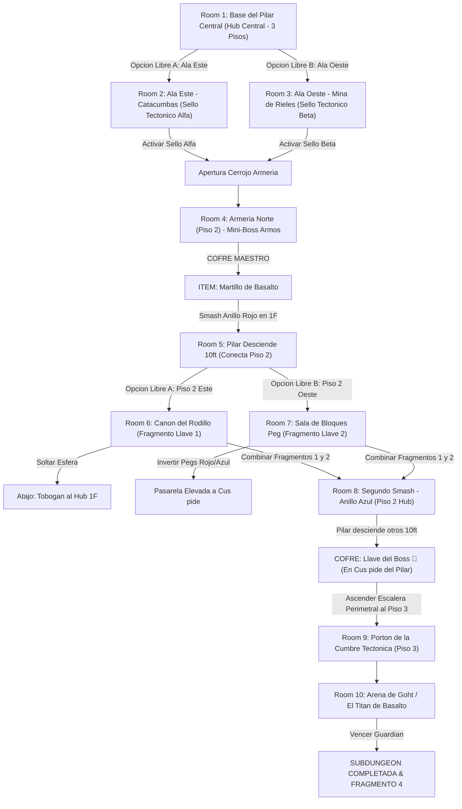

# 🪨 Subdungeon 4: El Dominio Telúrico (Layout No-Lineal con Ramificación Doble estilo Snowhead Temple)

> **Ubicación**: `7 - DM/OneShots/ARepeat/Subdungeons/04_Subdungeon_Tierra_Dominio.md`  
> **Inspiración Verbatim**: **Snowhead Temple** (*Majora's Mask* - Edición Basalto)  
> **Regla de Diseño DM**: **CERO BLOQUEOS POR TIRADA OBLIGATORIA (No Skill-Check Gates)**. La progresión es 100% interactiva, mecánica y espacial. Las tiradas de dados son opcionales (evitar daño, ir más rápido o hallar secretos), pero el avance obligatorio NUNCA requiere fallar/pasar un dado.  
> **Estructura de Layout**: **Hub Central de 3 Pisos** + **Ramificación Paralela Pre-Item (Ala Este & Ala Oeste)** + **Ramificación Paralela Post-Item (Cañón Rodante & Bloques Peg)** + **Pilar Central Tectónico**  
> **Dungeon Item**: *Martillo de Basalto* (Gran Megaton Hammer Telúrico)  
> **Guardián de Área**: *El Titán de Basalto* (Inspirado en *Goht / Scaldera*)  
> **Recompensa**: 🔓 Desbloqueo Permanente del Dominio Telúrico + Fragmento de Tablilla #4

---

## 🗺️ Mapa de Flujo No-Lineal de la Mazmorra (Snowhead Dual-Branching Layout)

---

## 🏛️ Recorrido Verbatim Sala por Sala (DM Walkthrough & Parallel Flow)

### Room 1: Base del Pilar Central (Hub Central - 3 Pisos)
> *"Un monumental atrio cilíndrico de tres pisos. En su eje se alza un Pilar Central de Basalto de 30 pies compuesto por dos Anillos Rúnicos (Anillo Rojo en 1F y Anillo Azul en 2F). Desde el suelo del Piso 1 parten dos entradas abiertas en paralelo: el Ala Este (Catacumbas) y el Ala Oeste (Mina). Al norte, en el Piso 3, domina el Portón de la Cumbre 🔒."*
* **Mecánica No-Lineal**: El grupo puede explorar Ala Este (Room 2) o Ala Oeste (Room 3) en cualquier orden.

---

### Room 2: 🧩 Ala Este (Piso 1): Catacumbas de Basalto (Sello Alfa)
> *"Una galería subterránea barrida por temblores donde losas de granito han colapsado sobre sarcófagos antiguos."*
* **Puzle Mecánico Sin Gating**: Desplazar la losa de falla de 300 lbs (*Fuerza DC 11 opcional*) y derrotar a 3x Escarabajos Telúricos para activar el **Sello Tectónico Alfa**.

---

### Room 3: 🧩 Ala Oeste (Piso 1): Mina de Rieles y Vagoneras (Sello Beta)
> *"Un complejo de rieles de minería donde una vagonera de granito está trabada en la aguja de cambio de vía."*
* **Puzle Mecánico Sin Gating**: Girar la aguja de la vía y soltar el trinquete para que la vagonera colapse el muro inferior, activando el **Sello Tectónico Beta**.
* **Apertura de Armería**: Al activar los sellos Alfa y Beta en cualquier orden, los pesados cerrojos del Piso 2 Norte se liberan (Room 4).

---

### Room 4: ⚔️ Mini-Boss (Piso 2 Norte): Armería Norte (Armos de la Cumbre MM)
> *"Una sala abovedada en el Piso 2 donde un autómata gigante de granito despierta al pisar el altar."*
* **Combate**: Armos de la Cumbre (AC 16, 52 HP). Golpear la gema rúnica de su espalda cuando gira.
* **🎁 COFRE MAESTRO**: Otorga el **Martillo de Basalto** (Gran Megaton Hammer capaz de pulverizar anillos de basalto, remaches tectónicos y bloques Peg).

---

### Room 5: 🧩 Hub (Piso 1): Primer Smash al Pilar Central - Anillo Rojo (Snowhead MM)
> *"Posicionarse ante el Anillo de Basalto Rojo en la base del Pilar Central con el martillo."*
* **Puzle Mecánico**: Asestar un golpe de carga completa sobre el remache del Anillo Rojo.
* **Resultado**: ¡El Anillo Rojo se pulveriza y el Pilar Central desciende 10 feet! Esto alinea las pasarelas del Piso 2 directamente con **dos nuevas áreas paralelas**: Room 6 (Piso 2 Este) y Room 7 (Piso 2 Oeste).

---

### Room 6: 🧩 Piso 2 Este: Cañón del Rodillo de 500 lbs (Scaldera SS / MM)
> *"Un pasillo inclinado donde una esfera de basalto descansa atrapada en un trinquete."*
* **Puzle Mecánico Sin Gating**: Golpear el trinquete con el *Martillo de Basalto*. La esfera rueda destruyendo el muro inferior, abriendo un **Tobogán Atajo Permanente** a 1F y liberando el **Fragmento de Llave Rúnica 1**.

---

### Room 7: 🧩 Piso 2 Oeste: Sala de Bloques Peg Reversibles (Snowhead MM)
> *"Una estancia con bloques Peg intercambiables (Rojo elevado / Azul hundido)."*
* **Puzle Mecánico Sin Gating**: Golpear el bloque Peg rojo con el martillo para elevar el bloque Peg azul, formando una pasarela continua hacia la cima del pilar y revelando el **Fragmento de Llave Rúnica 2**.

---

### Room 8: 🧩 Hub (Piso 2): Segundo Smash & Llave del Boss 👑 (Snowhead MM)
> *"Con los dos Fragmentos de Llave Rúnica recuperados de Room 6 y Room 7, el grupo regresa a la pasarela del Piso 2."*
* **Puzle Mecánico**: Asestar un segundo golpe con el *Martillo de Basalto* sobre el Anillo Azul del pilar. El pilar desciende otros 10 ft, nivelando su cúspide plana con la pasarela.
* **Botín**: Caminar por encima de la cima del pilar para abrir el cofre dorado con la **Llave del Boss 👑 (Llave de Goht)**.

---

### Room 9: 🔒 Portón de la Cumbre Tectónica (Piso 3)
> *"Ascender por la pasarela de Bloques Peg (o la escalera perimetral) al Piso 3 e insertar la Llave del Boss 👑."*

---

### Room 10: 💀 Boss Final: Goht / El Titán de Basalto (Snowhead MM)
> *"Una monumental pista circular de basalto donde Goht embiste a gran velocidad envuelto en chispas y rocas."*
* **Mecánica Boss**: Asestar martillazos mecánicos en las articulaciones de sus patas durante sus embestidas para hacerlo tropezar y rematar su vientre.
* **Recompensa**: 🔓 Desbloqueo permanente del Dominio Telúrico + **Fragmento de Tablilla #4**.

