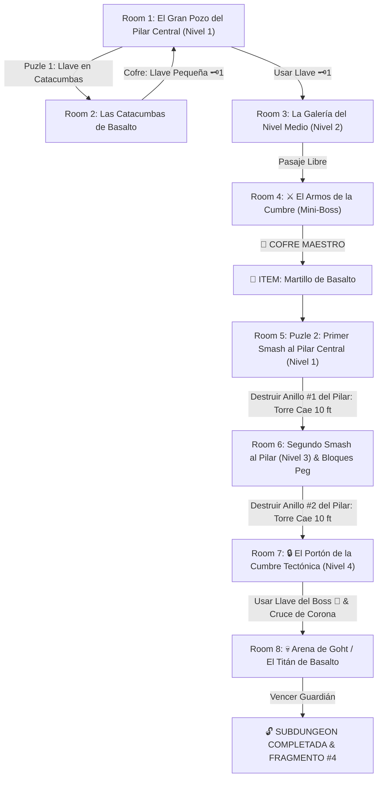

# 🪨 Subdungeon 4: El Dominio Telúrico (Verbatim Snowhead Temple - Majora's Mask Edición Basalto)

> **Ubicación**: `7 - DM/OneShots/ARepeat/Subdungeons/04_Subdungeon_Tierra_Dominio.md`  
> **Inspiración Verbatim**: **Snowhead Temple / Torre de la Cumbre** (*Majora's Mask* - Edición Basalto 100% Roca)  
> **Puzles Copiados Directos**: **El Colapso Vertical del Pilar Central de 4 Pisos**, **Interruptores Peg Rojos/Azules** y **La Carrera de Embestida contra Goht**  
> **Dungeon Item**: *Martillo de Basalto* (Gran Megaton Hammer Telúrico)  
> **Guardián de Área**: *El Titán de Basalto* (Inspirado en *Goht / Scaldera*)  
> **Recompensa**: 🔓 Desbloqueo Permanente del Dominio Telúrico + Fragmento de Tablilla #4

---

## 🗺️ Mapa de Flujo de la Mazmorra (Snowhead Central Pillar Layout)

---

## 🏛️ Recorrido Verbatim Sala por Sala con Puzles Involucrados

### Room 1: El Gran Pozo del Pilar Central (Entrada - Nivel 1)
> *"Una monumental torre cilíndrica de cuatro pisos en cuyo centro se alza un gigantesco Pilar Central de Basalto. Pasarelas de piedra giran alrededor del pilar a distintas alturas, pero las pasarelas superiores están desalineadas. En el piso inferior, un portón tiene un candado de hierro 🗝️1."*
* **Mecánica Central (Snowhead MM)**: Destruir anillos de basalto del pilar central hace caer la torre piso por piso.
* **Puertas**: Sur (Entrada), Norte (Locked 🗝️1), Este (Abierta).
* **Acción DM**: Explorar las catacumbas del Este (Room 2) para hallar la Llave Pequeña 🗝️1.

---

### Room 2: Las Catacumbas de Basalto (Llave Pequeña #1)
> *"Un pasadizo donde temblores desprenden rocas. En el fondo, tras una pared frágil, descansa el cofre."*
* **Enemigos**: 3x Escarabajos Telúricos (AC 14, 16 HP).
* **Resolución**: Retirar los escombros (*Fuerza DC 11*) y derrotar a los escarabajos para tomar la **Llave Pequeña 🗝️1**.

---

### Room 3: La Galería del Nivel Medio (Nivel 2)
> *"Una pasarela circular en el piso 2. Al usar la Llave 🗝️1, la esclusa se abre hacia el Mini-Boss."*
* **Resolución**: Insertar la Llave 🗝️1 para acceder a la arena de combate.

---

### Room 4: ⚔️ Mini-Boss Verbatim: Armos de la Cumbre (MM)
> *"Un autómata de granito que custodia el cofre maestro del templo."*
* **Mini-Boss**: **Armos de la Cumbre** (AC 16, 52 HP).
* **🎁 COFRE MAESTRO**: Al vencerlo, el cofre entrega el **Martillo de Basalto** (Gran Megaton Hammer que destruye anillos del Pilar Central, hunde estacas de ancla y aplasta corazas minerales).

---

### Room 5: 🧩 Puzle 1 Verbatim: Primer Golpe al Pilar Central (Snowhead MM)
> *"En la base del Pilar Central en el Piso 1 destaca el primer anillo de basalto azulado cubierto de grietas sísmicas."*
* **Puzle Involucrado**:
  1. **Alineación del Impacto**: Pararse en el ángulo de la grieta y asestar un golpe de masa completa con el *Martillo de Basalto* (*Ataque o Fuerza DC 13*).
  2. **Colapso Vertical del Pilar**: ¡El primer anillo de 10 pies del pilar se pulveriza y todo el Pilar Central desciende 10 pies hacia el subsuelo!
* **Resultado**: Las pasarelas del Piso 2 quedan perfectamente alineadas con el balcón del Piso 3 (Room 6).

---

### Room 6: 🧩 Puzle 2 Verbatim: Segundo Golpe al Pilar y Bloques Peg (Snowhead MM - Llave del Boss 👑)
> *"Al ascender al Piso 3, el grupo halla el segundo anillo frágil del Pilar Central. Al otro lado de la sala hay dos bloques Peg (uno rojo elevado y uno azul hundido) que bloquean el cofre dorado."*
* **Puzle Involucrado**:
  1. **Segundo Golpe de Martillo**: Golpe de masa con el *Martillo de Basalto* sobre el segundo anillo del pilar. El pilar desciende otros 10 pies.
  2. **Intercambiar Bloques Peg**: Asestar un golpe de martillo sobre el bloque Peg rojo para hundirlo, haciendo elevar automáticamente el bloque Peg azul y despejando el camino sobre la corona del pilar desprendido.
* **Botín**: Caminar por la cima del pilar desprendido para reclamar la **Llave del Boss 👑 (Llave de Goht)**.

---

### Room 7: 🔒 El Portón de la Cumbre Tectónica (Nivel 4)
> *"La cima de la torre en el Piso 4 con un portón de basalto y un candado monumental."*
* **Resolución**: Insertar la **Llave del Boss 👑** para abrir el acceso a la arena circular.

---

### Room 8: 💀 Boss Final Verbatim: Goht / El Titán de Basalto (Snowhead MM)
> *"Una vasta pista circular de basalto donde Goht (un coloso de embestida cubierto por coraza rocosa) rueda a gran velocidad alrededor del eje central lanzando rocas y estalactitas."*
* **Mecánica Goht Involucrada**:
  - **Fase de Embestida**: Goht corre a gran velocidad por la pista circular. Los jugadores deben esquivar su arremetida (*Salvadura de Destreza DC 13* o sufrir 2d6 daño contundente).
  - **Fase de Intercepción con el Martillo**: Esperar a que pase por una curva y asestar un golpe cargado con el *Martillo de Basalto* directamente en sus patas delanteras o coraza (*Ataque Melé DC 13*).
  - **Fase de Desequilibrio & Aturdimiento**: El impacto hace tropezar a Goht, volteándolo boca arriba y aturdiéndolo durante 1 ronda para golpear su vientre expuesto.
* **Recompensa**: 🔓 Desbloqueo permanente del Dominio Telúrico + **Fragmento de Tablilla #4**.
