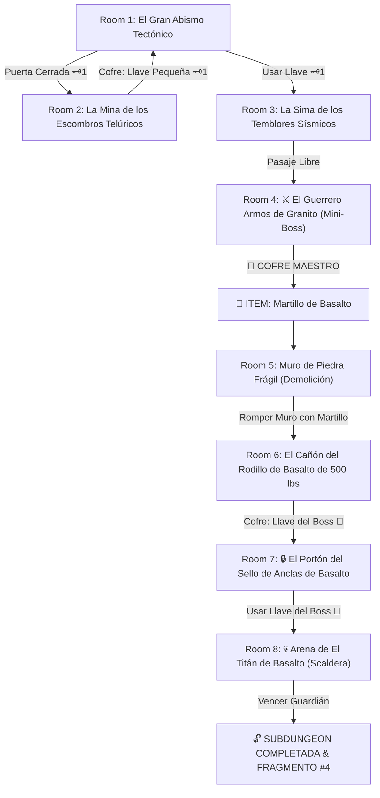

# 🪨 Subdungeon 4: El Dominio Telúrico (Puramente Tectónico - Goron Mines & Earth Temple SS)

> **Ubicación**: `7 - DM/OneShots/ARepeat/Subdungeons/04_Subdungeon_Tierra_Dominio.md`  
> **Inspiración Directa**: **Goron Mines** (*Twilight Princess*) + **Earth Temple** (*Skyward Sword*)  
> **Mecánicas Clave**: **Movimiento de Placas Tectónicas**, **Demolición por Gran Martillo**, **Anclas de Basalto** y **Esferas Rodantes**  
> **Dungeon Item**: *Martillo de Basalto* (Gran Megaton Hammer Telúrico)  
> **Guardián de Área**: *El Titán de Basalto* (Inspirado en *Scaldera / Fyrus*)  
> **Recompensa**: 🔓 Desbloqueo Permanente del Dominio Telúrico + Fragmento de Tablilla #4

---

## 🗺️ Mapa de Flujo de la Mazmorra (Tectonic Earth Layout)

---

## 🏛️ Recorrido Verbatim Sala por Sala (Earth Temple Walkthrough)

### Room 1: El Gran Abismo Tectónico (Entrada)
> *"Una impresionante gruta subterránea dominada por losas de piedra masivas desalineadas por fallas sísmicas. Del suelo sobresalen tres gruesas estacas de basalto de contrapeso. Al norte, un espeso portón de piedra volcánica con un ojo de cerradura de latón 🗝️1 bloquea el avance."*
* **Estética**: Estratos de piedra sísmica, vetas de mineral, estalactitas gigantes, temblores continuos de fondo.
* **Puertas**: Sur (Entrada), Norte (Locked 🗝️1), Este (Abierta).
* **Acción DM**: Descender a las galerías mineras del Este (Room 2) para hallar la Llave Pequeña 🗝️1.

---

### Room 2: La Mina de los Escombros Telúricos (Llave Pequeña #1)
> *"Una cañuela inclinada infestada de escarabajos de roca donde vagones mineros oxidados yacen estrellados. Tras un derrumbe de rocas descansa un cofre de hierro."*
* **Enemigos**: 3x Escarabajos de Basalto (AC 14, 16 HP; coraza de piedra).
* **Resolución**: Retirar las rocas caídas (*Fuerza DC 12*) y derrotar a los escarabajos para tomar la **Llave Pequeña 🗝️1**.

---

### Room 3: La Sima de los Temblores Sísmicos
> *"Grandes losas de piedra inclinadas 20 grados sobre un pivote subterráneo. Al usar la Llave 🗝️1, la compuerta se despeja hacia el sector de pruebas de fuerza."*
* **Puertas**: Sur (Locked 🗝️1 de vuelta), Norte (Puerta del Mini-Boss).
* **Resolución**: Insertar la Llave 🗝️1 y colocar cuñas de granito (*Fuerza DC 12*) para fijar las losas y cruzar el foso.

---

### Room 4: ⚔️ El Guerrero Armos de Granito (Mini-Boss & Dungeon Item)
> *"Un colosal autómata de piedra volcánica de 14 pies armado con un mazo de granito que hace temblar la sala con cada pisada."*
* **Mini-Boss**: **Armos de Granito** (AC 16, 52 HP; inmune a cortes/flechas).
* **🎁 COFRE MAESTRO**: Contiene el **Martillo de Basalto** (Gran Megaton Hammer que pulveriza muros agrietados, hunde estacas de ancla y destruye armaduras de roca).

---

### Room 5: Muro de Piedra Frágil (Demolición Isaac)
> *"Una pared gruesa de mampostería de basalto que muestra profundas grietas estructurales por las que se filtra polvo constante."*
* **Puzle**: Asestar un golpe de impacto con el recién obtenido *Martillo de Basalto*.
* **Resultado**: La pared se desploma en escombros (Isaac Shatter), abriendo paso a Room 6.

---

### Room 6: El Cañón del Rodillo de Basalto de 500 lbs (Llave del Boss 👑)
> *"Un pasillo inclinado donde una esfera masiva de basalto de 500 lbs descansa sobre un trinquete de hierro. Al final del cañón hay una barricada de roca que custodia un cofre dorado."*
* **Puzle**: Golpear el trinquete con el *Martillo de Basalto*. La esfera desciende rodando por el canal pulverizando la barricada de roca (estilo Scaldera).
* **Botín**: Abrir el cofre detrás de los escombros para reclamar la **Llave del Boss 👑 (Llave de las Anclas)**.

---

### Room 7: 🔒 El Portón del Sello de Anclas de Basalto
> *"Un portón monumental de granito retrazado por tres estacas de ancla que requieren ser golpeadas con masa extrema para liberar los pasadores."*
* **Resolución**: Insertar la **Llave del Boss 👑** y golpear la losa central con el *Martillo de Basalto* para retraer las anclas.

---

### Room 8: 💀 Arena de El Titán de Basalto (Scaldera Boss)
> *"Una gran gruta abovedada donde El Titán de Basalto (un coloso de magma cubierto por coraza rocosa impenetrable) rueda por la arena."*
* **Mecánica Scaldera**: Ver ficha en [`05_Arena_del_Titan_de_Basalto.md`](file:///Users/matiasbay/Documents/Obsidian/Shivath/7%20-%20DM/OneShots/ARepeat/Salas/07_Salas_Especiales/05_Arena_del_Titan_de_Basalto.md). Impactar con el *Martillo de Basalto* agrieta su coraza rocosa y expone su núcleo durante 1 ronda.
* **Recompensa**: 🔓 Desbloqueo permanente del Dominio Telúrico + **Fragmento de Tablilla #4**.
