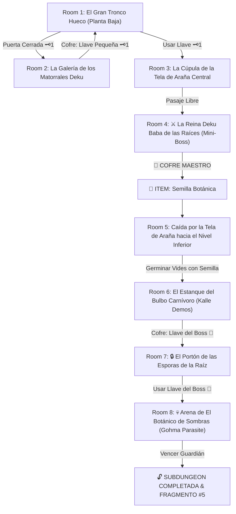

# 🌿 Subdungeon 5: El Invernadero Ancestral (Inspirada en Inside the Great Deku Tree - OoT & Forbidden Woods - WW)

> **Ubicación**: `7 - DM/OneShots/ARepeat/Subdungeons/05_Subdungeon_Vida_Invernadero.md`  
> **Inspiración Directa**: **Inside the Great Deku Tree** (*Ocarina of Time*) + **Forbidden Woods** (*The Wind Waker*)  
> **Estética**: **El Interior del Árbol Titánico Ancestral**, **Telas de Araña Arcanas**, **Nueces Deku** y **Raíces Gigantes**  
> **Dungeon Item**: *Semilla Botánica* (Semilla Deku Titánica que germina vides instantáneas y trampolines vegetales)  
> **Guardián de Área**: *El Botánico de Sombras* (Inspirado en *Gohma / Kalle Demos*)  
> **Recompensa**: 🔓 Desbloqueo Permanente del Invernadero + Fragmento de Tablilla #5

---

## 🗺️ Mapa de Flujo de la Mazmorra (Great Deku Tree Layout)

---

## 🏛️ Recorrido Verbatim Sala por Sala (Deku Tree Walkthrough)

### Room 1: El Gran Tronco Hueco (Entrada)
> *"El interior de un árbol titánico de quinientos pies de altura. Raíces gigantescas sirven como rampas para subir entre las corteza. En el muro del tronco, una compuerta de madera con un ojo de cerradura de nuez 🗝️1 bloquea el paso."*
* **Estética (Great Deku Tree)**: Hojas bioluminiscentes, musgo suave, enredaderas escalables, luz que se filtra por el dosel.
* **Puertas**: Sur (Entrada), Norte (Locked 🗝️1), Este (Abierta).
* **Acción DM**: Escalar las raíces hacia el hueco Este (Room 2) para hallar la Llave Pequeña 🗝️1.

---

### Room 2: La Galería de los Matorrales Deku (Llave Pequeña #1)
> *"Un nicho en la corteza donde tres Matorrales Deku escupen nueces de madera desde sus muescas de flor. En una plataforma cubierta de hiedra descansa un cofre."*
* **Enemigos**: 3x Matorrales Deku (AC 12, 10 HP; escupen proyectiles de nuez).
* **Resolución**: Reflejar o esquivar las nueces (*Destreza DC 11*) y derrotar a los matorrales para tomar la **Llave Pequeña 🗝️1**.

---

### Room 3: La Cúpula de la Tela de Araña Central
> *"Un nivel elevado del tronco donde una gigantesca tela de araña elástica de 20 pies de diámetro cubre el suelo del pozo inferior. Al usar la Llave 🗝️1, el paso se abre hacia la cámara del Mini-Boss."*
* **Puertas**: Sur (Locked 🗝️1 de vuelta), Norte (Puerta del Mini-Boss).
* **Resolución**: Usar la Llave 🗝️1 y saltar sobre la tela de araña (*Acrobacias DC 11*) para ingresar en Room 4.

---

### Room 4: ⚔️ La Reina Deku Baba de las Raíces (Mini-Boss & Dungeon Item)
> *"Una planta carnívora titánica con tallo de madera y flores venenosas que emerge del corazón del árbol."*
* **Mini-Boss**: **Reina Deku Baba** (AC 14, 48 HP).
* **🎁 COFRE MAESTRO**: Contiene la **Semilla Botánica** (Semilla Deku Titánica que al plantarse germina vides elásticas instantáneas para rebotar, escalar o atrancar compuertas).

---

### Room 5: Caída por la Tela de Araña hacia el Nivel Inferior
> *"De regreso a la tela de araña central, el grupo debe prenderle fuego o lanzarse desde 30 pies de altura para romper el centro de la tela y caer al nivel inferior inundado por la savia del árbol."*
* **Puzle**: Usar una antorcha o el rebote de la recién obtenida *Semilla Botánica* para romper la tela y caer de forma segura al agua/savia de Room 6.

---

### Room 6: El Estanque del Bulbo Carnívoro (Kalle Demos - Llave del Boss 👑)
> *"Un estanque de savia bioluminiscente sumergido en las raíces del árbol donde un bulbo carnívoro de 10 pies (Kalle Demos) custodia un cofre dorado."*
* **Puzle**: Plantar la *Semilla Botánica* en las tentáculos del bulbo. Las vides germinadas entraman las mandíbulas e impiden que se cierren.
* **Botín**: Rescatar de forma segura el cofre dorado con la **Llave del Boss 👑 (Llave de la Semilla Deku)**.

---

### Room 7: 🔒 El Portón de las Esporas de la Raíz
> *"Un portón de madera milenaria revestido por zarzas de flores en capullo con un candado grabado con la hoja del Gran Árbol Deku."*
* **Resolución**: Insertar la **Llave del Boss 👑** para que los brotes se abran y liberen la entrada a la cámara de la Reina Gohma.

---

### Room 8: 💀 Arena de El Botánico de Sombras (Gohma Parasite Boss)
> *"La cúpula inferior de las raíces del árbol, a oscuras. En el techo, un ojo gigantesco de parásito (Gohma / Botánico de Sombras) se enciende fijando al grupo."*
* **Mecánica Gohma**: Ver ficha en [`06_Arena_del_Botanico_de_Sombras.md`](file:///Users/matiasbay/Documents/Obsidian/Shivath/7%20-%20DM/OneShots/ARepeat/Salas/07_Salas_Especiales/06_Arena_del_Botanico_de_Sombras.md). Usar la *Semilla Botánica* para germinar trampolines de vid, saltar hacia el ojo del techo y aturdir al boss 1 ronda.
* **Recompensa**: 🔓 Desbloqueo permanente del Invernadero + **Fragmento de Tablilla #5**.
