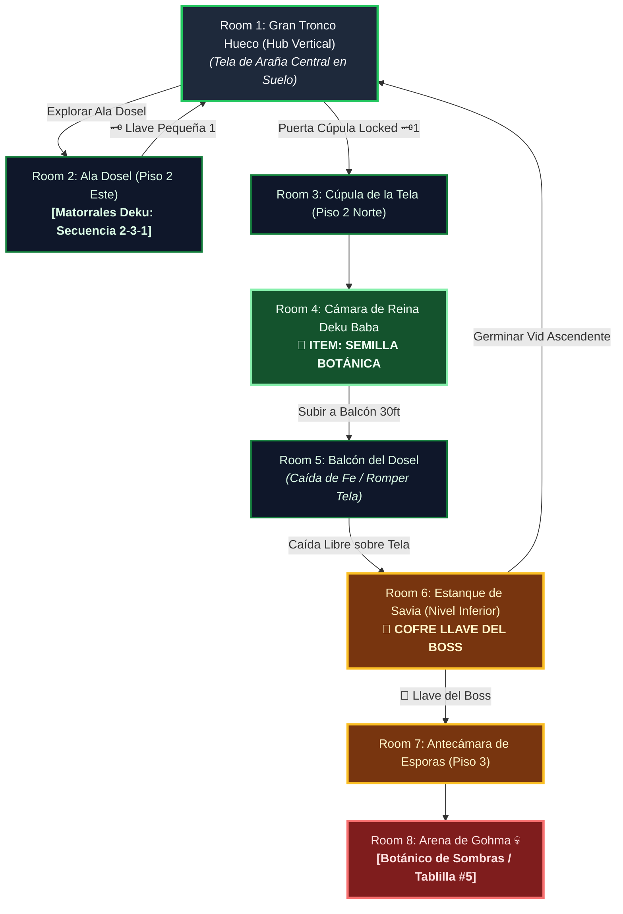

# 🌿 Subdungeon 5: El Invernadero Ancestral (Layout Complejo y No-Lineal estilo Great Deku Tree)

> **Ubicación**: `7 - DM/OneShots/ARepeat/Subdungeons/05_Subdungeon_Vida_Invernadero.md`  
> **Inspiración Verbatim**: **Inside the Great Deku Tree** (*Ocarina of Time*)  
> **Regla de Diseño DM**: **CERO BLOQUEOS POR TIRADA OBLIGATORIA (No Skill-Check Gates)**. La progresión es 100% interactiva, mecánica y espacial. Las tiradas de dados son opcionales (evitar daño, ir más rápido o hallar secretos), pero el avance obligatorio NUNCA requiere fallar/pasar un dado.  
> **Estructura de Layout**: **El Gran Tronco Hueco (Hub Vertical de 3 Pisos)** + **Ala Dosel (Matorrales Deku)** + **Ala Raíces Sumergidas (Foso de Savia)** + **Caída Libre con Destrucción de Tela de Araña**  
> **Dungeon Item**: *Semilla Botánica* (Semilla Deku Titánica que germina vides instantáneas y trampolines)  
> **Guardián de Área**: *El Botánico de Sombras* (Inspirado en *Gohma*)  
> **Recompensa**: 🔓 Desbloqueo Permanente del Invernadero + Fragmento de Tablilla #5

---

## 🗺️ Mapa de Flujo No-Lineal de la Mazmorra (Great Deku Tree Non-Linear Layout)

---

### 📊 Tabla Resumen de Progreso (Paso a Paso)

| Paso | Ubicación | Tipo | Objetivo y Acción Clave | Resultado |
| :---: | :--- | :---: | :--- | :--- |
| **1** | **Room 2 (Ala Dosel)** | 🟢 Exploración | Desviar nueces Deku en secuencia 2-3-1 | Obtenida **Llave Pequeña 🗝️1** |
| **2** | **Room 3 & 4 (Cúpula Norte)** | ⚔️ Mini-Boss | Despejar pasillo y vencer a la *Reina Deku Baba* | 🎁 Obtención de la **Semilla Botánica** |
| **3** | **Room 5 (Balcón Dosel)** | 🧩 Puzle | Saltar en caída libre a 30ft rompiendo la tela central | Caída al Estanque de Savia Inferior |
| **4** | **Room 6 (Estanque B1)** | 👑 Clave & Atajo | Entramar bulbo de Kalle Demos y germinar vid | 👑 Obtenida **Llave del Boss** |
| **5** | **Room 8 (Arena Final)** | 💀 Boss | Escalar vid al Piso 3 e ingresar a cúpula de esporas | 🔓 Subdungeon 5 + Fragmento #5 |

---

## 🏛️ Recorrido Verbatim Sala por Sala (DM Walkthrough & Tree Drops)

### Room 1: El Gran Tronco Hueco (Hub 3 Pisos - Planta Baja)
> *"Un árbol titánico de 500 pies en cuyo interior hueco raíces gigantescas forman rampas en espiral. En el centro del suelo del Piso 1 hay una gran tela de araña elástica tensada sobre un abismo. Tres accesos destacan: el Ala Dosel (Piso 2 - Este), la Cúpula Norte (Piso 2 - Locked 🗝️1) y la Antecámara de Esporas en el Piso 3 (Locked 🔒)."*

---

### Room 2: 🧩 Ala Dosel: Galería de los Matorrales Deku (OoT)
> *"Un nicho en la corteza con tres Matorrales Deku que escupen nueces."*
* **Puzle Mecánico Sin Gating**: Reflejar proyectiles de nuez con el escudo y golpear a los matorrales en el orden **2-3-1 (Centro, Derecha, Izquierda)**. *(Tirada opcional de Destreza DC 12 permite desviar la nuez a la primera, pero el intento es 100% infinito hasta lograr la secuencia 2-3-1)*.
* **Botín**: El matorral confiesa la clave y entrega la **Llave Pequeña 🗝️1**.
* **🔄 BACKTRACKING**: Regresar al **Hub (Room 1)** e insertar la Llave 🗝️1 en la Cúpula Norte del Piso 2.

---

### Room 3: Ala Norte: Cúpula de la Tela de Araña Central
> *"Un pasillo que bordea la tela de araña central y da paso a la estancia del Mini-Boss."*

---

### Room 4: ⚔️ Cámara del Mini-Boss: Reina Deku Baba (OoT)
> *"Una planta carnívora titánica que surge del barro."*
* **🎁 COFRE MAESTRO**: Entrega la **Semilla Botánica** (Germina vides elásticas instantáneas y trampolines).
* **🔄 BACKTRACKING & CAÍDA LIBRE**: El grupo regresa al balcón superior del **Hub (Room 1)** a 30 pies sobre la tela de araña central.

---

### Room 5: 🧩 Balcón del Dosel: Caída de Fe sobre la Tela (OoT)
> *"Pararse en el borde del balcón a 30 pies de altura sobre la tela de araña central."*
* **Puzle Mecánico Sin Gating**: Encender la antorcha del muro y saltar en caída libre directamente sobre el centro de la tela. El peso del impacto rompe la tela de araña, haciendo caer al grupo de forma segura al Nivel Inferior de las Raíces (Room 6). *(Tirada opcional de Acrobacias DC 12 amortigua el agua sin mojarse la mochila, pero la caída es 100% segura)*.

---

### Room 6: Nivel Inferior: Estanque de Savia & Bulbo Kalle Demos (Llave del Boss 👑)
> *"Un estanque de savia bioluminiscente sumergido entre las raíces del árbol donde Kalle Demos custodia el cofre."*
* **Puzle**: Plantar la *Semilla Botánica* en los tentáculos del bulbo para entramar sus mandíbulas.
* **Botín**: Reclamar la **Llave del Boss 👑 (Llave de la Semilla Deku)**.
* **🔄 BACKTRACKING**: Plantar una *Semilla Botánica* en el lecho del estanque para germinar una vid gigante ascendente que regresa al grupo al Piso 1 del **Hub (Room 1)**.

---

### Room 7: 🔒 Antecámara de las Esporas (Piso 3)
> *"Escalar al Piso 3 e insertar la Llave del Boss 👑."*

---

### Room 8: 💀 Boss Final: Gohma / El Botánico de Sombras (OoT)
> *"La cúpula de las raíces a oscuras dominada por el ojo rojo de Gohma en el techo."*
* **Mecánica Boss**: Disparar a su ojo cuando parpadee en **rojo** para aturdirla en el suelo.
* **Recompensa**: 🔓 Desbloqueo permanente del Invernadero + **Fragmento de Tablilla #5**.
