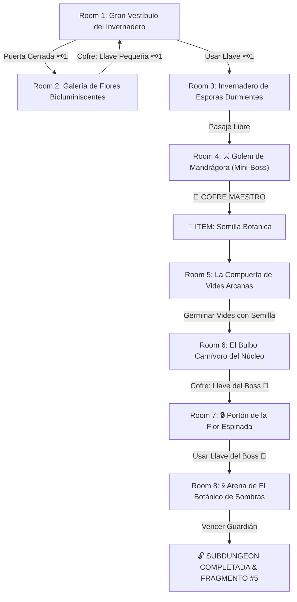

# 🌿 Subdungeon 5: El Invernadero Ancestral (Life Temple Verbatim)

> **Ubicación**: `7 - DM/OneShots/ARepeat/Subdungeons/05_Subdungeon_Vida_Invernadero.md`  
> **Estilo**: Zelda Classic Dungeon Layout  
> **Dungeon Item**: *Semilla Botánica*  
> **Guardián de Área**: *El Botánico de Sombras*  
> **Recompensa**: 🔓 Desbloqueo Permanente del Invernadero + Fragmento de Tablilla #5

---

## 🗺️ Mapa de Flujo de la Mazmorra (Zelda Diagram)

---

## 🏛️ Recorrido Verbatim Sala por Sala (DM Walkthrough)

### Room 1: Gran Vestíbulo del Invernadero (Entrada)
> *"Un gran invernadero subterráneo donde enredaderas gigantes cuelgan del techo. En el muro norte se yergue una compuerta de madera petrificada con un ojo de cerradura de madera tallada 🗝️1. El paso del Este está abierto entre arbustos bioluminiscentes."*
* **Puertas**: Sur (Entrada), Norte (Locked 🗝️1), Este (Abierta).
* **Acción DM**: Avanzar por el pasaje del Este (Room 2) para obtener la Llave Pequeña 🗝️1.

---

### Room 2: Galería de Flores Bioluminiscentes (Llave Pequeña #1)
> *"Una sala en penumbra donde flores fosforescentes se abren al calor corporal. En el centro descansa un cofre vegetal cubierto por raíces delgadas."*
* **Enemigos**: 3x Plantas Carnívoras Menores (AC 12, 14 HP).
* **Resolución**: Derrotar a las plantas carnívoras para hacer retraer las raíces y abrir el cofre con la **Llave Pequeña 🗝️1**.

---

### Room 3: Invernadero de Esporas Durmientes
> *"El aire se halla cargado con una neblina flotante de esporas verdosas en reposo. Al usar la Llave 🗝️1, la compuerta se abre hacia el sanctum del Mini-Boss."*
* **Puertas**: Sur (Locked 🗝️1 de vuelta), Norte (Puerta del Mini-Boss).
* **Puzle**: Cruzar en sigilo (*Sigilo DC 13*) para no inflamar las esporas ni agitar los esporangios.

---

### Room 4: ⚔️ Guardia del Golem de Mandrágora (Mini-Boss & Dungeon Item)
> *"Un coloso vegetal de madera entramada y raíces entrelazadas emerge del barro emitiendo un grito ultrasónico."*
* **Mini-Boss**: **Golem de Mandrágora** (AC 15, 50 HP; Ataque: Porrazo Vegetal +5, 2d6+3 Contundente).
* **Estrategia DM**: Regenera 5 HP por ronda si toca barro. Derrotarlo despeja el cofre místico.
* **🎁 COFRE MAESTRO**: Contiene la **Semilla Botánica** (Germina vides gigantes instantáneas como pasarelas, cuerdas o estructuras para trancar compuertas).

---

### Room 5: La Compuerta de Vides Arcanas (Pasarela Botánica)
> *"Un abismo insondable de 25 pies corta el paso. En los bordes de ambas plataformas sobresalen hendiduras rellenas de tierra fértil arcana."*
* **Puzle**: Plantar la recién obtenida *Semilla Botánica* en la tierra arcana.
* **Resultado**: La semilla germina en 1 ronda tejiendo un puente permanente de vides entrelazadas de 25 pies sobre el abismo hacia Room 6.

---

### Room 6: El Bulbo Carnívoro del Núcleo (Llave del Boss 👑)
> *"Un bulbo vegetal gigantesco de pétalos carnosos y dentados de 10 pies de diámetro custodia en su estómago un cofre dorado."*
* **Puzle**: Plantar la *Semilla Botánica* en las fauces del bulbo carnívoro. Las vides germinan entramando las mandíbulas e impidiendo que se cierren.
* **Botín**: Rescatar de forma segura el cofre dorado que contiene la **Llave del Boss 👑 (Llave de la Flor)**.

---

### Room 7: 🔒 Portón de la Flor Espinada
> *"Un portón de piedra revestido por zarzas de flor espinada con un candado tallado en forma de brote vegetal."*
* **Resolución**: Insertar la **Llave del Boss 👑** para que las zarzas se replieguen y abran la arena del Boss.

---

### Room 8: 💀 Arena de El Botánico de Sombras (Guardián de Vida)
> *"Un estanque vegetal circular donde El Botánico de Sombras se oculta en la flor central resguardado por bulbos carnívoros titánicos."*
* **Mecánica Boss**: Ver ficha en [`06_Arena_del_Botanico_de_Sombras.md`](file:///Users/matiasbay/Documents/Obsidian/Shivath/7%20-%20DM/OneShots/ARepeat/Salas/07_Salas_Especiales/06_Arena_del_Botanico_de_Sombras.md). Plantar la *Semilla Botánica* en la base de los bulbos aprisiona sus fauces y expone al verdadero boss durante 1 ronda.
* **Recompensa**: 🔓 Desbloqueo permanente del Invernadero + **Fragmento de Tablilla #5**.
