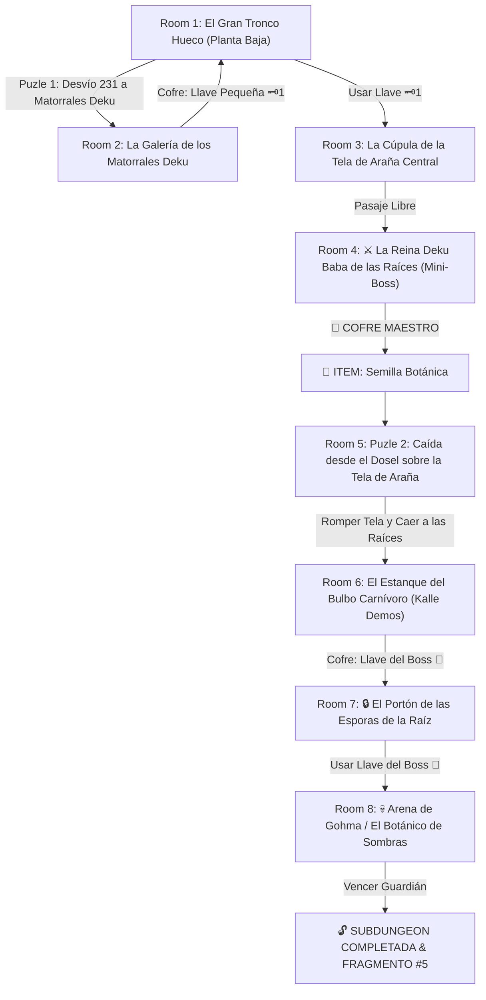

# 🌿 Subdungeon 5: El Invernadero Ancestral (Verbatim Inside the Great Deku Tree - Ocarina of Time)

> **Ubicación**: `7 - DM/OneShots/ARepeat/Subdungeons/05_Subdungeon_Vida_Invernadero.md`  
> **Inspiración Verbatim**: **Inside the Great Deku Tree** (*The Legend of Zelda: Ocarina of Time*)  
> **Puzles Copiados Directos**: **El Desvío de Nueces Deku en Secuencia 231**, **La Caída desde el Dosel para Romper la Tela de Araña** y **El Cegado del Ojo de Gohma en el Techo**  
> **Dungeon Item**: *Semilla Botánica* (Semilla Deku Titánica que germina vides elásticas instantáneas y trampolines)  
> **Guardián de Área**: *El Botánico de Sombras* (Inspirado en *Gohma*)  
> **Recompensa**: 🔓 Desbloqueo Permanente del Invernadero + Fragmento de Tablilla #5

---

## 🗺️ Mapa de Flujo de la Mazmorra (Great Deku Tree Layout)

---

## 🏛️ Recorrido Verbatim Sala por Sala con Puzles Involucrados

### Room 1: El Gran Tronco Hueco (Entrada)
> *"Un árbol titánico de 500 pies de altura en cuyo interior hueco raízas gigantescas sirven como rampas para subir entre las paredes de corteza. Al norte, una compuerta de madera con candado de nuez 🗝️1 bloquea el paso."*
* **Puertas**: Sur (Entrada), Norte (Locked 🗝️1), Este (Abierta).
* **Acción DM**: Escalar las raíces hacia el hueco Este (Room 2) para resolver el Puzle 231.

---

### Room 2: 🧩 Puzle 1 Verbatim: Secuencia de Matorrales Deku "2-3-1 es el Secreto" (OoT)
> *"Un nicho amplio donde tres Matorrales Deku se ocultan en sus capullos en el suelo. Al aproximarse, los tres saltan escupiendo proyectiles de nuez rúnica a gran velocidad."*
* **Puzle Involucrado**:
  1. **Desviar los Proyectiles**: Los jugadores deben usar sus escudos o armas para reflejar las nueces escupidas (*Check de Destreza / Reacción DC 12*).
  2. **Secuencia Exacta "2-3-1"**: Para que los matorrales se rindan y revelen la clave, deben ser golpeados en el orden numérico exacto:
     - **1º Impacto**: Al **Matorral del Centro (#2)**.
     - **2º Impacto**: Al **Matorral de la Derecha (#3)**.
     - **3º Impacto**: Al **Matorral de la Izquierda (#1)**.
* **Botín**: Si se ejecuta el orden 2-3-1, el matorral final confiesa: *"¡2-3-1 es el secreto!"* y se rinde, abriendo el cofre con la **Llave Pequeña 🗝️1**. Si se falla el orden, los matorrales reinician su salud.

---

### Room 3: La Cúpula de la Tela de Araña Central
> *"Un nivel elevado del tronco donde una gigantesca tela de araña elástica de 20 pies cubre el centro del suelo. Al usar la Llave 🗝️1, la puerta se abre al Mini-Boss."*
* **Resolución**: Insertar la Llave 🗝️1 para acceder a la arena de combate.

---

### Room 4: ⚔️ Mini-Boss Verbatim: Reina Deku Baba (OoT)
> *"Una planta carnívora titánica con tallo de madera que surge del barro."*
* **Mini-Boss**: **Reina Deku Baba** (AC 14, 48 HP).
* **🎁 COFRE MAESTRO**: Al vencerla, el cofre entrega la **Semilla Botánica** (Semilla Deku Titánica que germina vides instantáneas y trampolines vegetales).

---

### Room 5: 🧩 Puzle 2 Verbatim: Caída desde el Dosel para Romper la Tela (OoT)
> *"De regreso a la tela de araña central. Los jugadores deben escalar las enredaderas de la pared hasta la cornisa superior a 30 pies de altura."*
* **Puzle Involucrado**:
  1. **Encender la Antorcha**: Encender la antorcha del muro usando una flecha o la *Semilla Botánica* en el brasero del dosel.
  2. **Salto en Caída Libre**: Ejecutar un salto de fe de 30 pies desde la cornisa superior directamente al centro de la tela de araña (*Acrobacias DC 12*).
  3. **Ruptura de la Tela**: El impulso de la caída libre rompe el centro de la tela de araña, haciendo caer al grupo de forma segura al estanque de savia del nivel inferior en Room 6.

---

### Room 6: El Estanque del Bulbo Carnívoro (Kalle Demos - Llave del Boss 👑)
> *"Un estanque de savia bioluminiscente sumergido en las raíces donde un bulbo carnívoro gigante (Kalle Demos) custodia un cofre dorado."*
* **Puzle**: Plantar la *Semilla Botánica* en los tentáculos del bulbo para entramar sus mandíbulas.
* **Botín**: Reclamar el cofre dorado con la **Llave del Boss 👑 (Llave de la Semilla Deku)**.

---

### Room 7: 🔒 El Portón de las Esporas de la Raíz
> *"Un portón de madera milenaria revestido por zarzas con un candado grabado con la hoja del Gran Árbol Deku."*
* **Resolución**: Insertar la **Llave del Boss 👑** para despejar el acceso a la cámara final.

---

### Room 8: 💀 Boss Final Verbatim: Gohma / El Botánico de Sombras (OoT)
> *"La cúpula inferior de las raíces a oscuras. En el techo, el gran ojo rojo del parásito Gohma se enciende fijando al grupo antes de parir crías de arañas."*
* **Mecánica Gohma Involucrada**:
  - **Fase de Techo (Ojo Rojo)**: Gohma trepa por el techo a oscuras. Cuando su único ojo parpadea en color **Rojo brillante**, los jugadores tienen 1 turno para disparar una proyectil de luz o *Semilla Botánica* directamente a su ojo (*Ataque a Distancia DC 12*).
  - **Fase de Caída & Cegado**: Al ser alcanzada en el ojo, Gohma cae del techo aturdida al suelo durante 1 ronda, permitiendo ataques melé con daño multiplicado.
  - **Fase de Crías de Araña**: Si no es dañada en esa ronda, engendra 3x Crías de Gohma (AC 11, 8 HP) que atacan en grupo.
* **Recompensa**: 🔓 Desbloqueo permanente del Invernadero + **Fragmento de Tablilla #5**.
