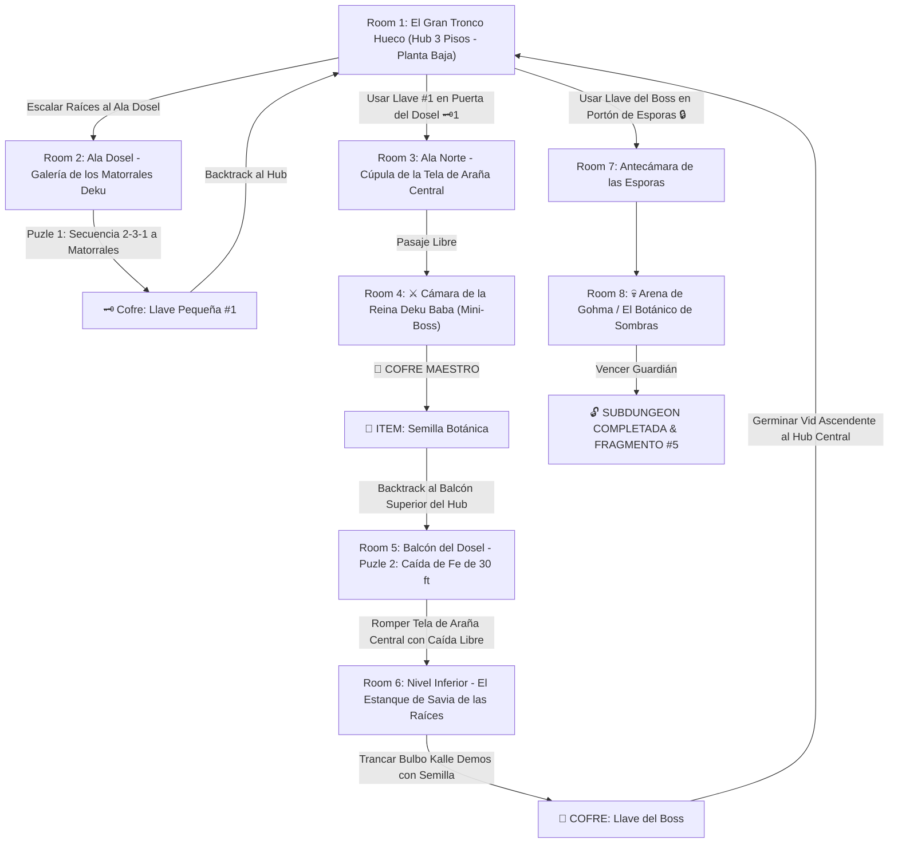

# 🌿 Subdungeon 5: El Invernadero Ancestral (Layout Complejo y No-Lineal estilo Great Deku Tree)

> **Ubicación**: `7 - DM/OneShots/ARepeat/Subdungeons/05_Subdungeon_Vida_Invernadero.md`  
> **Inspiración Verbatim**: **Inside the Great Deku Tree** (*Ocarina of Time*)  
> **Estructura de Layout**: **El Gran Tronco Hueco (Hub Vertical de 3 Pisos)** + **Ala Dosel (Matorrales Deku)** + **Ala Raíces Sumergidas (Foso de Savia)** + **Caída Libre con Destrucción de Tela de Araña**  
> **Dungeon Item**: *Semilla Botánica* (Semilla Deku Titánica que germina vides instantáneas y trampolines)  
> **Guardián de Área**: *El Botánico de Sombras* (Inspirado en *Gohma*)  
> **Recompensa**: 🔓 Desbloqueo Permanente del Invernadero + Fragmento de Tablilla #5

---

## 🗺️ Mapa de Flujo No-Lineal de la Mazmorra (Great Deku Tree Non-Linear Layout)

---

## 🏛️ Recorrido Verbatim Sala por Sala (DM Walkthrough & Tree Drops)

### Room 1: El Gran Tronco Hueco (Hub 3 Pisos - Planta Baja)
> *"Un árbol titánico de 500 pies en cuyo interior hueco raíces gigantescas forman rampas en espiral. En el centro del suelo del Piso 1 hay una gran tela de araña elástica tensada sobre un abismo. Tres accesos destacan: el Ala Dosel (Piso 2 - Este), la Cúpula Norte (Piso 2 - Locked 🗝️1) y la Antecámara de Esporas en el Piso 3 (Locked 🔒)."*
* **Estructura Hub**: Conecta verticalmente la Planta Baja con el Dosel y las Raíces Subterráneas.

---

### Room 2: 🧩 Ala Dosel: Galería de los Matorrales Deku (OoT)
> *"Un nicho en la corteza con tres Matorrales Deku que escupen nueces."*
* **Puzle Involucrado**: Reflejar proyectiles (*DC 12*) y golpear a los matorrales en el orden **2-3-1 (Centro, Derecha, Izquierda)**.
* **Botín**: El matorral confiesa la clave y entrega la **Llave Pequeña 🗝️1**.
* **🔄 BACKTRACKING**: Regresar al **Hub (Room 1)** e insertar la Llave 🗝️1 en la Cúpula Norte del Piso 2.

---

### Room 3: Ala Norte: Cúpula de la Tela de Araña Central
> *"Un pasillo que bordea la tela de araña central y da paso a la estancia del Mini-Boss."*

---

### Room 4: ⚔️ Cámara del Mini-Boss: Reina Deku Baba (OoT)
> *"Una planta carnívora titánica que surge del barro."*
* **🎁 COFRE MAESTRO**: Entrega la **Semilla Botánica** (Germina vides elásticas instantáneas y trampolines).
* **🔄 BACKTRACKING & CAÍDA LIBRE**: El grupo regresa al balcón superior del **Hub (Room 1)** a 30 pies sobre la tela de araña central.

---

### Room 5: 🧩 Balcón del Dosel: Caída de Fe sobre la Tela (OoT)
> *"Pararse en el borde del balcón a 30 pies de altura sobre la tela de araña central."*
* **Puzle Involucrado**: Encender la antorcha del muro y saltar en caída libre (*Acrobacias DC 12*) directamente sobre la tela. El impacto de la caída rompe la tela y catapulta al grupo al Nivel Inferior de las Raíces (Room 6).

---

### Room 6: Nivel Inferior: Estanque de Savia & Bulbo Kalle Demos (Llave del Boss 👑)
> *"Un estanque de savia bioluminiscente sumergido entre las raíces del árbol donde Kalle Demos custodia el cofre."*
* **Puzle**: Plantar la *Semilla Botánica* en los tentáculos del bulbo para entramar sus mandíbulas.
* **Botín**: Reclamar la **Llave del Boss 👑 (Llave de la Semilla Deku)**.
* **🔄 BACKTRACKING**: Plantar una *Semilla Botánica* en el lecho del estanque para germinar una vid gigante ascendente que regresa al grupo al Piso 1 del **Hub (Room 1)**.

---

### Room 7: 🔒 Antecámara de las Esporas (Piso 3)
> *"Escalar al Piso 3 e insertar la Llave del Boss 👑."*

---

### Room 8: 💀 Boss Final: Gohma / El Botánico de Sombras (OoT)
> *"La cúpula de las raíces a oscuras dominada por el ojo rojo de Gohma en el techo."*
* **Mecánica Boss**: Disparar a su ojo cuando parpadee en **rojo** (*DC 12*) para aturdirla en el suelo.
* **Recompensa**: 🔓 Desbloqueo permanente del Invernadero + **Fragmento de Tablilla #5**.
