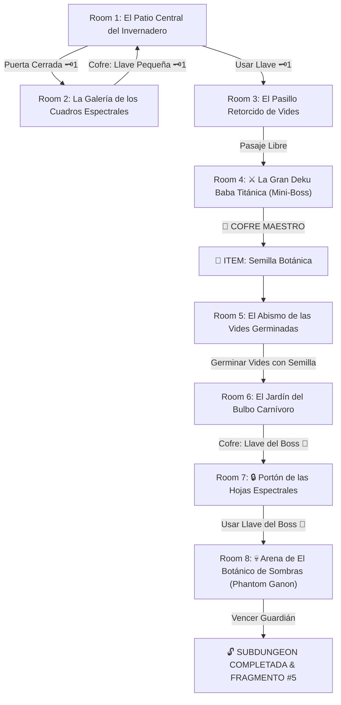

# 🌿 Subdungeon 5: El Invernadero Ancestral (Inspirada en Forest Temple - Ocarina of Time & Twilight Princess)

> **Ubicación**: `7 - DM/OneShots/ARepeat/Subdungeons/05_Subdungeon_Vida_Invernadero.md`  
> **Inspiración Directa**: **Forest Temple** (*The Legend of Zelda: Ocarina of Time*) + **Forest Temple** (*Twilight Princess*)  
> **Mecánicas Clave**: **Pasillos Retorcidos de Verdor**, **Vides Germinadas** y **Cuadros Espectrales Botánicos**  
> **Dungeon Item**: *Semilla Botánica* (Germina vides gigantes instantáneas como pasarelas o para aprisionar estructuras)  
> **Guardián de Área**: *El Botánico de Sombras* (Inspirado en *Phantom Ganon / Diababa*)  
> **Recompensa**: 🔓 Desbloqueo Permanente del Invernadero + Fragmento de Tablilla #5

---

## 🗺️ Mapa de Flujo de la Mazmorra (Forest Temple Layout)

---

## 🏛️ Recorrido Verbatim Sala por Sala (Forest Temple Walkthrough)

### Room 1: El Patio Central del Invernadero (Entrada)
> *"Un jardín abovedado envuelto en una penumbra verdosa. Cuatro antorchas en el centro proyectan luces de colores; una gran escalera conduce a un portón de madera petrificada con un candado de tallos 🗝️1. El paso del Este está cubierto de hiedra."*
* **Estética**: Enredaderas antiguas, ruinas de piedra cubiertas de musgo, estatuas de lobos/simios.
* **Puertas**: Sur (Entrada), Norte (Locked 🗝️1), Este (Abierta).
* **Acción DM**: Atravesar la hiedra del Este (Room 2) para obtener la Llave Pequeña 🗝️1.

---

### Room 2: La Galería de los Cuadros Espectrales (Llave Pequeña #1)
> *"Un pasillo donde tres retratos al óleo de brujas espectrales están colgados en las paredes. Al acercarse, las figuras de las brujas desaparecen de los cuadros y atacan desde las sombras."*
* **Enemigos**: 3x Hermanas Poe Botánicas (AC 13, 14 HP).
* **Resolución**: Derrotar a las hermanas espectrales para encender la primera antorcha del patio y revelar el cofre con la **Llave Pequeña 🗝️1**.

---

### Room 3: El Pasillo Retorcido de Vides
> *"Un corredor de piedra extrañamente deformado y retorcido en espiral de 90 grados donde las paredes y el techo parecen haber rotado. Al usar la Llave 🗝️1, la compuerta del norte se desengancha."*
* **Puertas**: Sur (Locked 🗝️1 de vuelta), Norte (Puerta del Mini-Boss).
* **Resolución**: Cruzar la sección retorcida (*Acrobacias DC 12*) e insertar la Llave 🗝️1.

---

### Room 4: ⚔️ La Gran Deku Baba Titánica (Mini-Boss & Dungeon Item)
> *"Una planta carnívora gigantesca con fauces purpúreas y dientes de cristal que emerge de una fosa de barro."*
* **Mini-Boss**: **Deku Baba Titánica** (AC 15, 50 HP).
* **🎁 COFRE MAESTRO**: Contiene la **Semilla Botánica** (Germina vides gigantes instantáneas como puentes, cuerdas o estructuras para trancar compuertas).

---

### Room 5: El Abismo de las Vides Germinadas (Pasarela Vegetal)
> *"Un gran abismo de 25 pies corta el pasillo. En los bordes hay hendiduras de tierra fértil arcana."*
* **Puzle**: Plantar la recién obtenida *Semilla Botánica* en la tierra arcana.
* **Resultado**: Las vides germinan entrelazándose sobre el abismo formando un puente botánico permanente hacia Room 6.

---

### Room 6: El Jardín del Bulbo Carnívoro (Llave del Boss 👑)
> *"Un bulbo carnívoro gigante de 10 pies custodia un cofre dorado en el fondo de sus fauces dentadas."*
* **Puzle**: Plantar la *Semilla Botánica* dentro de las fauces del bulbo. Las vides germinan entramando sus mandíbulas e impidiendo que se cierren.
* **Botín**: Rescatar de forma segura el cofre dorado con la **Llave del Boss 👑 (Llave de las Hojas)**.

---

### Room 7: 🔒 Portón de las Hojas Espectrales
> *"Un gran portón de madera decorado con tres cuadros de brujas espectrales y un candado con el relieve de una hoja ancestral."*
* **Resolución**: Insertar la **Llave del Boss 👑** para desenganchar los cerrojos de vides.

---

### Room 8: 💀 Arena de El Botánico de Sombras (Phantom Ganon Boss)
> *"Una sala circular rodeada por 6 cuadros en las paredes donde El Botánico de Sombras galopa entre los retratos antes de saltar a la arena."*
* **Mecánica Boss**: Ver ficha en [`06_Arena_del_Botanico_de_Sombras.md`](file:///Users/matiasbay/Documents/Obsidian/Shivath/7%20-%20DM/OneShots/ARepeat/Salas/07_Salas_Especiales/06_Arena_del_Botanico_de_Sombras.md). Plantar la *Semilla Botánica* en el suelo tranca los bulbos guardianes y hace caer al boss de su caballo espectral durante 1 ronda.
* **Recompensa**: 🔓 Desbloqueo permanente del Invernadero + **Fragmento de Tablilla #5**.
