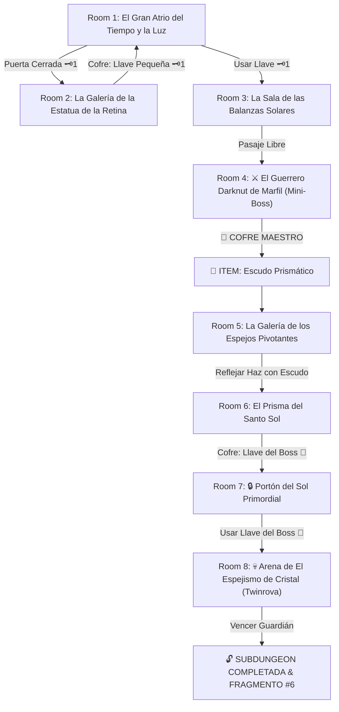

# ☀️ Subdungeon 6: El Santuario Prismático (Inspirada en Temple of Time & Spirit Temple)

> **Ubicación**: `7 - DM/OneShots/ARepeat/Subdungeons/06_Subdungeon_Luz_Santuario.md`  
> **Inspiración Directa**: **Temple of Time** (*Twilight Princess*) + **Spirit Temple** (*Ocarina of Time*)  
> **Mecánicas Clave**: **Dominio de Estatuas Ceremoniales**, **Descomposición Prismática** y **Perspectiva de Penumbra**  
> **Dungeon Item**: *Escudo Prismático* (Refleja haces solares, descompone luz blanca en 3 primarios y desvela ilusiones)  
> **Guardián de Área**: *El Espejismo de Cristal* (Inspirado en *Armogohma / Twinrova*)  
> **Recompensa**: 🔓 Desbloqueo Permanente del Santuario Prismático + Fragmento de Tablilla #6

---

## 🗺️ Mapa de Flujo de la Mazmorra (Temple of Time Layout)

---

## 🏛️ Recorrido Verbatim Sala por Sala (Temple of Time Walkthrough)

### Room 1: El Gran Atrio del Tiempo y la Luz (Entrada)
> *"Una majestuosa catedral de mármol blanco de ocho pisos donde un potente haz solar cae sobre una peana desierta. Al norte, una gran estatua de un guardián de granito blanco custodia un portón con un ojo de cerradura de cuarzo 🗝️1."*
* **Estética**: Mármol blanco impecable, vidrieras doradas, engranajes temporales de latón.
* **Puertas**: Sur (Entrada), Norte (Locked 🗝️1), Este (Abierta).
* **Acción DM**: Avanzar por la galería Este (Room 2) para hallar la Llave Pequeña 🗝️1.

---

### Room 2: La Galería de la Estatua de la Retina (Llave Pequeña #1)
> *"Una sala con pilares rotos donde linternas de cuarzo proyectan sombras caóticas. Al pararse sobre la losa de retina del suelo, las sombras encajan revelando un nicho con un cofre."*
* **Enemigos**: 3x Bebés Armos de Marfil (AC 14, 12 HP).
* **Resolución**: Pararse sobre la losa de retina para alinear el glifo de sombras y reclamar la **Llave Pequeña 🗝️1**.

---

### Room 3: La Sala de las Balanzas Solares
> *"Dos grandes platos de mármol penden de cadenas de oro. Al usar la Llave 🗝️1, la puerta del norte se abre hacia el pabellón de combate."*
* **Puertas**: Sur (Locked 🗝️1 de vuelta), Norte (Puerta del Mini-Boss).
* **Resolución**: Colocar estatuas miniatura en las balanzas (*Fuerza DC 11*) e insertar la Llave 🗝️1.

---

### Room 4: ⚔️ El Guerrero Darknut de Marfil (Mini-Boss & Dungeon Item)
> *"Un imponente caballero con armadura de placas de marfil de 10 pies de altura armado con un espadón ceremonial de bronce."*
* **Mini-Boss**: **Darknut de Marfil** (AC 17, 55 HP; la armadura cae por piezas tras sufrir daño).
* **🎁 COFRE MAESTRO**: Contiene el **Escudo Prismático** (Refleja rayos solares hacia receptores, descompone luz blanca en 3 primarios y disipa ilusiones).

---

### Room 5: La Galería de los Espejos Pivotantes (Reflexión de Haz)
> *"Un haz solar entra por una cúpula sobre una estatua reflectante rota. Las puertas laterales permanecen bloqueadas por gemas apagadas."*
* **Puzle**: Interponer el recién obtenido *Escudo Prismático* para sustituir el espejo roto y desviar el haz solar hacia los receptores del muro.
* **Resultado**: La gema absorbe el rayo dorado y abre la puerta norte hacia Room 6.

---

### Room 6: El Prisma del Santo Sol (Llave del Boss 👑)
> *"Un haz concentrado de luz blanca pura cae sobre un pedestal. En el muro norte hay tres receptores primarios: Rojo, Azul y Amarillo."*
* **Puzle**: Interponer el *Escudo Prismático* sobre el pedestal central para descomponer el haz de luz blanca en los 3 colores primarios dirigiéndolos a los 3 receptores.
* **Botín**: Abrir el cofre desenganchado para tomar la **Llave del Boss 👑 (Llave del Sol Primordial)**.

---

### Room 7: 🔒 Portón del Sol Primordial
> *"Un portón monumental de pan de oro con una gran gema prismática apagada y un candado con el relieve del astro sol."*
* **Resolución**: Insertar la **Llave del Boss 👑** para que el haz solar encienda la gema final y abra la arena.

---

### Room 8: 💀 Arena de El Espejismo de Cristal (Twinrova Boss)
> *"Una sala octogonal revestida de espejos donde El Espejismo de Cristal vuela escoltado por tres copias de luz ilusorias."*
* **Mecánica Boss**: Ver ficha en [`07_Arena_del_Espejismo_de_Cristal.md`](file:///Users/matiasbay/Documents/Obsidian/Shivath/7%20-%20DM/OneShots/ARepeat/Salas/07_Salas_Especiales/07_Arena_del_Espejismo_de_Cristal.md). Usar el *Escudo Prismático* para reflejar la luz solar sobre las copias las disipa de inmediato y aturde al verdadero boss 1 ronda.
* **Recompensa**: 🔓 Desbloqueo permanente del Santuario Prismático + **Fragmento de Tablilla #6**.
