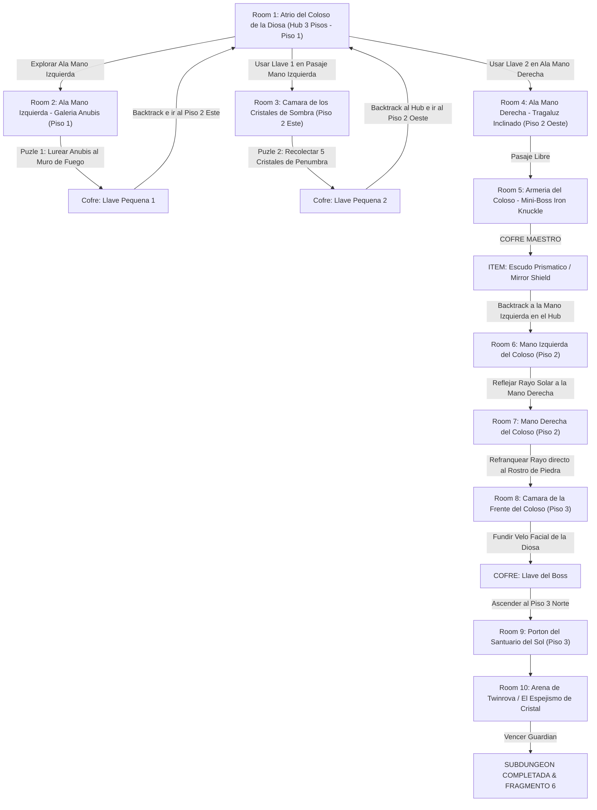

# ☀️ Subdungeon 6: El Santuario Prismático (Layout Complejo estilo Spirit Temple Verbatim)

> **Ubicación**: `7 - DM/OneShots/ARepeat/Subdungeons/06_Subdungeon_Luz_Santuario.md`  
> **Inspiración Verbatim**: **Spirit Temple** (*The Legend of Zelda: Ocarina of Time*)  
> **Estructura de Layout**: **El Atrio del Coloso de la Diosa (Hub 3 Pisos)** + **2 Llaves Pequeñas** + **Ala Mano Izquierda (Sombras)** + **Ala Mano Derecha (Iron Knuckle)** + **Cadena de Refracción de Luz Solar entre Manos**  
> **Dungeon Item**: *Escudo Prismático / Mirror Shield* (Reflexión de Luz Solar & Refracción Elemental)  
> **Guardián de Área**: *El Espejismo de Cristal* (Inspirado en *Twinrova / Iron Knuckle*)  
> **Recompensa**: 🔓 Desbloqueo Permanente del Santuario Prismático + Fragmento de Tablilla #6

---

## 🗺️ Mapa de Flujo No-Lineal de la Mazmorra (Spirit Temple Complex Multi-Floor Layout)

---

## 🏛️ Recorrido Verbatim Sala por Sala con Puzles e Interconexiones

### Room 1: Atrio del Coloso de la Diosa (Hub Central - 3 Pisos - Piso 1)
> *"Un templo excavado en un coloso del desierto de 40 pies con la forma de la Diosa de la Arena. Sus dos manos extendidas están a la altura del Piso 2 y su rostro cubierto por un velo de piedra preside el Piso 3. En la base destacan: Ala Mano Izquierda (Este 1F), Ala Mano Derecha (Oeste 2F - Locked 🗝️2) y el Portón del Sol en la cumbre (Piso 3 Norte - Locked 🔒)."*

---

### Room 2: 🧩 Ala Mano Izquierda (Piso 1): Galería Anubis (OoT)
> *"Un corredor flanqueado por estatuas de cobras donde un espectro Anubis flota imitando cada paso del jugador en espejo."*
* **Puzle Involucrado**: Encender la antorcha del muro y maniobrar la posición (*Inteligencia DC 12*) para forzar al Anubis imitado a entrar al fuego.
* **Botín**: El espectro se incinera revelando la **Llave Pequeña 🗝️1**.
* **🔄 BACKTRACKING**: Ascender al Piso 2 e insertar la Llave 🗝️1 en el pasaje de la Mano Izquierda (Room 3).

---

### Room 3: 🧩 Ala Mano Izquierda (Piso 2): Cámara de Cristales de Sombra (OoT)
> *"Una sala con pasarelas sobre el vacío donde 5 cristales de penumbra flotan sobre trampas de estacas."*
* **Puzle Involucrado**: Recolectar los 5 cristales en menos de 60 segundos (*Acrobacias DC 12*).
* **Botín**: El mecanismo de tiempo desengancha el cofre con la **Llave Pequeña 🗝️2**.
* **🔄 BACKTRACKING**: Regresar al **Hub (Room 1)**, cruzar al Piso 2 Oeste e insertar la Llave 🗝️2 en el Ala Mano Derecha.

---

### Room 4: Ala Mano Derecha (Piso 2 Oeste): Tragaluz Inclinado
> *"Un pasillo iluminado en diagonal por un haz solar de cúpula."*

---

### Room 5: ⚔️ Mini-Boss (Piso 2 Oeste): Armería del Coloso (Iron Knuckle OoT)
> *"Un caballero en armadura pesada de hierro armado con un hacha masiva."*
* **Mini-Boss**: Iron Knuckle (AC 17, 55 HP; al ser golpeado, su armadura cae por piezas aumentando su velocidad).
* **🎁 COFRE MAESTRO**: Otorga el **Escudo Prismático / Mirror Shield** (Capaz de reflejar luz solar concentrada y refranquear magia elemental).
* **🔄 BACKTRACKING & CADENA DE REFRACCIÓN**: El grupo regresa al **Hub (Room 1)** y sube a la **Mano Izquierda del Coloso en el Piso 2 (Room 6)**.

---

### Room 6: 🧩 Mano Izquierda del Coloso (Piso 2): Primera Refracción (OoT)
> *"Pararse en la palma izquierda de la estatua e interponer el Escudo Prismático (Mirror Shield) en el haz solar principal."*
* **Puzle Involucrado**: Reflejar el rayo solar horizontalmente a través de todo el atrio central hacia el espejo de la **Mano Derecha (Room 7)** (*Destreza DC 12*).

---

### Room 7: 🧩 Mano Derecha del Coloso (Piso 2): Refracción al Rostro (OoT)
> *"Cruzar a la palma derecha de la estatua donde el rayo reflejado impacta en el segundo espejo."*
* **Puzle Involucrado**: Refranquear el haz concentrado directo al rostro de piedra de la estatua en el Piso 3 durante 6 segundos.
* **Resultado**: ¡La piedra del velo facial se calienta al rojo vivo y se pulveriza en un destello de luz!, revelando la cámara oculta de la frente (Room 8).

---

### Room 8: Cámara de la Frente del Coloso (Piso 3 - Llave del Boss 👑)
> *"La estancia secreta detrás del rostro fundido de la Diosa."*
* **Botín**: Reclamar el cofre dorado con la **Llave del Boss 👑 (Llave de la Diosa de la Arena)**.

---

### Room 9: 🔒 Portón del Santuario del Sol (Piso 3 Norte)
> *"Insertar la Llave del Boss 👑 en el portón de bronce grabado con Kotake y Koume."*

---

### Room 10: 💀 Boss Final: Twinrova / El Espejismo de Cristal (OoT)
> *"Plataforma elevada donde Kotake (Fuego) y Koume (Hielo) vuelan lanzando ráfagas elementales opuestas."*
* **Mecánica Twinrova**: Absorber 3 impactos de fuego con el *Mirror Shield* (*DC 13*) y reflejar una bola masiva de fuego sobre Koume (Hielo) para aturdirla.
* **Recompensa**: 🔓 Desbloqueo permanente del Santuario Prismático + **Fragmento de Tablilla #6**.
