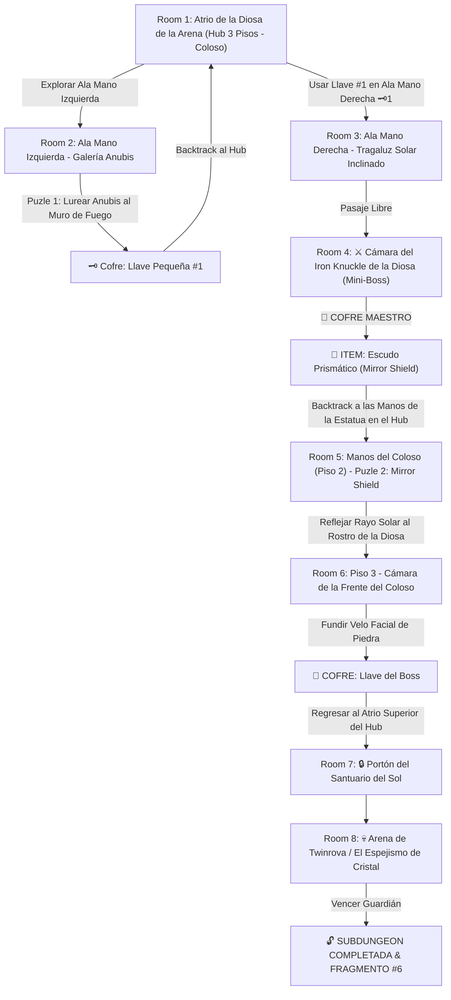

# ☀️ Subdungeon 6: El Santuario Prismático (Layout Complejo y No-Lineal estilo Spirit Temple)

> **Ubicación**: `7 - DM/OneShots/ARepeat/Subdungeons/06_Subdungeon_Luz_Santuario.md`  
> **Inspiración Verbatim**: **Spirit Temple** (*The Legend of Zelda: Ocarina of Time*)  
> **Estructura de Layout**: **El Atrio del Coloso del Desierto (Hub de 3 Pisos)** + **Ala Mano Izquierda (Galería Anubis)** + **Ala Mano Derecha (Iron Knuckle)** + **Refracción de Luz Solar con el Mirror Shield al Rostro de Piedra**  
> **Dungeon Item**: *Escudo Prismático / Mirror Shield* (Reflexión de Luz Solar y Refracción Elemental)  
> **Guardián de Área**: *El Espejismo de Cristal* (Inspirado en *Twinrova / Iron Knuckle*)  
> **Recompensa**: 🔓 Desbloqueo Permanente del Santuario Prismático + Fragmento de Tablilla #6

---

## 🗺️ Mapa de Flujo No-Lineal de la Mazmorra (Spirit Temple Non-Linear Layout)

---

## 🏛️ Recorrido Verbatim Sala por Sala (DM Walkthrough & Light Refracion)

### Room 1: Atrio de la Diosa de la Arena (Hub 3 Pisos - Coloso)
> *"Un templo de piedra rojiza excavado en un coloso del desierto. Una estatua de 40 pies de la Diosa de la Arena domina el centro con sus dos manos extendidas a la altura del Piso 2. El rostro está cubierto por un velo facial de piedra. Tres accesos destacan: Mano Izquierda (Este), Mano Derecha (Oeste - Locked 🗝️1) y el Portón del Sol en la cima del Piso 3 (Locked 🔒)."*
* **Estructura Hub**: Conecta horizontal y verticalmente las alas de la estatua.

---

### Room 2: 🧩 Ala Mano Izquierda: Galería Anubis (OoT)
> *"Un corredor donde flota un espectro Anubis que imita cada paso en espejo."*
* **Puzle Involucrado**: Encender la antorcha del muro y maniobrar la posición (*Inteligencia DC 12*) para forzar al Anubis imitado a entrar al fuego.
* **Botín**: El espectro se incinera revelando la **Llave Pequeña 🗝️1**.
* **🔄 BACKTRACKING**: Regresar al **Hub (Room 1)** e insertar la Llave 🗝️1 en el Ala Mano Derecha.

---

### Room 3: Ala Mano Derecha: Tragaluz Solar Inclinado
> *"Un pasillo iluminado en diagonal por un haz solar de cúpula."*

---

### Room 4: ⚔️ Cámara del Mini-Boss: Iron Knuckle de la Diosa (OoT)
> *"Un caballero en armadura pesada de hierro armado con un hacha masiva."*
* **🎁 COFRE MAESTRO**: Otorga el **Escudo Prismático / Mirror Shield** (Refleja luz solar concentrada y absorbe magia elemental).
* **🔄 BACKTRACKING & REFLEXIÓN AL ROSTRO**: El grupo regresa al **Hub (Room 1)** y sube a las manos extendidas de la estatua en el Piso 2.

---

### Room 5: 🧩 Manos del Coloso: Reflejar Luz al Rostro de Piedra (OoT)
> *"Pararse en las palmas de la estatua e interponer el recién obtenido Escudo Prismático (Mirror Shield) en el haz solar."*
* **Puzle Involucrado**: Intercept el rayo solar y apuntar la reflexión directa al velo de piedra del rostro de la estatua (*Destreza DC 12*) durante 6 segundos.
* **Resultado**: La piedra del velo facial se calienta al rojo vivo y se pulveriza en luz, revelando la cámara oculta de la frente en el Piso 3 (Room 6).

---

### Room 6: Piso 3: Cámara de la Frente del Coloso (Llave del Boss 👑)
> *"La cámara secreta detrás del rostro fundido de la Diosa."*
* **Botín**: Reclamar el cofre dorado con la **Llave del Boss 👑 (Llave de la Diosa)**.

---

### Room 7: 🔒 Portón del Santuario del Sol (Piso 3)
> *"Insertar la Llave del Boss 👑 en el portón de bronce con los relieves de Kotake y Koume."*

---

### Room 8: 💀 Boss Final: Twinrova / El Espejismo de Cristal (OoT)
> *"Plataforma elevada rodeada por un abismo donde Kotake (Fuego) y Koume (Hielo) vuelan lanzando ráfagas."*
* **Mecánica Boss**: Absorber 3 impactos de fuego con el *Mirror Shield* y reflejar una bola masiva de fuego sobre Koume (Hielo) para aturdirla.
* **Recompensa**: 🔓 Desbloqueo permanente del Santuario Prismático + **Fragmento de Tablilla #6**.
