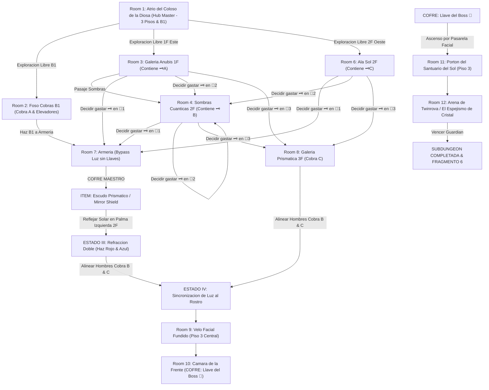

# ☀️ Subdungeon 6: El Santuario Prismático (Zelda Macro-Dungeon: Spirit Temple / Light Network Style)

> **Ubicación**: `7 - DM/OneShots/ARepeat/Subdungeons/06_Subdungeon_Luz_Santuario.md`  
> **Inspiración Verbatim**: **Spirit Temple** (*Ocarina of Time*) + **Water Temple** (*Ocarina of Time*)  
> **Regla de Diseño DM**: **CERO BLOQUEOS POR TIRADA OBLIGATORIA (No Skill-Check Gates)**. La progresión es 100% interactiva, mecánica y espacial. Las tiradas de dados son opcionales (evitar daño, ir más rápido o hallar secretos), pero el paso a nuevas áreas NUNCA depende de fallar/pasar un dado.  
> **Estructura de Layout**: **Hub Master (3 Pisos & B1 Foso)** + **Macro-Gimmick: Matriz Prismática Solar (4 Estados de Red de Luz Global)** + **3 Estatuas Cobra Orientables** + **Matriz No-Lineal de 3 Llaves Pequeñas e Intercambiables**  
> **Dungeon Item**: *Escudo Prismático / Mirror Shield* (Reflexión Solar & Refracción Elemental)  
> **Guardián de Área**: *El Espejismo de Cristal* (Inspirado en *Twinrova / Iron Knuckle*)  
> **Recompensa**: 🔓 Desbloqueo Permanente del Santuario Prismático + Fragmento de Tablilla #6

---

## ⚙️ El Macro-Gimmick Global: Matriz Prismática Solar (4 Estados de Red de Luz)

Del tragaluz de la cúpula en el Hub Master desciende un haz de luz solar blanca constante. Tres **Estatuas Cobra Rúnicas (A en B1, B en 2F Este, C en 3F Centro)** pueden orientarse mediante ruedas de engranajes o utilizando el *Escudo Prismático* para canalizar el haz de luz a través de toda la estructura de la mazmorra:

* **ESTADO I (Luz al Foso B1 - Cobra A)**: Orientar el haz solar principal hacia el Foso B1 enciende el Cristal del Estanque, activando elevadores hidráulicos de agua de alabastro que conectan 1F con 2F.
* **ESTADO II (Luz a la Armería 2F - Cobra B)**: Canalizar el haz solar hacia el pasaje 2F Oeste calienta y funde la muralla de alabastro translúcido de la Armería (Room 7), permitiendo enfrentar al *Iron Knuckle* (con o sin Llaves Pequeñas).
* **ESTADO III (Refracción Doble Prismática - Mirror Shield + Cobra C)**: Usar el *Mirror Shield* en 2F para reflejar el haz solar hacia el prisma de la Cobra C (3F) **divide el haz en 2 haces elementales (Haz Rojo de Fuego y Haz Azul de Hielo)** que cruzan el atrio flotante.
* **ESTADO IV (Sincronización al Rostro)**: Orientar los dos haces refractados simultáneamente a los dos receptores oculares del Velo de Piedra de la Diosa. El velo de roca se pulveriza en un destello de luz, revelando la Cámara de la Frente y la *Llave del Boss 👑*.

---

## 🔑 Matriz No-Lineal de Llaves Pequeñas y Candados Intercambiables

El grupo puede hallar hasta **3 Llaves Pequeñas (🗝️A, 🗝️B, 🗝️C)** en cualquier secuencia y decidir en qué **Puerta Candado (🚪1, 🚪2, 🚪3)** gastarlas primero:

| Llave Pequeña | Ubicación Inicial | Acceso |
| :--- | :--- | :--- |
| **🗝️ Llave A** | Cofre tras puzle Anubis (Room 3: Ala Sombras 1F) | Libre desde 1F Este |
| **🗝️ Llave B** | Cofre en plataforma de sombras (Room 4: Sombras Cuánticas 2F) | Requiere alinear linternas de cuarzo |
| **🗝️ Llave C** | Cofre tras tragaluz inclinado (Room 6: Ala Sol 2F) | Requiere orientar espejo basculante |

| Puerta Candado | Destino | Ventaja de Abrir Primero |
| :--- | :--- | :--- |
| **🚪 Puerta 1** | Room 7: Armería del Coloso (Piso 2 Oeste) | Acceso temprano al **Mirror Shield** sin esperar al Estado II de luz. |
| **🚪 Puerta 2** | Room 4: Cámara de Sombras Cuánticas (Piso 2 Este) | Permite proyectar el puente de sombra entre Palma Izquierda y Palma Derecha. |
| **🚪 Puerta 3** | Room 8: Galería Prismática (Piso 3 Centro) | Acceso manual a la rueda de engranajes de la Cobra C. |

---

## 🗺️ Mapa de Flujo No-Lineal de la Mazmorra (Spirit Matrix Flowchart)

---

## 🏛️ Recorrido Verbatim Sala por Sala (Mecánicas Zelda & Conexiones 3D)

### Room 1: Atrio del Coloso de la Diosa (Hub Master - 3 Pisos & B1 Foso)
> *"Un monumental templo excavado en la roca rojiza de un coloso de 40 pies. Sus dos palmas extendidas abarcadoras bordean el Piso 2, mientras un velo de piedra oculta su rostro en el Piso 3. Del tragaluz superior cae una columna de luz solar pura. En el suelo del Piso 1 parten tres accesos: Ala Sombras (Este), Ala Sol (Oeste) y el descenso al Foso de las Cobras (B1)."*
* **Mecánica Central**: Matriz de luz interconectada en 3D. Ningún bloqueo por tirada.

---

### Room 2: 🧩 Foso Subterráneo de las Cobras (Piso B1 - Cobra A & Elevadores)
> *"Un nivel inferior con estatuas de cobras sumergidas en un estanque de arena dorada."*
* **Puzle Mecánico Sin Gating**:
  1. Girar la rueda de engranajes de la Cobra A para dirigir el haz solar al Cristal del Estanque.
  2. El cristal activa dos columnas elevadoras hidráulicas de alabastro que conectan B1 directamente con Palma Izquierda (2F).
* **Bypass de Armería**: El reflejo secundario de la Cobra A funde la cerradura trasera de la Armería (Room 7) desde abajo.

---

### Room 3: 🧩 Ala Sombras (Piso 1 Este): Galería Anubis
> *"Un pasadizo custodiado por un espectro Anubis que flota sobre antorchas extintas imitando simétricamente los movimientos del jugador."*
* **Puzle Mecánico Sin Gating**:
  1. Presionar la losa de muro para encender la antorcha central.
  2. Desplazarse 3 casillas a la izquierda para obligar al Anubis imitado a marchar sobre el fuego.
* **Botín**: Cofre con la **Llave Pequeña 🗝️A**.

---

### Room 4: 🧩 Cámara de Sombras Cuánticas (Piso 2 Este - 🚪2)
> *"Una pasarela sobre el abismo donde linternas de cuarzo proyectan sombras sólidas sobre los muros."*
* **Puzle Mecánico Sin Gating**: Girar las linternas proyecta puentes de sombra sólida entre Palma Izquierda y Palma Derecha. *(Tirada opcional de Acrobacias DC 12 permite cruzar corriendo en mitad de tiempo)*.
* **Botín**: Cofre con la **Llave Pequeña 🗝️B**.

---

### Room 5: Palma Izquierda del Coloso (Piso 2 Este - Pedestal Cobra B)
> *"La gran palma extendida de la estatua en el Piso 2. Alberga la Estatua Cobra B y un tragaluz orientado al centro del atrio."*

---

### Room 6: 🧩 Ala Sol (Piso 2 Oeste): Tragaluz Solar Inclinado
> *"Un corredor bañado por un haz solar diagonal cruzado por espejos basculantes."*
* **Puzle Mecánico Sin Gating**: Ajustar la manivela de la cobra basculante dirige el rayo solar a la linterna rúnica.
* **Botín**: Cofre con la **Llave Pequeña 🗝️C**.

---

### Room 7: ⚔️ Armería del Coloso: Mini-Boss Iron Knuckle (Piso 2 Oeste - 🚪1 o Estado II de Luz)
> *"Una cámara abovedada donde un Iron Knuckle en armadura pesada de hierro empuña una hacha masiva."*
* **Combate**: Iron Knuckle (AC 18, 65 HP). Obligar al caballero a golpear los pilares de mármol para destrozar su armadura y rematar su núcleo.
* **🎁 COFRE MAESTRO**: Otorga el **Escudo Prismático / Mirror Shield** (Refleja rayos de luz solar y refracta proyectiles elementales).

---

### Room 8: 🧩 Galería Alta Prismática (Piso 3 Centro - 🚪3 & Cobra C)
> *"Una balconada alta en el Piso 3 con un monumental cristal de cuarzo divisor montado sobre la Estatua Cobra C."*
* **Mecánica (Estado III & IV)**: Recibir el haz reflejado por el *Mirror Shield* desde el Piso 2 divide el haz en **dos rayos elementales (Fuego Rojo y Hielo Azul)**.

---

### Room 9: 🧩 Palma Derecha y Velo Facial: Refracción Doble al Rostro (Estado IV)
> *"Cruzar a la Palma Derecha (Piso 2 Oeste) e interponer la estatua espejada para dirigir ambos haces refractados."*
* **Mecánica Posicional Pura**: Apuntar los haces elementales rojo y azul a los dos receptores oculares del **Velo de Piedra** durante 6 segundos.
* **Resultado**: La piedra del velo facial se calienta y funde en un destello de luz, colapsando y revelando la Cámara de la Frente (Room 10).

---

### Room 10: Cámara de la Frente del Coloso (Piso 3 Secreta): La Llave del Boss 👑
> *"La estancia secreta tras el velo facial colapsado."*
* **Botín**: Abrir el cofre dorado monumental para obtener la **Llave del Boss 👑 (Llave de la Diosa del Sol)**.

---

### Room 11: 🔒 Portón del Santuario del Sol (Piso 3 Norte)
> *"Ascender por los escombros del velo fundido e insertar la Llave del Boss 👑 en el portón de bronce."*

---

### Room 12: 💀 Boss Final: Twinrova / El Espejismo de Cristal (OoT)
> *"Una plataforma circular suspendida sobre el vacío donde Kotake (Fuego) y Koume (Hielo) sobrevuelan desatando ráfagas elementales."*
* **Mecánica Twinrova**: Absorber 3 ráfagas elementales consecutivas del mismo tipo con el *Mirror Shield* y redirigir la gran descarga refractada a la bruja opuesta para derribarla.
* **Recompensa**: 🔓 Desbloqueo permanente del Santuario Prismático + **Fragmento de Tablilla #6**.

