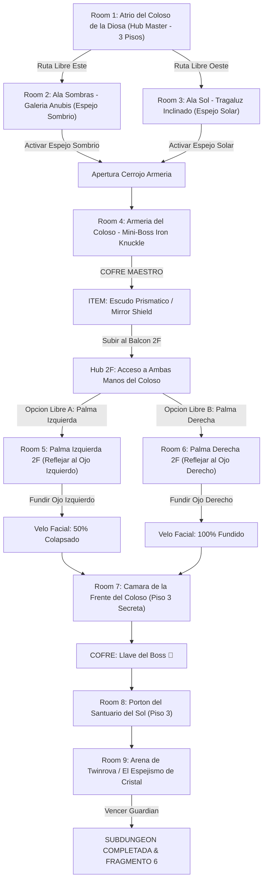

# ☀️ Subdungeon 6: El Santuario Prismático (Layout No-Lineal con Ramificación Doble estilo Spirit Temple OoT)

> **Ubicación**: `7 - DM/OneShots/ARepeat/Subdungeons/06_Subdungeon_Luz_Santuario.md`  
> **Inspiración Verbatim**: **Spirit Temple** (*The Legend of Zelda: Ocarina of Time*)  
> **Regla de Diseño DM**: **CERO BLOQUEOS POR TIRADA OBLIGATORIA (No Skill-Check Gates)**. La progresión es 100% interactiva, mecánica y espacial. Las tiradas de dados son opcionales (evitar daño, ir más rápido o hallar secretos), pero el paso a nuevas áreas NUNCA depende de fallar/pasar un dado.  
> **Estructura de Layout**: **Atrio del Coloso (Hub Master - 3 Pisos)** + **Ramificación Paralela Pre-Item (Ala Sombras Este & Ala Sol Oeste)** + **Ramificación Paralela Post-Item (Palma Izquierda & Palma Derecha)** + **Refracción Solar Doble al Rostro**  
> **Dungeon Item**: *Escudo Prismático / Mirror Shield* (Reflexión de Luz Solar & Refracción Elemental)  
> **Guardián de Área**: *El Espejismo de Cristal* (Inspirado en *Twinrova / Iron Knuckle*)  
> **Recompensa**: 🔓 Desbloqueo Permanente del Santuario Prismático + Fragmento de Tablilla #6

---

## 🗺️ Mapa de Flujo No-Lineal de la Mazmorra (Spirit Temple Dual-Branching Layout)

---

## 🏛️ Recorrido Verbatim Sala por Sala (DM Walkthrough & Dual-Branching Flow)

### Room 1: Atrio del Coloso de la Diosa (Hub Master - 3 Pisos)
> *"Un gran templo excavado en la piedra rojiza de un coloso de 40 pies. Sus dos manos extendidas están en el Piso 2 y su rostro cubierto por un velo de piedra domina el Piso 3. Del tragaluz de la cúpula cae un haz constante de luz solar blanca. Desde el Piso 1 parten dos accesos libres en paralelo: al Este el Ala Sombras y al Oeste el Ala Sol. En el Piso 3 se ubica el Portón del Sol 🔒."*
* **Acceso Sin Gating**: Los jugadores pueden comenzar explorando Ala Sombras (Room 2) o Ala Sol (Room 3) de manera totalmente independiente.

---

### Room 2: 🧩 Ala Sombras (Piso 1 Este): Galería Anubis (OoT)
> *"Un corredor donde flota un espectro Anubis que imita simétricamente cada paso del jugador."*
* **Puzle Mecánico Sin Gating**:
  1. Presionar la losa del muro para encender la antorcha central.
  2. Mover al personaje 3 casillas a la izquierda para forzar al Anubis imitado a marchar sobre el fuego, incinerándolo.
* **Resultado**: Se activa el **Espejo Sombrío**.

---

### Room 3: 🧩 Ala Sol (Piso 1 Oeste): Cámara del Tragaluz Inclinado (OoT)
> *"Una sala bañado por un haz solar inclinado cruzado por pedestales espejados."*
* **Puzle Mecánico Sin Gating**: Ajustar la manivela de la cobra espejada para alinear el rayo solar con el receptor de la pared.
* **Resultado**: Se activa el **Espejo Solar**.
* **Apertura de Armería**: Al activar el Espejo Sombrío y el Espejo Solar en cualquier orden, los pesados portones de bronce de la Armería (Room 4) en el Piso 2 se abren.

---

### Room 4: ⚔️ Mini-Boss (Piso 2 Oeste): Armería del Coloso (Iron Knuckle OoT)
> *"Una cámara abovedada donde un caballero en armadura de hierro pesada empuña una hacha masiva."*
* **Combate**: Iron Knuckle (AC 18, 65 HP). Obligarle a golpear los pilares de mármol de la sala para destrozar su armadura y rematar su núcleo.
* **🎁 COFRE MAESTRO**: Otorga el **Escudo Prismático / Mirror Shield** (Refleja rayos de luz solar y refracta proyectiles mágicos).
* **🔄 RAMIFICACIÓN EN PISO 2**: Con el *Mirror Shield*, los jugadores ascienden al balcón del Piso 2 donde tienen acceso libre a **ambas manos del Coloso en paralelo**.

---

### Room 5: 🧩 Palma Izquierda del Coloso (Piso 2 Este - Balcón Hub)
> *"La gran palma extendida de la estatua en el Piso 2 Este sobre la que cae un haz secundario de luz solar."*
* **Mecánica Posicional Sin Gating**: Interponer el *Mirror Shield* en el haz solar y reflejar el rayo hacia el **Ojo Izquierdo del Velo de Piedra**.
* **Resultado**: El Ojo Izquierdo de roca se calienta al rojo vivo y se colapsa en un destello (50% del velo fundido).

---

### Room 6: 🧩 Palma Derecha del Coloso (Piso 2 Oeste - Balcón Hub)
> *"La gran palma extendida de la estatua en el Piso 2 Oeste sobre la que cae el segundo haz de luz solar."*
* **Mecánica Posicional Sin Gating**: Interponer el *Mirror Shield* (o accionar el pedestal espejado de la mano derecha) para reflejar el rayo hacia el **Ojo Derecho del Velo de Piedra**.
* **Resultado**: El Ojo Derecho de roca se calienta al rojo vivo y se pulveriza.
* **Colapso del Velo Facial**: Al fundir ambos ojos en cualquier orden, la máscara facial completa de piedra se resquebraja y cae, revelando la estancia secreta de la frente (Room 7).

---

### Room 7: 🧩 Cámara de la Frente del Coloso (Piso 3 Secreta - Llave del Boss 👑)
> *"La estancia secreta detrás del rostro fundido de la Diosa."*
* **Botín**: Abrir el cofre dorado para reclamar la **Llave del Boss 👑 (Llave de la Diosa del Sol)**.

---

### Room 8: 🔒 Portón del Santuario del Sol (Piso 3 Norte)
> *"Ascender por los escombros del velo fundido al Piso 3 e insertar la Llave del Boss 👑 en el portón de bronce."*

---

### Room 9: 💀 Boss Final: Twinrova / El Espejismo de Cristal (OoT)
> *"Una plataforma circular suspendida sobre el vacío donde Kotake (Fuego) y Koume (Hielo) sobrevuelan desatando ráfagas elementales."*
* **Mecánica Twinrova**: Absorber 3 ráfagas elementales consecutivas del mismo tipo con el *Mirror Shield* y redirigir la gran descarga refractada a la bruja opuesta para derribarla.
* **Recompensa**: 🔓 Desbloqueo permanente del Santuario Prismático + **Fragmento de Tablilla #6**.

