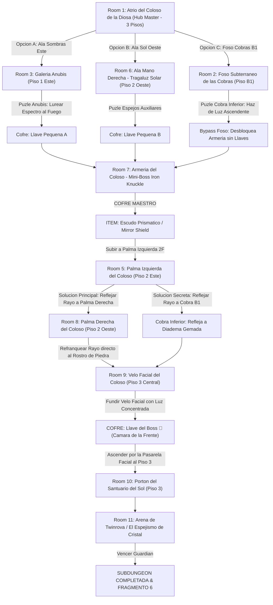

# ☀️ Subdungeon 6: El Santuario Prismático (Layout Ultra-No-Lineal estilo Spirit Temple OoT)

> **Ubicación**: `7 - DM/OneShots/ARepeat/Subdungeons/06_Subdungeon_Luz_Santuario.md`  
> **Inspiración Verbatim**: **Spirit Temple** (*The Legend of Zelda: Ocarina of Time*)  
> **Regla de Diseño DM**: **CERO BLOQUEOS POR TIRADA OBLIGATORIA (No Skill-Check Gates)**. La progresión es 100% interactiva, mecánica y espacial. Las tiradas de dados son opcionales (evitar daño, ir más rápido o hallar secretos), pero el paso a nuevas áreas NUNCA depende de fallar/pasar un dado.  
> **Estructura de Layout**: **Hub Master (3 Pisos)** + **Exploración Inicial Triple (Ala Sombras Este / Ala Sol Oeste / Foso Cobras B1)** + **Red Dinámica de Refracción de Luz Prismática** + **2 Soluciones de Luz a la Llave del Boss**  
> **Dungeon Item**: *Escudo Prismático / Mirror Shield* (Reflexión de Luz Solar & Refracción Elemental)  
> **Guardián de Área**: *El Espejismo de Cristal* (Inspirado en *Twinrova / Iron Knuckle*)  
> **Recompensa**: 🔓 Desbloqueo Permanente del Santuario Prismático + Fragmento de Tablilla #6

---

## 🗺️ Mapa de Flujo No-Lineal de la Mazmorra (Spirit Temple Multi-Branch Layout)

---

## 🏛️ Recorrido Verbatim Sala por Sala (DM Mechanics & No-Gate Guarantee)

### Room 1: Atrio del Coloso de la Diosa (Hub Master - 3 Pisos)
> *"Un monumental templo tallado en la roca rojiza de un coloso de 40 pies. Sus dos grandes palmas extendidas flanquean el Piso 2, mientras un velo de piedra cubre la frente y rostro de la estatua en el Piso 3. Del tragaluz de la cúpula desciende un torrente de luz solar blanca. En el Piso 1 existen tres accesos inmediatos: el Ala Sombras (Este), el Ala Sol (Oeste) y las escalinatas descendentes al Foso Subterráneo de las Cobras (B1)."*
* **Acceso Sin Gating**: Los jugadores eligen libremente su punto de entrada inicial.

---

### Room 2: 🧩 Foso Subterráneo de las Cobras (Piso B1 - Red de Espejos / Ruta Atajo)
> *"Un nivel inferior rodeado de pilares donde estatuas de cobras sumergidas en arena sostienen discos de alabastro pulido."*
* **Mecánica Sin Gating**:
  1. Girar la Cobra de Piedra Inferior alineando su disco con el haz de luz residual del atrio.
  2. El disco refleja un rayo vertical ascendente a través de la rejilla del suelo directamente al portón de la Armería (Room 7), **permitiendo acceder al Mini-Boss sin consumir llaves pequeñas**.

---

### Room 3: 🧩 Ala Sombras (Piso 1 Este): Galería Anubis (OoT / Spirit Temple)
> *"Un corredor flanqueado por antorchas extintas donde flota un espectro Anubis que imita simétricamente cada paso del jugador."*
* **Puzle Mecánico Puro (Sin Tirada Requerida)**:
  1. Presionar la losa del muro para encender la antorcha central.
  2. Desplazarse 3 casillas a la izquierda para forzar al Anubis imitado a marchar directamente sobre la llama, incinerándolo.
* **Botín**: Aparece el cofre con la **Llave Pequeña A 🗝️**.

---

### Room 4: 🧩 Cámara de las Sombras Cuánticas (Piso 2 Este)
> *"Una pasarela sobre el vacío donde linternas de cuarzo proyectan sombras sólidas en los muros."*
* **Mecánica Sin Gating**: Mover las linternas proyecta puentes de sombra sólida. Cruzar es 100% seguro al alinear las luces. *(Tirada opcional de Acrobacias DC 12 permite cruzar corriendo en la mitad de tiempo)*. Otorga un pasaje directo a la **Palma Izquierda (Room 5)**.

---

### Room 5: Palma Izquierda del Coloso (Piso 2 Este - Balcón del Hub)
> *"La gran palma abierta de la estatua en el Piso 2. Un pedestal espejado está posicionado justo donde impacta un rayo reflectante."*

---

### Room 6: 🧩 Ala Sol (Piso 2 Oeste): Tragaluz Solar Inclinado (OoT)
> *"Un pasadizo bañado por un haz de luz en diagonal. Un pedestal con trinquete permite orientar un espejo basculante."*
* **Puzle Mecánico Sin Gating**: Ajustar la manivela del trinquete proyecta el rayo al portón de la Armería.
* **Botín**: Otorga la **Llave Pequeña B 🗝️**.

---

### Room 7: ⚔️ Armería del Coloso: Mini-Boss Iron Knuckle (OoT)
> *"Una cámara circular donde se yergue un Iron Knuckle en armadura de hierro pesada empuñando una gran hacha."*
* **Combate Involucrado**: Forzar al Iron Knuckle a golpear los pilares de mármol de la estancia para destruir la armadura del boss y rematar su núcleo.
* **🎁 COFRE MAESTRO**: Otorga el **Escudo Prismático / Mirror Shield** (Refleja rayos de luz solar y refracta proyectiles mágicos).

---

### Room 8: 🧩 Palma Izquierda: Primera Refracción en Cadena (OoT)
> *"Pararse en la Palma Izquierda (Room 5) con el recién obtenido Escudo Prismático (Mirror Shield) e interponerlo en el rayo solar."*
* **Mecánica No-Lineal (Elección de Ruta de Luz)**:
  - *Ruta Principal (A la Palma Derecha)*: Apuntar el *Mirror Shield* horizontalmente cruzando el atrio hacia la Palma Derecha (Room 9).
  - *Ruta Secreta (Al Foso B1)*: Apuntar el rayo hacia la estatua de Cobra en el Foso B1 para activar el disparador del tesoro de la Diadema.

---

### Room 9: 🧩 Palma Derecha: Refracción al Velo Facial (OoT)
> *"Cruzar a la Palma Derecha (Piso 2 Oeste) e interceptar el rayo procedente de la Palma Izquierda."*
* **Mecánica Posicional Pura**: Interceptar el rayo con la segunda estatua espejada (o usando un segundo jugador con el *Mirror Shield*) y apuntarlo directamente al **Velo de Piedra** que cubre el rostro del Coloso durante 6 segundos.
* **Resultado**: La roca del velo se calienta al rojo vivo y se pulveriza en un fogonazo de luz, colapsando y revelando la cámara oculta de la frente (Room 10).

---

### Room 10: Cámara de la Frente del Coloso (Piso 3 Secreta - Llave del Boss 👑)
> *"La estancia secreta tras el rostro fundido de la Diosa."*
* **Botín**: Abrir el cofre dorado para reclamar la **Llave del Boss 👑 (Llave de la Diosa del Sol)**.

---

### Room 11: 🔒 Portón del Santuario del Sol (Piso 3 Norte)
> *"Ascender por los escombros del velo fundido e insertar la Llave del Boss 👑 en el portón de bronce."*

---

### Room 12: 💀 Boss Final: Twinrova / El Espejismo de Cristal (OoT)
> *"Una plataforma circular suspendida sobre el vacío donde Kotake (Fuego) y Koume (Hielo) sobrevuelan desatando ráfagas elementales."*
* **Mecánica Twinrova**: Absorber 3 ráfagas elementales consecutivas del mismo tipo con el *Mirror Shield* y redirigir la gran descarga refractada a la bruja opuesta para derribarla.
* **Recompensa**: 🔓 Desbloqueo permanente del Santuario Prismático + **Fragmento de Tablilla #6**.
