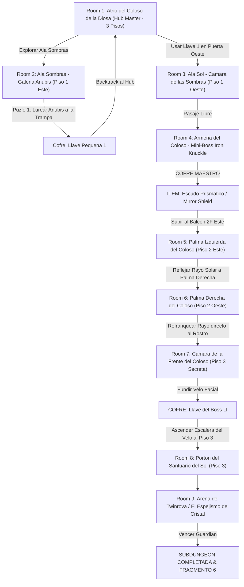

# ☀️ Subdungeon 6: El Santuario Prismático (Layout No-Lineal estilo Spirit Temple OoT)

> **Ubicación**: `7 - DM/OneShots/ARepeat/Subdungeons/06_Subdungeon_Luz_Santuario.md`  
> **Inspiración Verbatim**: **Spirit Temple** (*The Legend of Zelda: Ocarina of Time*)  
> **Regla de Diseño DM**: **CERO BLOQUEOS POR TIRADA OBLIGATORIA (No Skill-Check Gates)**. La progresión es 100% interactiva, mecánica y espacial. Las tiradas de dados son opcionales (evitar daño, ir más rápido o hallar secretos), pero el paso a nuevas áreas NUNCA depende de fallar/pasar un dado.  
> **Estructura de Layout**: **Atrio del Coloso (Hub Master - 3 Pisos)** + **Ala Sombras (Piso 1 Este)** + **Ala Sol (Piso 1 Oeste)** + **Red de Refracción de Luz entre Manos** + **Backtracking con Dungeon Item**  
> **Dungeon Item**: *Escudo Prismático / Mirror Shield* (Reflexión de Luz Solar & Refracción Elemental)  
> **Guardián de Área**: *El Espejismo de Cristal* (Inspirado en *Twinrova / Iron Knuckle*)  
> **Recompensa**: 🔓 Desbloqueo Permanente del Santuario Prismático + Fragmento de Tablilla #6

---

## 🗺️ Mapa de Flujo No-Lineal de la Mazmorra (Spirit Temple Balanced Zelda Layout)

---

## 🏛️ Recorrido Verbatim Sala por Sala (DM Walkthrough & Light Mechanics)

### Room 1: Atrio del Coloso de la Diosa (Hub Master - 3 Pisos)
> *"Un gran templo excavado en la piedra rojiza de un coloso de 40 pies. Sus dos manos extendidas están en el Piso 2 y su rostro cubierto por un velo de piedra domina el Piso 3. Del tragaluz de la cúpula cae un haz constante de luz solar blanca. Tres accesos destacan: al Este el Ala Sombras, al Oeste un corredor con cerrojo de latón 🗝️1, y en el Piso 3 el Portón del Sol 🔒."*
* **Acceso Sin Gating**: Los jugadores eligen libremente por dónde explorar.

---

### Room 2: 🧩 Ala Sombras (Piso 1 Este): Galería Anubis (OoT)
> *"Un corredor donde flota un espectro Anubis que imita simétricamente cada paso del jugador."*
* **Puzle Mecánico Sin Gating**:
  1. Presionar la losa del muro para encender la antorcha central.
  2. Mover al personaje 3 casillas a la izquierda para forzar al Anubis imitado a marchar sobre el fuego, incinerándolo.
* **Botín**: Aparece el cofre con la **Llave Pequeña 🗝️1**.
* **🔄 BACKTRACKING**: Regresar al **Hub (Room 1)** e insertar la Llave 🗝️1 en la Puerta Oeste.

---

### Room 3: 🧩 Ala Sol (Piso 1 Oeste): Cámara de las Sombras Cuánticas (OoT)
> *"Una sala sobre el vacío donde linternas de cuarzo proyectan sombras sólidas sobre los muros."*
* **Puzle Mecánico Sin Gating**: Mover las linternas proyecta puentes de sombra sólida para cruzar de forma 100% segura. *(Tirada opcional de Acrobacias DC 12 permite cruzar corriendo en mitad de tiempo)*. Otorga paso a la Armería (Room 4).

---

### Room 4: ⚔️ Mini-Boss (Piso 2 Oeste): Armería del Coloso (Iron Knuckle OoT)
> *"Una cámara abovedada donde un caballero en armadura de hierro pesada empuña una hacha masiva."*
* **Combate**: Iron Knuckle (AC 18, 65 HP). Obligarle a golpear los pilares de mármol de la sala para destrozar su armadura y rematar su núcleo.
* **🎁 COFRE MAESTRO**: Otorga el **Escudo Prismático / Mirror Shield** (Refleja rayos de luz solar y refracta proyectiles mágicos).
* **🔄 BACKTRACKING & REFRACCIÓN DE LUZ**: Con el *Mirror Shield*, subir al balcón del **Hub (Room 1 - Palma Izquierda)**.

---

### Room 5: 🧩 Palma Izquierda del Coloso (Piso 2 Este - Hub Balcón)
> *"La gran palma extendida de la estatua en el Piso 2. El haz solar principal procedente del tragaluz cae directamente sobre la palma."*
* **Mecánica Posicional Sin Gating**: Interponer el *Escudo Prismático (Mirror Shield)* en el haz solar y reflejar el rayo de luz horizontalmente cruzando todo el atrio hasta la Palma Derecha (Room 6).

---

### Room 6: 🧩 Palma Derecha: Refracción al Velo Facial (OoT)
> *"Cruzar a la Palma Derecha (Piso 2 Oeste) e interceptar el rayo procedente de la Palma Izquierda."*
* **Mecánica Posicional Sin Gating**: Interceptar el rayo con la estatua espejada de la mano derecha (o con el escudo) y apuntarlo directamente al **Velo de Piedra** que cubre el rostro del Coloso durante 6 segundos.
* **Resultado**: La roca del velo facial se calienta al rojo vivo y se pulveriza en un destello de luz, colapsando y revelando la cámara oculta de la frente (Room 7).

---

### Room 7: 🧩 Cámara de la Frente del Coloso (Piso 3 Secreta - Llave del Boss 👑)
> *"La estancia secreta detrás del rostro fundido de la Diosa."*
* **Botín**: Abrir el cofre dorado para reclamar la **Llave del Boss 👑 (Llave de la Diosa del Sol)**.

---

### Room 8: 🔒 Portón del Santuario del Sol (Piso 3 Norte)
> *"Ascender por los escombros del velo fundido al Piso 3 e insertar la Llave del Boss 👑 en el portón de bronce."*

---

### Room 9: 💀 Boss Final: Twinrova / El Espejismo de Cristal (OoT)
> *"Una plataforma circular suspendida sobre el vacío donde Kotake (Fuego) y Koume (Hielo) sobrevuelan desatando ráfagas elementales."*
* **Mecánica Twinrova**: Absorber 3 ráfagas elementales consecutivas del mismo tipo con el *Mirror Shield* y redirigir la gran descarga refractada a la bruja opuesta para derribarla.
* **Recompensa**: 🔓 Desbloqueo permanente del Santuario Prismático + **Fragmento de Tablilla #6**.

