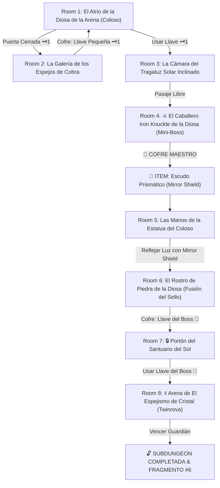

# ☀️ Subdungeon 6: El Santuario Prismático (Inspirada en el Spirit Temple - Ocarina of Time Verbatim)

> **Ubicación**: `7 - DM/OneShots/ARepeat/Subdungeons/06_Subdungeon_Luz_Santuario.md`  
> **Inspiración Directa**: **Spirit Temple** (*The Legend of Zelda: Ocarina of Time*)  
> **Estética**: **El Coloso del Desierto**, **La Estatua de la Diosa de la Arena**, **Reflexión por Escudo de Espejo** e **Iron Knuckles**  
> **Dungeon Item**: *Escudo Prismático* (El legendario Mirror Shield de la Diosa)  
> **Guardián de Área**: *El Espejismo de Cristal* (Inspirado en *Twinrova / Iron Knuckle*)  
> **Recompensa**: 🔓 Desbloqueo Permanente del Santuario Prismático + Fragmento de Tablilla #6

---

## 🗺️ Mapa de Flujo de la Mazmorra (Spirit Temple Layout)

---

## 🏛️ Recorrido Verbatim Sala por Sala (Spirit Temple Walkthrough)

### Room 1: El Atrio de la Diosa de la Arena (Entrada)
> *"Un templo de piedra rojiza excavado en la roca de un coloso en medio del desierto. En el fondo del atrio se alza una majestuosa estatua de 40 pies de la Diosa de la Arena con brazos extendidos. En el rostro de la estatua hay un velo de piedra que oculta la entrada. Al norte, un portón con un candado de cobra 🗝️1 bloquea el paso."*
* **Estética (Spirit Temple OoT)**: Antorchas encendidas, relieves de cobras, estatuas de la Diosa de la Arena, tragaluces solares.
* **Puertas**: Sur (Entrada), Norte (Locked 🗝️1), Este (Abierta).
* **Acción DM**: Avanzar por el pasaje del Este (Room 2) para hallar la Llave Pequeña 🗝️1.

---

### Room 2: La Galería de los Espejos de Cobra (Llave Pequeña #1)
> *"Un corredor flanqueado por estatuas de cobras de piedra con espejos pulidos en sus cabezas. En el centro descansa un cofre de granito."*
* **Enemigos**: 3x Estatuas Anubis / Momias del Desierto (AC 13, 15 HP; vulnerables al fuego y la luz directa).
* **Resolución**: Girar la cabeza de las cobras para dirigir la luz solar sobre los Anubis y abrir el cofre con la **Llave Pequeña 🗝️1**.

---

### Room 3: La Cámara del Tragaluz Solar Inclinado
> *"Un haz de luz solar directa penetra en diagonal desde un tragaluz en la roca. Al usar la Llave 🗝️1, la puerta se abre hacia los aposentos del guardián."*
* **Puertas**: Sur (Locked 🗝️1 de vuelta), Norte (Puerta del Mini-Boss).
* **Resolución**: Insertar la Llave 🗝️1 y mover la estatua reflectante (*Fuerza DC 11*) para despejar el acceso a Room 4.

---

### Room 4: ⚔️ El Caballero Iron Knuckle de la Diosa (Mini-Boss & Dungeon Item)
> *"Un temible caballero cubierto por una armadura de placas de hierro masiva de 10 pies de altura provisto de un hacha de batalla gigante."*
* **Mini-Boss**: **Iron Knuckle** (Inspirado en Nabooru / Iron Knuckle OoT; AC 17, 55 HP; la armadura cae por piezas al sufrir daño).
* **🎁 COFRE MAESTRO**: Contiene el **Escudo Prismático / Mirror Shield** (El legendario escudo espejado capaz de reflejar haces de luz solar directa, fundir sellos faciales y disipar ilusiones).

---

### Room 5: Las Manos de la Estatua del Coloso (Navegación de Luz)
> *"El grupo asciende a las manos extendidas de la estatua de la Diosa de la Arena a 30 pies de altura. Frente al rostro de piedra de la estatua se alza un velo de piedra con el símbolo de un sol."*
* **Puzle**: Pararse en la mano de la estatua e interponer el recién obtenido *Escudo Prismático (Mirror Shield)* para interceptar el haz solar del tragaluz.
* **Resultado**: El espejo del escudo refleja un potente haz de luz solar concentrado directamente sobre la cara de piedra de la estatua de la Diosa.

---

### Room 6: El Rostro de Piedra de la Diosa (Llave del Boss 👑)
> *"El haz de luz reflejado por el Mirror Shield calienta el velo de piedra del rostro de la estatua hasta fundirlo en luz resplandeciente, revelando la cámara oculta de la frente."*
* **Puzle**: Entrar por la apertura fundida en la frente de la estatua.
* **Botín**: Reclamar del altar interior el cofre dorado con la **Llave del Boss 👑 (Llave de la Diosa de la Arena)**.

---

### Room 7: 🔒 Portón del Santuario del Sol
> *"Un portón ceremonial grabado con las efigies de Kotake y Koume (las brujas gemelas de fuego y hielo) y un candado con el relieve del sol espejado."*
* **Resolución**: Insertar la **Llave del Boss 👑** para abrir el paso hacia la cima de la cúpula del templo.

---

### Room 8: 💀 Arena de El Espejismo de Cristal (Twinrova Boss)
> *"Una plataforma elevada rodeada por un abismo donde El Espejismo de Cristal (las brujas gemelas de luz y penumbra) ataca refractando rayos solares."*
* **Mecánica Twinrova**: Ver ficha en [`07_Arena_del_Espejismo_de_Cristal.md`](file:///Users/matiasbay/Documents/Obsidian/Shivath/7%20-%20DM/OneShots/ARepeat/Salas/07_Salas_Especiales/07_Arena_del_Espejismo_de_Cristal.md). Usar el *Escudo Prismático (Mirror Shield)* para absorber y reflejar los rayos solares directamente a las brujas, disipando sus ilusiones y aturdiéndolas 1 ronda.
* **Recompensa**: 🔓 Desbloqueo permanente del Santuario Prismático + **Fragmento de Tablilla #6**.
