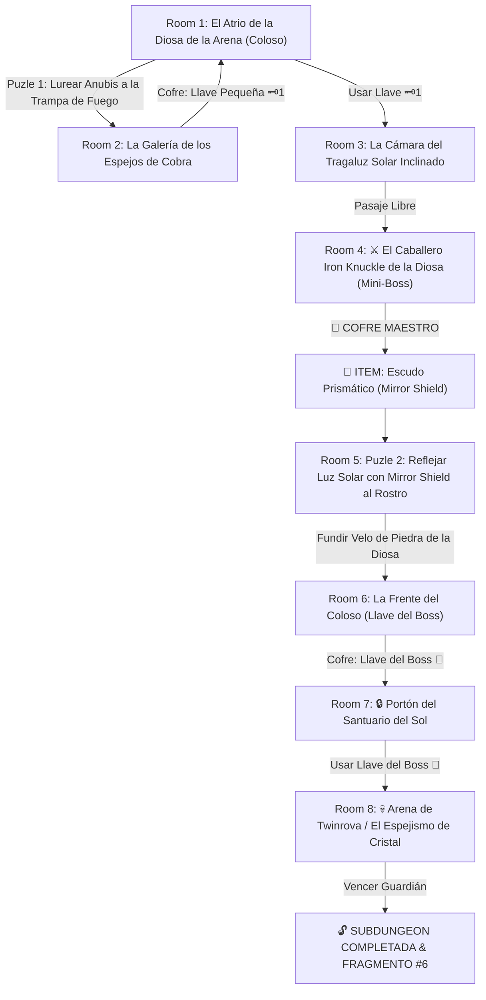

# ☀️ Subdungeon 6: El Santuario Prismático (Verbatim Spirit Temple - Ocarina of Time)

> **Ubicación**: `7 - DM/OneShots/ARepeat/Subdungeons/06_Subdungeon_Luz_Santuario.md`  
> **Inspiración Verbatim**: **Spirit Temple** (*The Legend of Zelda: Ocarina of Time*)  
> **Puzles Copiados Directos**: **El Ladrón de Sombras Anubis imitado en Trampa de Fuego**, **El Fundido del Velo Facial de la Diosa con el Mirror Shield** y **La Refracción Elemental contra Twinrova**  
> **Dungeon Item**: *Escudo Prismático / Mirror Shield* (Reflexión de Luz Solar y Refracción Elemental)  
> **Guardián de Área**: *El Espejismo de Cristal* (Inspirado en *Twinrova / Iron Knuckle*)  
> **Recompensa**: 🔓 Desbloqueo Permanente del Santuario Prismático + Fragmento de Tablilla #6

---

## 🗺️ Mapa de Flujo de la Mazmorra (Spirit Temple Layout)

---

## 🏛️ Recorrido Verbatim Sala por Sala con Puzles Involucrados

### Room 1: El Atrio de la Diosa de la Arena (Entrada)
> *"Un templo excavado en la piedra rojiza de un coloso en el desierto. En el fondo se alza una estatua de 40 pies de la Diosa de la Arena. Su rostro está cubierto por un velo de piedra. Al norte, un portón tiene un candado de cobra 🗝️1."*
* **Puertas**: Sur (Entrada), Norte (Locked 🗝️1), Este (Abierta).
* **Acción DM**: Avanzar por el pasaje del Este (Room 2) para resolver el Puzle de Anubis.

---

### Room 2: 🧩 Puzle 1 Verbatim: Atraer al Enemigo Anubis a la Trampa de Fuego (OoT)
> *"Un corredor flanqueado por estatuas de cobras donde flota un espectro Anubis envuelto en túnicas doradas. Al moverse cualquier jugador, el Anubis imita exactamente la posición reflejada en la sala."*
* **Puzle Involucrado**:
  1. **Movimiento Espejo de Anubis**: El Anubis flota en el aire y replica cada paso del jugador en dirección opuesta (si el PJ camina a la derecha, Anubis se desplaza a la izquierda).
  2. **Encender la Trampa de Fuego**: Activar la antorcha o pisador del fondo para encender un muro de fuego en el centro del pasillo.
  3. **Maniobra de Lureo**: El jugador debe maniobrar su posición de forma que obligue al Anubis imitado a desplazarse directamente dentro del muro de fuego (*Check de Inteligencia / Posicionamiento DC 12*).
* **Botín**: Al caer Anubis al fuego, el espectro se incinera revelando el cofre con la **Llave Pequeña 🗝️1**.

---

### Room 3: La Cámara del Tragaluz Solar Inclinado
> *"Un haz solar penetra en diagonal desde un tragaluz. Al usar la Llave 🗝️1, la puerta se abre hacia el pabellón de combate."*
* **Resolución**: Insertar la Llave 🗝️1 y mover la estatua rúnica (*Fuerza DC 11*).

---

### Room 4: ⚔️ Mini-Boss Verbatim: Iron Knuckle de la Diosa (OoT)
> *"Un imponente caballero en armadura pesada de hierro armado con un hacha gigante que destroza pilares."*
* **Mini-Boss**: **Iron Knuckle** (AC 17, 55 HP; al ser golpeado, su armadura cae por piezas aumentando su velocidad).
* **🎁 COFRE MAESTRO**: Al ser derrotado, entrega el **Escudo Prismático / Mirror Shield** (Capaz de reflejar haces de luz solar directa, fundir sellos faciales de piedra y refranquear magia elemental).

---

### Room 5: 🧩 Puzle 2 Verbatim: Fundir el Velo Facial de la Diosa con Mirror Shield (OoT)
> *"El grupo asciende a las manos extendidas de la estatua de la Diosa a 30 pies de altura. Frente a la cara de la estatua hay un velo de piedra con el símbolo de un sol."*
* **Puzle Involucrado**:
  1. **Interceptar el Haz Solar**: Pararse en la mano de la estatua e interponer el recién obtenido *Escudo Prismático (Mirror Shield)* en el haz de luz que entra por la cúpula.
  2. **Apuntar al Rostro de Piedra**: Reflejar un potente rayo de luz solar concentrada directamente sobre la frente de la estatua (*Check de Destreza DC 12*).
  3. **Fundir el Sello Facial**: Mantener el rayo constante durante 6 segundos (1 ronda). La piedra del velo facial se calienta hasta al rojo vivo y se desmorona en un destello de luz, revelando la cámara interior de la frente.
* **Resultado**: Acceder a la cámara de la frente en Room 6.

---

### Room 6: La Frente del Coloso (Llave del Boss 👑)
> *"La cámara interior detrás del rostro fundido de la Diosa. Sobre un pedestal de oro descansa el cofre final."*
* **Botín**: Abrir el cofre dorado para reclamar la **Llave del Boss 👑 (Llave de la Diosa de la Arena)**.

---

### Room 7: 🔒 Portón del Santuario del Sol
> *"Un portón de bronce grabado con las efigies de Kotake y Koume (las brujas gemelas) y un candado de sol."*
* **Resolución**: Insertar la **Llave del Boss 👑** para despejar la entrada a la arena final.

---

### Room 8: 💀 Boss Final Verbatim: Twinrova / El Espejismo de Cristal (OoT)
> *"Una plataforma elevada rodeada por un abismo donde Kotake (Bruja del Fuego) y Koume (Bruja del Hielo) vuelan lanzando ráfagas elementales opuestas."*
* **Mecánica Twinrova Involucrada**:
  - **Fase 1 (Absorción con Mirror Shield)**: Kotake dispara una ráfaga de fuego. El jugador con el *Escudo Prismático (Mirror Shield)* debe interceptar el fuego (*Check de Reacción / Atletismo DC 13*). El escudo absorbe 3 impactos de fuego acumulando energía solar.
  - **Fase 2 (Reflejar sobre el Elemento Opuesto)**: Al acumular 3 cargas de fuego, el *Mirror Shield* expulsa una bola masiva de fuego que debe ser apuntada a Koume (Bruja de Hielo), congelando y haciendo caer a la bruja aturdida a la plataforma durante 1 ronda.
  - **Fase 3 (Fusión Twinrova)**: Al perder mitad de salud, ambas brujas se fusionan en una entidad de cristal (AC 15, 60 HP) que debe ser atacada con combos elementales opuestos.
* **Recompensa**: 🔓 Desbloqueo permanente del Santuario Prismático + **Fragmento de Tablilla #6**.
