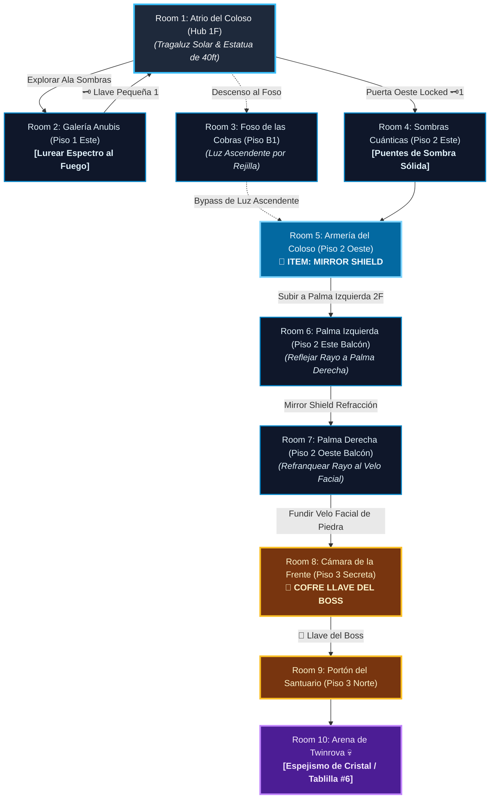

# ☀️ Subdungeon 6: El Santuario Prismático (Mazmorra Zelda estilo Spirit Temple OoT)

> **Ubicación**: `7 - DM/OneShots/ARepeat/Subdungeons/06_Subdungeon_Luz_Santuario.md`  
> **Inspiración Verbatim**: **Spirit Temple** (*The Legend of Zelda: Ocarina of Time*)  
> **Regla de Diseño DM**: **CERO BLOQUEOS POR TIRADA OBLIGATORIA (No Skill-Check Gates)**. La progresión es 100% interactiva, mecánica y espacial. Las tiradas de dados son opcionales (evitar daño, ir más rápido o hallar secretos), pero el paso a nuevas áreas NUNCA depende de fallar/pasar un dado.  
> **Estructura de Layout**: **Hub Master (3 Pisos & Foso B1)** + **Estatua del Coloso de la Diosa de 40 ft** + **Red de Refracción Solar en Cadena entre Manos** + **Backtracking con Dungeon Item**  
> **Dungeon Item**: *Escudo Prismático / Mirror Shield* (Reflexión de Luz Solar & Refracción Elemental)  
> **Guardián de Área**: *El Espejismo de Cristal* (Inspirado en *Twinrova / Iron Knuckle*)  
> **Recompensa**: 🔓 Desbloqueo Permanente del Santuario Prismático + Fragmento de Tablilla #6

---

## 🗺️ Mapa de Flujo No-Lineal de la Mazmorra (Spirit Temple Complex Layout)

---

## 📊 Tabla Resumen de Progreso (Paso a Paso)

| Paso | Ubicación | Tipo | Objetivo y Acción Clave | Resultado |
| :---: | :--- | :---: | :--- | :--- |
| **1** | **Room 2 (Galería Anubis)** | 🟢 Exploración | Moverse en espejo para encender antorcha y quemar Anubis | Obtenida **Llave Pequeña 🗝️1** |
| **2** | **Room 3 (Foso B1)** | 🧩 Puzle Atajo | Girar Cobra de Piedra B1 para reflejar luz por la rejilla | Abre bypass a Armería sin llaves |
| **3** | **Room 4 (Sombras Cuánticas)**| 🧩 Puzle | Usar 🗝️1 y mover linternas para formar sombras sólidas | Acceso a Armería del Coloso 2F |
| **4** | **Room 5 (Armería 2F)** | ⚔️ Mini-Boss | Enfrentar al *Iron Knuckle* haciéndole romper pilares | 🎁 Obtención del **Mirror Shield** |
| **5** | **Room 6 (Palma Izquierda)**| ☀️ Refracción | Interponer Mirror Shield en el haz solar principal del tragaluz | Refleja el rayo a Palma Derecha |
| **6** | **Room 7 (Palma Derecha)** | ☀️ Refracción | Apuntar rayo reflejado al Velo de Piedra durante 6 segundos | Velo facial se funde y abre la frente |
| **7** | **Room 8 (Cámara Frente)** | 👑 Clave Boss | Ingresar tras el rostro fundido y abrir el cofre dorado | 👑 Obtenida **Llave del Boss (Sol)** |
| **8** | **Room 10 (Arena Final)** | 💀 Boss Final | Ascender por los escombros del velo al Portón 3F | 🔓 Subdungeon 6 + Fragmento #6 |

---

## 🏛️ Recorrido Verbatim Sala por Sala (DM Walkthrough & Light Mechanics)

### Room 1: Atrio del Coloso de la Diosa (Hub Master - 3 Pisos)
> *"Un monumental templo excavado en la roca rojiza de un coloso de 40 pies. Sus dos palmas extendidas abarcadoras bordean el Piso 2, mientras un velo de piedra oculta su rostro en el Piso 3. Del tragaluz de la cúpula cae una columna constante de luz solar blanca. En el Piso 1 existen tres accesos: Ala Sombras (Este), Ala Sol (Oeste - Locked 🗝️1) y la rampa descendente al Foso de las Cobras (B1)."*
* **Mecánica Central**: Matriz de refracción solar entre las manos del Coloso para fundir el velo de piedra.

---

### Room 2: 🧩 Ala Sombras (Piso 1 Este): Galería Anubis (OoT / Spirit Temple)
> *"Un pasadizo custodiado por un espectro Anubis que flota sobre antorchas extintas imitando simétricamente cada paso del jugador."*
* **Puzle Mecánico Sin Gating**:
  1. Presionar la losa de muro para encender la antorcha central.
  2. Desplazarse 3 casillas a la izquierda para obligar al Anubis imitado a marchar directamente sobre la llama, incinerándolo.
* **Botín**: Cofre con la **Llave Pequeña 🗝️1**.

---

### Room 3: 🧩 Foso Subterráneo de las Cobras (Piso B1 - Ruta Atajo)
> *"Un nivel inferior rodeado de pilares donde estatuas de cobras sumergidas en arena sostienen discos de alabastro pulido."*
* **Mecánica Sin Gating**: Girar la Cobra de Piedra Inferior alineando su disco con la luz residual del atrio proyecta un rayo ascendente a través de las rejillas del suelo hasta la cerradura de la Armería (Room 5), sirviendo como ruta atajo alternativa.

---

### Room 4: 🧩 Cámara de las Sombras Cuánticas (Piso 2 Este - 🗝️1)
> *"Una pasarela sobre el vacío donde linternas de cuarzo proyectan sombras sólidas sobre los muros."*
* **Puzle Mecánico Sin Gating**: Usar la **Llave Pequeña 🗝️1**. Mover las linternas de cuarzo proyecta puentes de sombra sólida para cruzar de forma 100% segura. *(Tirada opcional de Acrobacias DC 12 permite cruzar corriendo en mitad de tiempo)*. Otorga paso a la Armería.

---

### Room 5: ⚔️ Armería del Coloso: Mini-Boss Iron Knuckle (OoT)
> *"Una cámara abovedada en el Piso 2 Oeste donde se yergue un Iron Knuckle en armadura pesada de hierro empuñando una gran hacha."*
* **Combate**: Iron Knuckle (AC 18, 65 HP). Obligarle a golpear los pilares de mármol de la sala para destrozar su armadura y rematar su núcleo.
* **🎁 COFRE MAESTRO**: Otorga el **Escudo Prismático / Mirror Shield** (Refleja rayos de luz solar y refracta proyectiles elementales).
* **🔄 BACKTRACKING & REFRACCIÓN DE LUZ**: Con el *Mirror Shield*, subir al balcón del **Hub (Room 1 - Palma Izquierda)**.

---

### Room 6: 🧩 Palma Izquierda del Coloso (Piso 2 Este - Hub Balcón)
> *"La gran palma extendida de la estatua en el Piso 2 Este sobre la que cae directamente el haz solar principal del tragaluz."*
* **Mecánica Posicional Sin Gating**: Pararse en la Palma Izquierda con el *Mirror Shield* e interponerlo en el haz solar principal. Apuntar el rayo reflejado horizontalmente a través de todo el atrio hacia la **Palma Derecha (Room 7)**.

---

### Room 7: 🧩 Palma Derecha: Refracción al Velo Facial (OoT)
> *"Cruzar a la Palma Derecha (Piso 2 Oeste) e interceptar el rayo procedente de la Palma Izquierda."*
* **Mecánica Posicional Sin Gating**: Interceptar el rayo reflectado con la estatua espejada de la mano derecha (o con el escudo) y apuntarlo directamente al **Velo de Piedra** que cubre el rostro del Coloso durante 6 segundos.
* **Resultado**: La roca del velo facial se calienta al rojo vivo y se pulveriza en un destello de luz, colapsando y formando una pasarela de escombros hacia la estancia secreta de la frente (Room 8).

---

### Room 8: 🧩 Cámara de la Frente del Coloso (Piso 3 Secreta - Llave del Boss 👑)
> *"La estancia secreta detrás del rostro fundido de la Diosa."*
* **Botín**: Abrir el cofre dorado monumental para reclamar la **Llave del Boss 👑 (Llave de la Diosa del Sol)**.

---

### Room 9: 🔒 Portón del Santuario del Sol (Piso 3 Norte)
> *"Ascender por la pasarela de escombros del velo fundido al Piso 3 e insertar la Llave del Boss 👑 en el portón de bronce."*

---

### Room 10: 💀 Boss Final: Twinrova / El Espejismo de Cristal (OoT)
> *"Una plataforma circular suspendida sobre el vacío donde Kotake (Fuego) y Koume (Hielo) sobrevuelan desatando ráfagas elementales."*
* **Mecánica Twinrova**: Absorber 3 ráfagas elementales consecutivas del mismo tipo con el *Mirror Shield* y redirigir la gran descarga refractada a la bruja opuesta para derribarla.
* **Recompensa**: 🔓 Desbloqueo permanente del Santuario Prismático + **Fragmento de Tablilla #6**.

