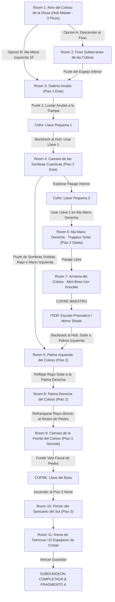

# ☀️ Subdungeon 6: El Santuario Prismático (Layout Ultra-Complejo No-Lineal estilo Spirit Temple OoT)

> **Ubicación**: `7 - DM/OneShots/ARepeat/Subdungeons/06_Subdungeon_Luz_Santuario.md`  
> **Inspiración Verbatim**: **Spirit Temple** (*The Legend of Zelda: Ocarina of Time*)  
> **Regla de Diseño DM**: **CERO BLOQUEOS POR TIRADA OBLIGATORIA (No Skill-Check Gates)**. La progresión es 100% interactiva, mecánica y espacial. Las tiradas de dados son opcionales (evitar daño, ir más rápido o hallar secretos), pero el paso a nuevas áreas NUNCA depende de fallar/pasar un dado.  
> **Estructura de Layout**: **Hub Master (3 Pisos)** + **Ala Mano Izquierda (Sombras)** + **Ala Mano Derecha (Armería)** + **Foso Subterráneo** + **Red de Refracción de Luz en Cadena entre Manos**  
> **Dungeon Item**: *Escudo Prismático / Mirror Shield* (Reflexión de Luz Solar & Refracción Elemental)  
> **Guardián de Área**: *El Espejismo de Cristal* (Inspirado en *Twinrova / Iron Knuckle*)  
> **Recompensa**: 🔓 Desbloqueo Permanente del Santuario Prismático + Fragmento de Tablilla #6

---

## 🗺️ Mapa de Flujo No-Lineal de la Mazmorra (Spirit Temple Ultra-Complex Layout)

---

## 🏛️ Recorrido Verbatim Sala por Sala (DM Mechanics & No-Gate Guarantee)

### Room 1: Atrio del Coloso de la Diosa (Hub Master - 3 Pisos)
> *"Un gran templo excavado en la piedra rojiza de un coloso de 40 pies. Sus dos manos extendidas están en el Piso 2 y su rostro cubierto por un velo de piedra domina el Piso 3. El grupo tiene múltiples opciones de exploración inmediata: el Foso Subterráneo (B1), el Ala Mano Izquierda (Piso 1 Este) o examinar el tragaluz de cúpula."*
* **Acceso Sin Gating**: Los jugadores eligen libremente por dónde comenzar sin tiradas cerradas.

---

### Room 2: Foso Subterráneo de las Cobras (Piso B1 - Opcional / Atajo)
> *"Un nivel inferior con estatuas de cobras sumergidas en arena."*
* **Mecánica Sin Gating**: Girar la cobra de piedra manualmente desbloquea una escalera atajo que conduce a Room 3 sin consumir recursos.

---

### Room 3: 🧩 Galería Anubis (Piso 1 Este - Puzle Posicional)
> *"Un corredor donde flota un espectro Anubis que imita cada paso del jugador en espejo."*
* **Puzle Mecánico Puro (Sin Tirada Requerida)**:
  1. Presionar la losa del muro para encender la antorcha central.
  2. Mover al personaje 3 casillas a la izquierda para forzar al Anubis imitado a desplazarse directamente al fuego, incinerando al espectro.
* **Botín**: Aparece el cofre con la **Llave Pequeña 🗝️1**.
* **🔄 BACKTRACKING**: Usar la Llave 🗝️1 para abrir la Cámara de las Sombras (Room 4).

---

### Room 4: 🧩 Cámara de las Sombras Cuánticas (Piso 2 Este)
> *"Una sala con pasarelas sobre el vacío donde linternas de cuarzo proyectan sombras sólidas."*
* **Mecánica Sin Gating**: Mover las linternas proyecta puentes de sombra sólida. Cruzar es 100% seguro al alinear las luces. *(Tirada opcional de Acrobacias DC 12 permite cruzar corriendo en la mitad de tiempo, pero si se falla solo se tarda 1 ronda extra sin caer)*.
* **Botín & Atajo**: Otorga la **Llave Pequeña 🗝️2** y abre una trampilla directa a la **Palma Izquierda (Room 5)**.
* **🔄 BACKTRACKING**: Usar la Llave 🗝️2 en la Ala Mano Derecha (Room 6).

---

### Room 5: Palma Izquierda del Coloso (Piso 2 Este - Balcón del Hub)
> *"La gran palma extendida de la estatua en el Piso 2. Una peana con tragaluz solar está orientada hacia el atrio."*
* **Mecánica**: Requiere el *Escudo Prismático (Mirror Shield)* para conectarse con Room 8.

---

### Room 6: Ala Mano Derecha: Tragaluz Solar Inclinado (Piso 2 Oeste)
> *"Un corredor iluminado por un haz solar en diagonal. Las estatuas de cobra redirigen la luz al presionar los pedestales."*

---

### Room 7: ⚔️ Armería del Coloso: Mini-Boss Iron Knuckle (OoT)
> *"Un caballero en armadura de hierro pesada armado con un hacha masiva."*
* **Combate Involucrado**: Obligar al Iron Knuckle a golpear los pilares de mármol para romper la armadura del boss.
* **🎁 COFRE MAESTRO**: Otorga el **Escudo Prismático / Mirror Shield**.
* **🔄 BACKTRACKING & CADENA DE REFRACCIÓN**: Con el *Mirror Shield*, regresar a la **Palma Izquierda del Coloso (Room 5)**.

---

### Room 8: 🧩 Palma Izquierda: Primera Refracción en Cadena (OoT)
> *"Pararse en la palma izquierda de la estatua e interponer el Escudo Prismático (Mirror Shield) en el haz solar principal."*
* **Mecánica Posicional Pura (Sin Tirada)**: Orientar el *Mirror Shield* refleja el rayo solar horizontalmente a través de todo el atrio directamente a la palma de la **Mano Derecha (Room 9)**.

---

### Room 9: 🧩 Palma Derecha: Refracción al Rostro & Sello Facial (OoT)
> *"Cruzar a la palma derecha de la estatua en el Piso 2."*
* **Mecánica Posicional Pura**: Interceptar el rayo procedente de la mano izquierda con la estatua espejada de la mano derecha y apuntar directamente al rostro de la Diosa durante 6 segundos.
* **Resultado**: La piedra del velo facial se calienta al rojo vivo y se pulveriza en un destello de luz, revelando la cámara oculta de la frente (Room 10).

---

### Room 10: Cámara de la Frente del Coloso (Piso 3 Secreta - Llave del Boss 👑)
> *"La estancia secreta detrás del rostro fundido de la Diosa."*
* **Botín**: Abrir el cofre dorado para reclamar la **Llave del Boss 👑 (Llave de la Diosa de la Arena)**.

---

### Room 11: 🔒 Portón del Santuario del Sol (Piso 3 Norte)
> *"Insertar la Llave del Boss 👑 en el portón de bronce."*

---

### Room 12: 💀 Boss Final: Twinrova / El Espejismo de Cristal (OoT)
> *"Plataforma elevada rodeada por un abismo donde Kotake (Fuego) y Koume (Hielo) vuelan lanzando ráfagas."*
* **Mecánica Twinrova**: Absorber 3 ráfagas de fuego con el *Mirror Shield* y redirigir la bola de fuego masiva a Koume (Hielo) para aturdirla.
* **Recompensa**: 🔓 Desbloqueo permanente del Santuario Prismático + **Fragmento de Tablilla #6**.
