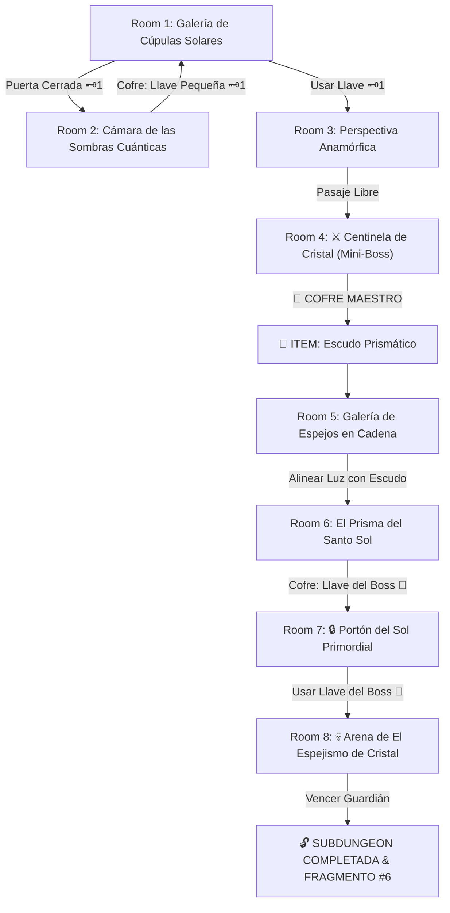

# ☀️ Subdungeon 6: El Santuario Prismático (Light Temple Verbatim)

> **Ubicación**: `7 - DM/OneShots/ARepeat/Subdungeons/06_Subdungeon_Luz_Santuario.md`  
> **Estilo**: Zelda Classic Dungeon Layout  
> **Dungeon Item**: *Escudo Prismático*  
> **Guardián de Área**: *El Espejismo de Cristal*  
> **Recompensa**: 🔓 Desbloqueo Permanente del Santuario Prismático + Fragmento de Tablilla #6

---

## 🗺️ Mapa de Flujo de la Mazmorra (Zelda Diagram)

---

## 🏛️ Recorrido Verbatim Sala por Sala (DM Walkthrough)

### Room 1: Galería de Cúpulas Solares (Entrada)
> *"Una majestuosa cámara de mármol blanco bañada por un haz vertical de luz solar pura. Al norte se yergue un portón prismático con un ojo de cerradura cristalino 🗝️1. En el muro este un arco reflectante conduce a las pasarelas."*
* **Puertas**: Sur (Entrada), Norte (Locked 🗝️1), Este (Abierta).
* **Acción DM**: Avanzar hacia la sala Este (Room 2) para conseguir la Llave Pequeña 🗝️1.

---

### Room 2: Cámara de las Sombras Cuánticas (Llave Pequeña #1)
> *"Un abismo de 40 pies cruzado por luces de linternas de cuarzo. Al proyectar la luz sobre los pilares, sus sombras se vuelven físicamente sólidas sobre el vacío."*
* **Enemigos**: 3x Espectros de Penumbra (AC 13, 15 HP; Inmunes a ataques físicos a menos que estén bajo la luz).
* **Puzle**: Cruzar las pasarelas de sombra sólida y derrotar a los espectros para abrir el cofre con la **Llave Pequeña 🗝️1**.

---

### Room 3: Perspectiva Anamórfica
> *"Columnas rotas proyectan sombras desordenadas sobre el muro. Al usar la Llave 🗝️1 y pararse sobre la losa de la retina en el suelo, las sombras encajan formando el glifo del templo."*
* **Puertas**: Sur (Locked 🗝️1 de vuelta), Norte (Puerta del Mini-Boss).
* **Resolución**: Pararse en la losa de retina para alinear el glifo y abrir el pasaje norte hacia el Mini-Boss.

---

### Room 4: ⚔️ Guardia del Centinela de Cristal (Mini-Boss & Dungeon Item)
> *"Un constructo de cuarzo transparente de 4 brazos que refracta haces de luz láser cegadores desde sus palmas."*
* **Mini-Boss**: **Centinela de Cristal** (AC 16, 50 HP; Ataque: Haz Refractado +6, 2d6+4 Radiante).
* **Estrategia DM**: Inmune mientras esté en la sombra; atraelo a la luz solar. Al ser derrotado libera el cofre maestro.
* **🎁 COFRE MAESTRO**: Contiene el **Escudo Prismático** (Refleja haces solares hacia sensores, descompone luz blanca en 3 primarios y desvela ilusiones).

---

### Room 5: Galería de los Espejos en Cadena (Reflexión Continua)
> *"Un haz solar entra por un oculus e impacta en una estatua giratoria. Varias estatuas con espejos pivotantes están distribuidas en la sala pero una de ellas está rota."*
* **Puzle**: Girar las estatuas intactas e interponer el recién obtenido *Escudo Prismático* para sustituir la estatua rota y conducir la luz hasta la gema del portón norte.
* **Resultado**: La gema absorbe la luz dorada y retrae el pasador del portón.

---

### Room 6: El Prisma del Santo Sol (Llave del Boss 👑)
> *"Un haz de luz blanca pura cae sobre un pedestal central. En la pared norte hay tres gemas receptoras: una roja, una azul y una amarilla."*
* **Puzle**: Interponer el *Escudo Prismático* sobre el pedestal central para descomponer el rayo de luz blanca en 3 haces de color primario dirigidos exactamente a los tres receptores.
* **Botín**: La activación simultánea de las 3 gemas desengancha el cofre dorado con la **Llave del Boss 👑 (Llave del Sol)**.

---

### Room 7: 🔒 Portón del Sol Primordial
> *"Un portón monumental revestido de pan de oro coronado por una gran gema prismática apagada y un candado con la efigie del astro sol."*
* **Resolución**: Insertar la **Llave del Boss 👑** para que la gema prismática resplandezca y abra la arena final.

---

### Room 8: 💀 Arena de El Espejismo de Cristal (Guardián de Luz)
> *"Una estancia revestida de espejos donde El Espejismo de Cristal flota rodeado por tres copias de luz ilusorias."*
* **Mecánica Boss**: Ver ficha en [`07_Arena_del_Espejismo_de_Cristal.md`](file:///Users/matiasbay/Documents/Obsidian/Shivath/7%20-%20DM/OneShots/ARepeat/Salas/07_Salas_Especiales/07_Arena_del_Espejismo_de_Cristal.md). Usar el *Escudo Prismático* para reflejar la luz solar sobre las copias las disipa de inmediato y aturde al verdadero boss 1 ronda.
* **Recompensa**: 🔓 Desbloqueo permanente del Santuario Prismático + **Fragmento de Tablilla #6**.
