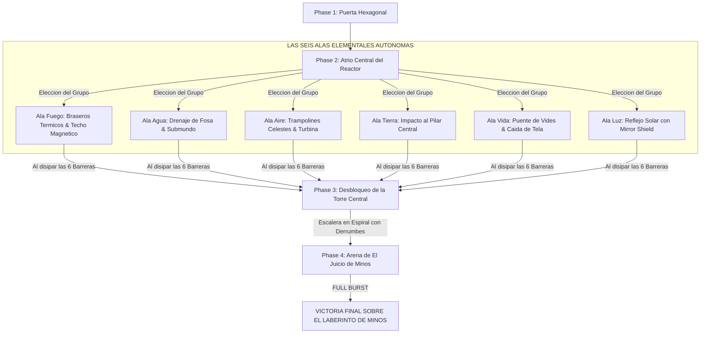

# 👑 Sanctum 12: El Reactor Central de Minos (Layout Complejo y No-Lineal estilo Ganon's Castle)

> **Ubicación**: `7 - DM/OneShots/ARepeat/Subdungeons/07_Sanctum_12_Reactor_Central.md`  
> **Inspiración Verbatim**: **Ganon's Castle** (*The Legend of Zelda: Ocarina of Time*) + **Hyrule Castle** (*Tears of the Kingdom*)  
> **Regla de Diseño DM**: **CERO BLOQUEOS POR TIRADA OBLIGATORIA (No Skill-Check Gates)**. La progresión es 100% interactiva, mecánica y espacial. Las tiradas de dados son opcionales (evitar daño, ir más rápido o hallar secretos), pero el avance obligatorio NUNCA requiere fallar/pasar un dado.  
> **Estructura de Layout**: **Atrio Hexagonal de Entrada (Hub Master)** + **Seis Alas Elementales Autónomas (Wings 1 a 6)** + **Desbloqueo de la Torre Central de Ascenso**  
> **Requisitos**: Reunir los 6 Fragmentos de Tablilla (de las 6 Subdungeons de Zelda)  
> **Boss Final**: *El Juicio de Minos* (Nivel Recomendado 7-8, Grupo de 5 PJs)

---

## 🗺️ Mapa de Flujo No-Lineal del Sanctum Final (Ganon's Castle Hub Wings Layout)

---

## 🏛️ Recorrido Verbatim por Fases y Navegación de Alas (DM Walkthrough)

### Phase 1: La Gran Puerta Hexagonal (Acceso)
> *"Una monumental cúpula de basalto sellada por una losa de seis lados. En cada vértice brilla un zócalo para un Fragmento de Tablilla."*
* **Mecánica**: Encajar los **6 Fragmentos de Tablilla**. La losa desciende abriendo el paso al Hub Master del Reactor.

---

### Phase 2: 🧩 Atrio Central y las Seis Alas Elementales Autónomas (Ganon's Castle OoT)
> *"Un atrio circular catedralicio donde levita la esfera descalibrada del Reactor Central. Seis grandes pasillos abovedados conducen a seis Alas Elementales protegidas por barreras de fuerza de colores primarios. El grupo puede abordar las 6 alas en cualquier orden."*

* **Ala 1: Fuego (Roja - OoT/TP)**: Disparar el *Guantelete de Llama* a los braseros y caminar boca abajo por el techo magnético para pulsar el cristal rúnico.
* **Ala 2: Agua (Azul - OoT/SS)**: Tocar la *Flauta del Mar* a Nivel BAJO para drenar la fosa, bajar al submundo y recuperar la llave de la esclusa.
* **Ala 3: Aire (Verde - OoT/TotK)**: Usar la *Capa del Vértice* en los trampolines celestiales para volar sobre la barrera y acelerar la turbina de paso.
* **Ala 4: Tierra (Gris - OoT/MM)**: Asestar un golpe de *Martillo de Basalto* en la estaca de ancla para colapsar la torre de prueba 10 ft.
* **Ala 5: Vida (Verde Esmeralda - OoT)**: Plantar la *Semilla Botánica* en la arcilla para tejer un puente de vides y descender en caída libre por la tela de araña.
* **Ala 6: Luz (Dorada - OoT)**: Interponer el *Escudo Prismático (Mirror Shield)* en el tragaluz para reflejar luz solar directa sobre el ojo de cuarzo.

---

### Phase 3: 🧩 Desbloqueo de la Torre Central de Ascenso (OoT)
> *"Al disiparse las seis barreras elementales, el campo de fuerza del centro se desmorona con un zumbido armónico. Una gran escalera en espiral desenganchada se eleva hacia la cúspide mientras pedazos de mampostería caen del techo."*
* **Puzle de Ascenso Sin Gating**: Correr por la escalera en espiral esquivando las rocas caídas aprovechando los nichos de protección. *(Tirada opcional de Atletismo o Destreza DC 13 evita 1d6 daño si alguien corre sin cubrirse, pero el ascenso es 100% garantizado)*.

---

### Phase 4: 💀 Boss Final Verbatim: El Juicio de Minos (Ganon Core OoT / Xenoblade 2)
> *"Una catedral circular suspendida sobre el vacío electromagnético donde El Juicio de Minos toca el órgano del reactor rodeado por seis Orbes Elementales."*
* **Mecánica Xenoblade 2**: Romper los 6 Orbes Elementales usando sus contra-elementos opuestos para desencadenar el **⚡ FULL BURST** (Boss aturdido 1 ronda + daño crítico x2).
* **Recompensa**: 🔓 Cierre definitivo de la Incursión Repetible + **Tesoro Imperial de Alrest**.
