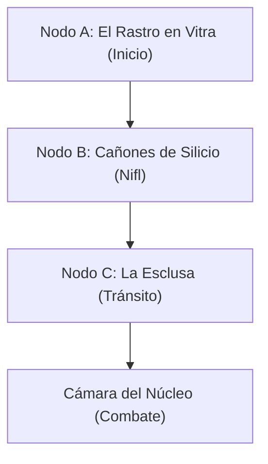

<< Anterior: [[00-Indice_y_Resumen]] | Siguiente: [[02-Combate_Cobalt_Rain]] >>

# 01 - Entornos e Investigación (Exploración en Nifl)

Los jugadores avanzan de forma autónoma exclusivamente a través de los sectores de **Nifl (el lado frío)**, siguiendo el rastro de droplets flotantes dejado por **Wes Ritchie (Cobalt Rain)** hasta llegar a la esclusa del Núcleo Central.

---

## Entornos Distintivos (Preparación del DM)

### 1. Los Cañones de Silicio (Nifl)
*   **Atmósfera:** Un laberinto silencioso de servidores metálicos de quince metros de altura que custodian los archivos de **El Registro**. El aire está a **-30°C** y se siente extremadamente denso y seco. Un vapor blanco y denso de nitrógeno líquido fluye como ríos lentos por las pasarelas metálicas del suelo.
*   **Iluminación:** Luces LED de estado lógico parpadeando en verde y azul pálido, reflejándose en las delgadas capas de escarcha cristalina que recubren los gabinetes.
*   **Sonido:** El zumbido constante y monótono de los ventiladores gigantes de enfriamiento y el crujido metálico de las pasarelas al contraerse por el frío.

### 2. El Gran Límite (Esclusa de Tránsito)
*   **Atmósfera:** La colosal muralla de aislamiento térmico de diez metros de espesor que divide físicamente a Nifl de Muspel. Aquí el aire choca: el vapor del lado caliente se congela al tocar las compuertas de Nifl, creando una lluvia constante de granizo fino y cortinas de condensación húmeda.
    *   *Vista a Muspel:* A través de los ojos de buey de vidrio reforzado de la esclusa, se puede divisar el sprawl industrial de Muspel: normalmente un mar de fuego y humo, ahora sumido en una penumbra silenciosa, con las chimeneas apagadas y cubiertas por una densa capa de escarcha.
*   **Iluminación:** Oscuridad industrial rota únicamente por luces halógenas amarillas de advertencia en las compuertas neumáticas.
*   **Sonido:** El clamor metálico de las esclusas bloqueadas por la dilatación diferencial y las alarmas automatizadas de descompresión sonando en bucle.

### 3. El Intercambiador Ginnunga (El Núcleo Central)
*   **Atmósfera:** Una cavidad mecánica esférica de cincuenta metros de diámetro donde se cruzan las tuberías gigantescas del Termopermutador. La atmósfera es caótica: ráfagas de aire a bajo cero circulan alrededor del chasis de Wes Ritchie, que brilla en el centro con un calor térmico incandescente insoportable.
*   **Iluminación:** El fulgor anaranjado y febril del núcleo sobrecargado de Wes ilumina la red de acoplamientos neumáticos que lo sujetan.
*   **Sonido:** El rugido sordo de los pistones de alivio de vapor y el chirrido de los engranajes principales del intercambiador trabándose por el desequilibrio de temperatura.

---

## La Telaraña de Investigación (Web of Clues)

Para resolver el misterio y obtener las herramientas/conocimientos necesarios para el combate, los jugadores deben investigar los siguientes 3 nodos de exploración en Nifl.

---

### Nodo A: El Rastro de Gotas (Vitra a Ginnun)
Punto de entrada de la misión. Los jugadores siguen el rastro inicial de Wes desde la frontera del distrito de Vitra.

*   **Pista 1 (Física - Audio Log):** Una grabadora de voz corporativa dañada por el frío, tirada a la entrada del sector.
    *   *Origen:* Wes Ritchie.
    *   *Revelación:* *"Si están escuchando esto, es porque mi núcleo no aguantó la entropía de Muspel. Me he adelantado para apagar las fundiciones de Anvil; los obreros no pueden seguir respirando este fuego. Les he dejado un rastro de gotas flotantes. Si me sobrecargo, usen las válvulas criogénicas del núcleo para enfriarme. No me dejen explotar."*
*   **Pista 2 (Visual - Gotas Flotantes):** Pequeñas esferas de agua perfectamente redondas suspendidas en el aire, congeladas al instante en hielo sólido.
    *   *Origen:* Rastro de Cobalt Rain.
    *   *Revelación:* La redondez molecular perfecta de las gotas indica que fueron congeladas mediante absorción entrópica activa (la firma de Wes), no por frío ambiental. Su rastro guía directamente a la compuerta de Nifl (Nodo B).
*   **Pista 3 (Física - Propaganda):** Un volante goblin arrugado y cubierto de escarcha.
    *   *Origen:* Resistencia de los Goblins de Nifl.
    *   *Revelación:* Revela la tensión del lugar: los Goblins de la escarcha apoyan el sabotaje de Wes porque el calor residual de Muspel está derritiendo los servidores de Nifl, destruyendo sus hogares en los sub-niveles.

---

### Nodo B: Los Cañones de Silicio (Nifl)
Exploración de la sección fría de la placa. Los servidores de El Registro están bajo alerta debido a las fluctuaciones en el intercambiador central.

*   **Pista 4 (Lógica - Consola de Seguridad):** Registro de acceso en un terminal de datos de El Registro.
    *   *Origen:* Archivero Skadi (Rime Elf).
    *   *Revelación:* Skadi registró que un warforged con credenciales de Color Menor anuló los protocolos de seguridad criogénica a las 04:00 horas para entrar directo a la esclusa del Termopermutador.
*   **Pista 5 (Operativa - Diagnóstico de Servidores):** Archivo de calibración en la red local.
    *   *Origen:* Sistema de monitoreo de El Registro.
    *   *Revelación:* Los servidores criogénicos están perdiendo estabilidad térmica (-20°C normales) debido a la succión de energía del Termopermutador. Si la temperatura central supera los 300°C (el límite del núcleo de Wes), el sector de datos sufrirá un borrado molecular masivo.
*   **Pista 6 (Física - Fragmento Metálico):** Un segmento de chasis de warforged con marcas de fatiga térmica severa.
    *   *Origen:* Rastro de Wes Ritchie.
    *   *Revelación:* Una prueba de **Inteligencia (Medicina/Tecnología) CD 13** revela que el chasis de Wes ya estaba sufriendo desgaste por dilatación antes de conectarse. Su Fiebre interna inicial en el combate empezará alta (Fiebre 150) debido a este daño previo.
*   **Pista 7 (Lógica - Reporte de Red):** Bitácora de voz interceptada en un terminal de red local que tiene enlace con el sistema de Muspel.
    *   *Origen:* Obrera-Forjada Hekla (Azer).
    *   *Revelación:* Hekla reporta que el metal en los crisoles comenzó a solidificarse en segundos. Vio a un warforged correr hacia el panel de control del intercambiador ignorando las advertencias. Exige que el Consorcio envíe personal antes de que el frío quiebre los chasis metálicos de los obreros Azer.
*   **Pista 8 (Lógica - Memorándum Interceptado):** Correo electrónico enviado a través de la intranet de la placa, visible desde cualquier consola de Nifl.
    *   *Origen:* Supervisor Brom (Consorcio Anvil).
    *   *Revelación:* Brom ordena a los capataces de Muspel ignorar la baja de temperatura y forzar a los Azer-Forjados a mantener los pistones calientes de forma manual, tildando la crisis de *"sabotaje externo temporal por parte de un Color Menor renegado"*. Prioriza la cuota de producción por sobre la supervivencia de los obreros.

---

### Nodo C: La Esclusa del Gran Límite (Tránsito)
El punto de entrada al intercambiador. El sistema hidráulico está bloqueado por el desbalance.

*   **Pista 9 (Física - Restos Desechados):** Restos de un crisol industrial roto tirado junto a los conductos de desecho de la compuerta de la esclusa.
    *   *Origen:* Desechos arrojados por operarios de Muspel que intentaban cruzar al lado de Nifl.
    *   *Revelación:* Un examen de **Fuerza (Atletismo/Minería) CD 13** indica que el bronce sufrió una cristalización criogénica ultra-rápida. El metal congelado en Muspel es extremadamente vulnerable al daño de impacto y los ataques de fuego directo (Vulnerabilidad al daño cortante y fuego).
*   **Pista 10 (Lógica - Diagnóstico Técnico de Esclusa):** Consola de diagnóstico de la esclusa.
    *   *Origen:* Sistema de control del Termopermutador.
    *   *Revelación:* Los acoplamientos del intercambiador están dilatados y soldados magnéticamente al chasis de Wes. Para romper los acoplamientos durante el combate, se requiere desactivar las pinzas liberando presión de vapor a través de los **Pistones de Alivio** auxiliares de la sala de control.
*   **Pista 11 (Física - Placa Pectoral):** Placa protectora de cobalto desprendida de Wes durante la entrada forzada.
    *   *Origen:* Wes Ritchie.
    *   *Revelación:* La placa contiene un sensor de calor dañado. Al analizarla con **Inteligencia (Tecnología) CD 14**, los jugadores descubren que el nitrógeno líquido de las **Válvulas Criogénicas** del núcleo es capaz de reducir la fiebre del Eco Sobrecargado en 40 puntos por activación, evitando la detonación del núcleo.
